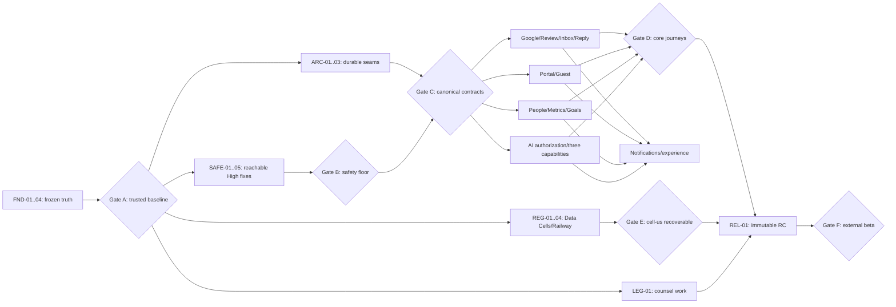

# RepKey comprehensive beta implementation program

- **Status:** Active execution authority; implementation approved 2026-08-25
- **Date:** 2026-08-25
- **Planning baseline:** `4d531c9791cf79b972a4853f90b9e61cdb5e779e` (clean and equal to local `origin/main` when this plan was written)
- **Frozen implementation baseline:** `718fad1807b7422885584660bd3580f2a3a49113` (the approved program commit immediately after the Inbox merge; immutable local evidence is under `docs/release-evidence/review/718fad1807b7422885584660bd3580f2a3a49113/`)
- **Release candidate:** Not selected. `REL-01` selects a later merged SHA only after its prerequisite gates pass.
- **Primary evidence:** `/Users/bozhidardenev/tmp/rep-key-comprehensive-review-consolidated-2026-08-24.md`, its 27 raw specialist reports, the ADR/standards matrices, and the owner decisions captured in the grilling session through 2026-08-25.

## 1. Outcome

This program turns the review and the settled product decisions into 42 evidence-bound work packages for an invitation-only, real-Google, geographically broad beta running in one Railway US Data Cell.

It is deliberately not a flat defect backlog. The critical path first makes the evidence trustworthy and removes reachable security/data-loss risks; it then establishes canonical domain contracts and durable facts; product lanes build against those contracts in parallel; finally, one immutable artifact is promoted to `cell-us` and proved with deployed journeys and recovery drills.

The target remains a **Regional Modular Monolith**:

- the same web and worker codebase is kept portable to a future Data Cell;
- each process owns exactly one Application Container; dependency injection remains explicit, but multiple complete containers in one process are not a supported runtime promise;
- the active `cell-us` owns its PostgreSQL, Redis, object storage, queues, secrets, and content-bearing data; any future cell must own the same boundaries independently;
- web and worker are separate process types, not separate domains;
- sidecars exist only for an actual credential, network, or provider trust boundary;
- no microservice rewrite and no new bounded context is part of beta stabilization;
- contexts expose small public interfaces and durable, tenant-scoped facts instead of repository reach-through;
- `shared/` contains deliberately shared mechanisms, not unowned business policy.

## 2. How to read this plan

| Marker   | Meaning                                                               |
| -------- | --------------------------------------------------------------------- |
| **BLK**  | Blocks the external beta until its definition of done is met          |
| **CP**   | On the implementation critical path                                   |
| **PAR**  | May run concurrently once its stated prerequisites are frozen         |
| **POST** | Controlled follow-on; not required for the first external beta cohort |
| **GATE** | Evidence join point; downstream work must not pass it on promises     |

Priority is based on reachability and impact, not the old report's P0/P1 labels. A package is complete only when its behavior, migration, operations, documentation, and evidence agree.

## 3. Fixed product and architecture contract

These decisions are inputs, not questions for implementers to reopen in individual pull requests.

### 3.1 Beta and account model

1. Beta is invitation-only. Operators provision an Organization and first AccountAdmin. A new account may be created only while consuming a valid, email-bound invitation. Public `/register` and self-service secondary Organization creation stay unavailable.
2. Beta interactive roles are `AccountAdmin` and `PropertyManager`. The canonical people terms are **Staff Participant** (a manager-maintained business profile) and **Staff User** (an optional login linked later). Staff User invitation, login, permissions, and dashboard are deferred.
3. Runtime custom roles are off. Existing custom-role records are audited and mapped to built-ins; dormant schema may remain temporarily.
4. A beta user has one active Organization Membership total. Multi-property Organizations remain supported. Multi-Organization records are retained and audited, but new conflicting invitations pause for support.
5. MFA and fresh password-confirmation/step-up are not beta scope. Normal password controls, rate limits, session revocation, secure cookies, and recovery safety remain mandatory.
6. Billing is not a beta capability. The Billing card and billing fields leave the UI/shell payload, collection stops, and existing unnecessary billing data is erased under the approved retention/legal process. Pilot commercial terms live outside the app.

### 3.2 Property, Data Cell, and geographic model

1. Beta is hospitality-focused but geographically broad: hotels, resorts, hostels, serviced accommodation, restaurants, cafés, bars, and related operator-approved establishments. The domain remains generic enough for these classes; it does not hard-code hotel-only assumptions or silently accept unsupported classifications.
2. Every Property has an initial immutable beta Data Cell selected by authoritative country/residency policy. Country and timezone remain editable business facts; changing them does not silently move data.
3. There is no customer self-service Data Cell move. Exceptional relocation is operator-managed, audited, rehearsed, and reversible until final cutover.
4. All approved geographic mappings ship. Geographic availability does not imply localization: the beta manager app and operational email are English; Unicode, provider translations, and RTL-safe foundations remain intact.
5. Beta deploys exactly one logical cell, `us`, in Railway US West/California (`us-west2`) with its object bucket in Railway US West/California (`sjc`); neither identifier supports a more precise city claim. All 245 supported countries map explicitly to this cell. `europe` and `global` remain denied future identifiers with no beta countries, workloads, environments, or release obligations.
6. A stateless multi-region replica connected to one remote database is not a Data Cell. The active cell has co-located stateful dependencies; any future cell must independently satisfy the same rule before activation.

### 3.3 Portal and Guest contract

1. A Portal is primarily a review gateway and secondarily a link tree.
2. The visitor gives a private 1–5 star rating first. After that rating, the **Google Review Action/Selection** remains available to every visitor. It records only that the visitor selected the verified destination; RepKey cannot observe whether a Google review was written or published.
3. At or below the Portal's **Private Feedback Threshold** (inclusive, valid beta values `1..5`, default `3`, configurable on creation and later), the visitor is additionally offered private feedback. `5` deliberately offers it to every respondent; `0` is invalid and cannot disable private feedback. Google is still available; the product does not block it.
4. Portal ratings are first-party, Portal-scoped managerial data. Mandatory Portal analytics cannot be declined.
5. Google review destination is a verified provider-supplied destination owned by the Portal's connected Property; managers do not paste an arbitrary destination and RepKey does not guess one by concatenating a location ID.
6. The creator is immutable provenance and, when eligible, the default Portal Responsible Manager. Active assigned Portal Responsible Managers receive Portal workflow notifications; all PropertyManagers do not. AccountAdmin is the fallback when nobody eligible remains. Staff-to-Portal performance attribution is the separate Portal Responsibility concept and does not confer access or notification authority.
7. A Portal is in zero or one active Portal Group. Teams are not used. Ungrouped Portals remain valid.
8. Ordinary removal means recoverable Portal Archive. Its identity, address, configuration, metrics, goals, and history remain stable; restoration returns it unpublished until deliberate republish.
9. Optional contact collection exists only behind explicit “Please contact me” consent for follow-up by that Property about this feedback. It is Portal-configurable/off by default, never required for rating/feedback, masked until an audited reveal only to AccountAdmins and the Portal creator/current Responsible Managers, excluded from analytics/search/routine export, and purged after 30 days. It cannot authorize promotions, surveys, mailing lists, cross-Property use, or an automated campaign; RepKey does not message guests in beta. The scoped secure Organization Export in `LIF-01` is the sole bulk-export exception while an unexpired permitted contact exists.
10. Guest retention defaults are: abuse/session/network pseudonyms 7 days; optional contacts 30 days; private-feedback text 90 days; de-identified rating, qualified-scan, click, correction, and withdrawal facts 24 months; content-free erasure/action evidence follows the counsel-approved audit horizon.

### 3.4 Google, Review, Inbox, and reply contract

1. A Google Connection is Organization-owned; `connectedBy` is audit provenance. AccountAdmins connect, reauthorize, and disconnect it.
2. “Select all eligible locations” imports all locations using resumable internal batches of at most 100. Verified country/timezone data is accepted; only missing, conflicting, or ambiguous rows require intervention.
3. Google Pub/Sub is the fast path; a targeted fetch handles a notification; adaptive polling is the reconciliation safety net; manual sync is recovery. A quiet healthy Property must be discovered within six hours.
4. A Review has stable identity. Provider content can expire or disappear without deleting RepKey replies, Inbox work, action history, or the logical Review. Re-observation reconnects to the same Review.
5. A Material Review Revision is created only when the original rating or normalized original guest text changes. Translation, photos, metadata, and observation timestamps do not create a handling revision.
6. An Inbox Item is stable and contains numbered Handling Cycles. A cycle is a work episode anchored to exactly one source revision—Material Review Revision for Google work or Guest Response Revision for private feedback—but more than one cycle may reference the same source revision. Status is only `open | closed`; assignment, escalation, and personal seen state are independent. Closure records an eligible reason and actor.
7. A material revision, loss/rejection/removal of a previously live provider reply, or another explicitly catalogued re-handling trigger opens a new cycle, preserves earlier handling/reply history, notifies Responsible Recipients, and fences stale drafts and publication attempts.
8. Assignment is optional and singular. Eligible assignees are active AccountAdmins or PropertyManagers with current Organization membership, PropertyAccessGrant, and active participation. Assignment does not grant access. Invalid assignees are automatically unassigned with history preserved.
9. Google Review `Response Target`, not SLA, defaults to 48 elapsed hours Organization-wide and is configurable by AccountAdmin. New-review timing starts at Google's original publication. Historic onboarding imports are excluded. A material revision starts a new target for its new cycle. Only the current reply reconciled as live on Google (`confirmed_on_google`) stops the clock. `Overdue` is derived and never mutates status or escalation.
10. Escalation is an explicit manager action with actor and optional reason; Responsible Recipients are notified; it is explicitly resolved and independent from closure.
11. Reply publication is explicit **Confirm & Publish** by an authorized manager; the author may confirm their own draft. Pending/rejected attempts do not close the cycle. Google is provider-authoritative; RepKey preserves its workflow and attempt history.
12. Bulk Reopen remains. Bulk Close is disabled for initial beta. A later Bulk Close requires cycle revision fencing, an eligible shared closure reason, compatibility preview, confirmation, compare-and-set, per-item outcomes, durable per-item facts, and a shared bulk ID.
13. Private feedback has its own **Private Feedback Handling Target**: Organization default with optional Property override, no Portal override, default 48 elapsed hours. Each cycle snapshots duration, policy source/version, UTC start/due times, and displays the due time in the Property timezone. Submission or reopening starts it; only explicit **Mark as handled** with an approved outcome completes it. Claim/read/note do not; guest withdrawal cancels it. One halfway reminder and one target-passed reminder are scheduled per active cycle, with no repeating direct escalation.

### 3.5 AI contract

1. Beta supports three separately controlled per-Property capabilities: Review Analysis, Reply Drafting, and Property Trends. Reply Drafting and Review Analysis may be enabled independently; Property Trends requires Review Analysis. All are off until AccountAdmin AI Authorization, live access, notice version, provider policy, and platform gates pass.
2. AccountAdmin owns the maximum authorized capability set and irreversible AI-data erasure. Authorized PropertyManagers operate only within that set. Disabling fences new/in-flight work immediately and hides outputs; erasure purges local derivatives within 24 hours while retaining content-free evidence. Re-enabling reuses data only when lineage/policy/model/freshness remain valid.
3. AI processes only eligible Google review content. Private Portal ratings, private feedback, contact, Inbox notes, and manager-internal text never leave for AI. Outputs are advisory and cannot mutate Inbox, assignment, escalation, reply publication, Portal behavior, Goal, Recognition, notifications, or Staff metrics.
4. Reply Drafting is genuine, on-demand, personalized, editable generation and always returns to the human Confirm & Publish workflow. Review Analysis is clearly labelled derivative metadata. Property Trends is deterministic aggregation of Review Analysis—there is no second trend-generation provider call.
5. Provider processing is an explicitly authorized/disclosed external transfer and does not move RepKey source records between Data Cells. Cell-local admission/egress, content minimization, source-revision fencing, lifecycle deletion, and counsel approval remain mandatory.

### 3.6 Metrics, goals, dashboards, and recognition

1. Property, Portal Group, and individual Portal goals use all three measures: qualified scans, rating count, and average private rating. A Portal may have goals without a group; person- and Team-scoped goals are prohibited.
2. Manager reporting defaults to rolling 30 days compared with the preceding 30 days. All Time is absolute and has no fabricated trend.
3. Missing, stale, incomplete, ineligible, or insufficient data is never coerced to zero. Surfaces use `Data through…`, `Updating`, `Insufficient data`, or `Temporarily unavailable`, and suppress invalid trends.
4. Goals ship after the governed Metric read/write contract is coherent. Legacy goal models are migrated/retired rather than layered.
5. Badge remains deferred. The old Recognition/Leaderboard ranking is replaced by a controlled post-core **Manager Achievement Board**: per-Property AccountAdmin Authorization off by default, PropertyManager-operated Program, manager-only, non-competitive, and initially limited to the system-defined Healthy Guest Gateway health achievement. It has no rank, composite score, bottom list, Staff audience, or ratings/feedback/Google/AI/workforce input and does not block the first external cohort.
6. Dead rollup tables/jobs with no beta reader are removed after fresh reachability proof. A projection stays only if a named beta consumer, freshness contract, replay strategy, and repair procedure exist.

### 3.7 Notifications, analytics, feedback, and support

1. Responsible Recipients are scope-specific and never inferred from access alone. Portal events use the creator/current Portal Responsible Managers; Property-wide Google/import/sync/health events use current Property Responsible Managers; assigned Inbox work uses the assignee; reply outcomes use the relevant author/confirmer; Organization/security/legal notices use the affected user and relevant AccountAdmins. AccountAdmin fallback is for unowned or persistently unacknowledged recovery, not routine fan-out. Every recipient is revalidated for current role/access at delivery. Self-generated synchronous collaboration notifications are suppressed for the actor; later asynchronous outcomes, security notices, and mandatory account notices are not.
2. The Notification Bell is distinct from the Inbox badge. It counts unread notifications for the active Organization. Opening/hover/focus changes nothing. Activating one row marks only it read and follows its link. Read is not resolved. Explicit read/unread/dismiss remains; dismiss hides but does not delete the source. Popover supports Mark all read, not Clear all; full-page Dismiss all requires confirmation.
3. Inbox navigation badge means new open work since the user's last successfully loaded Inbox. The server stamps a response watermark after a successful load; Open and Escalated totals remain inside Inbox.
4. Privacy-safe product analytics is a core function and is always present. Essential Portal Telemetry is first-party/server-side only: no analytics cookie, third-party tracker, advertising ID, fingerprinting, or raw IP/user-agent analytical fact. The guest cookie exists for response integrity, not behavioral tracking; short-lived abuse signals are separate and restricted. Lawful-basis/jurisdiction approval gates activation. Error monitoring is distinct from analytics and also always on.
5. Sentry is Germany-hosted. Continuous indiscriminate replay is prohibited. RepKey-native Beta Feedback supports Bug/Suggestion. Screenshot or short buffered replay is attached only with explicit per-submission consent, preview, and removal; sensitive routes and data are excluded and media is retained no more than 30 days.
6. No contractual uptime SLA, service credits, or 24/7 support is promised for beta. Requests may be sent any time and are handled Mon–Fri 09:00–18:00 Europe/Sofia excluding Bulgarian public holidays. Automated monitoring, incident alerts, verified backups, containment, and a named incident owner are mandatory.

### 3.8 Engineering and release contract

1. Documentation precedence is: external obligations → approved product contract and accepted/superseding ADRs → active standards → nearest context glossary/invariants → executable enforcement → implementation → archive. Exceptions have an owner, rationale, expiry, and executable mirror where possible.
2. Every mutation is classified `Local-Only` or `Durable Domain Fact Required`. State and its required fact commit atomically in one regional PostgreSQL transaction. An in-process bus can accelerate delivery but is never the only beta-critical path.
3. Durable consumers are tenant-scoped, idempotent, versioned, retryable, observable, and rebuildable. Facts are content-minimal. External effects record intent plus confirmed/failed/ambiguous outcome.
4. Operational Action History is durable and access-controlled, but RepKey makes no “immutable” or “tamper-evident” claim until a real cryptographic design is implemented.
5. `main` is protected. Required checks run on PRs. High-risk work receives recorded independent review; a solo beta may use a fresh-context review agent plus founder sign-off, but production requires human review.
6. CI builds each image once from the merged SHA, publishes unique SHA tags/digests, and promotes exactly those bytes to `cell-us`. `railway up` from a working tree is retired for production promotion.
7. The beta has no known reachable High defect in tenant isolation, authentication, user data, Google side effects, Portal/privacy paths, critical durability/recovery, or supported-browser critical workflows. Lower risk debt needs owner, impact, milestone, and sign-off. No arbitrary global 100% coverage claim is made.

## 4. Delivery rules

### 4.1 Change shape

- Prefer a tracer-bullet vertical slice through domain, persistence, API, UI, operations, and evidence over layer-wide rewrites.
- Write a failing characterization or contract test before changing risky behavior. For a new contract, freeze examples and error semantics before implementation.
- Before coding a high-consequence flow, hold a short Product/Domain/Security acceptance review over concrete state tables and Storybook/prototype states—not prose alone. Portal low/high rating, Review edit/reply loss, publication ambiguity, onboarding degradation, retention, and Data Cell failure each need signed examples of what the user sees and what the system records.
- Use **expand → backfill/report → verify → cut over → contract** for schema/model replacements. Do not add and drop a consequential representation in one deployment.
- Backfills have report-only mode, bounded batches, checkpoints, idempotency keys, progress/error counts, and safe resume.
- Dual-write only when a short, measured migration window requires it. Name one canonical reader and a removal condition; do not leave permanent dual truth.
- Feature/capability gates fail closed and default off until the activation evidence is attached. A hidden UI is not a gate.
- No “cleanup while here” inside a security/data-correctness patch unless the cleanup is necessary to prove the fix. Broader refactors follow after the regression test is green.
- Every PR updates the package's traceability row and includes rollback/forward-fix notes. Every merged commit is independently green.

### 4.2 Test surface by change type

| Change               | Minimum proof                                                                                                   |
| -------------------- | --------------------------------------------------------------------------------------------------------------- |
| Pure domain rule     | table-driven unit tests including boundary and invalid transitions                                              |
| Repository/schema    | real PostgreSQL integration tests, tenant-negative cases, constraints, transaction rollback, concurrent writers |
| Redis/queue/lease    | real Redis integration, lease expiry/stale leader, retry, duplicate delivery, restart/replay                    |
| Public endpoint      | request-level auth/CSRF/cache/rate-limit/abuse tests plus browser journey                                       |
| Provider side effect | sandbox/fixture contract, timeout/ambiguous outcome/reconciliation, no implicit retry                           |
| Projection           | duplicate/out-of-order delivery, correction, rebuild, freshness/completeness, parity report                     |
| UI state             | component states plus E2E success/error/empty/stale/conflict and keyboard behavior                              |
| Migration            | clean install, production-shaped upgrade fixture, report/backfill, rollback or restore procedure                |
| Railway/release      | IaC drift plan, immutable digest read-back, health/readiness, deployed critical journeys, rollback rehearsal    |

Flaky retries do not turn a failing gate green. A quarantined test needs owner, reason, expiry, and a release decision.

### 4.3 Migration integration bottleneck

Domain work may proceed concurrently, but authoritative migration numbering and shared schema-barrel integration are serialized through one migration integrator. Each schema lane first lands a contract/test or reserves its migration sequence. No team rebases migration history after another migration is deployed. Destructive contraction waits at least one verified deployment after cutover and backup/restore proof.

## 5. Critical path and concurrency



### 5.1 Work lanes

| Lane                        | Packages                           | Starts after                         | Blocks                             | Can run concurrently with                   |
| --------------------------- | ---------------------------------- | ------------------------------------ | ---------------------------------- | ------------------------------------------- |
| Evidence and governance     | FND-01..04, GOV-01..02, CNV-01     | immediately                          | all trustworthy implementation     | legal, Railway design, isolated repro tests |
| Security and identity       | SAFE-01, SAFE-02, PPL-01           | Gate A                               | Gate B; onboarding                 | data/provider fixes, regional IaC           |
| Data/provider correctness   | SAFE-03, SAFE-04, GGL-01, REV-01   | Gate A                               | Inbox/reply, Google launch         | Portal/Guest contract work, people model    |
| Durability and architecture | ARC-01..03, SAFE-05                | Gate A                               | all event-driven features          | regional IaC, direct endpoint fixes         |
| Inbox and notification      | IBX-01, RPL-01, NTF-01             | canonical Review/Fact contracts      | manager core journey               | Portal UI, metrics read models              |
| Portal and Guest            | POR-01, GST-01                     | public-edge safety + canonical facts | public beta Portal                 | Inbox, Google, people                       |
| Metrics and management      | MET-01, GOA-01, REC-01             | fact and attribution contracts       | goals/dashboard; recognition later | Portal UI, Inbox UI                         |
| AI capabilities             | AI-01..04                          | provider/Review/fact contracts       | AI-supported beta journeys         | Portal/Guest, Goals, regional IaC           |
| Platform and release        | REG-01..04, REL-01                 | Data Cell ADR can start immediately  | single-US beta                     | every product lane until final promotion    |
| Experience and operations   | ACT-01, EXP-01..03, OBS-01, LIF-01 | stable DTO/state contracts           | Gate D/E                           | feature backend work using mocks/contracts  |
| Legal/privacy               | LEG-01                             | immediately                          | external beta only                 | all engineering                             |

### 5.2 Hard blocking edges

1. No package treats current line numbers or module counts as authoritative before `FND-01`.
2. No public Portal/Guest activation before upload binding, destination/address safety, Guest durable facts, rating-first flow, notice/locale publication snapshot, verified Google destination, Responsible Recipients, cache policy, and abuse controls pass `SAFE-01`/`POR-01`/`GST-01`/`ARC-01`. Contact may be implemented in parallel but activates only after its notice/access/encryption/withdrawal/30-day purge evidence.
3. No Review lifecycle sweep or destructive retention before stable Review identity and reply-preservation tests pass `SAFE-03`/`REV-01`.
4. No Inbox Handling Cycle UI before the Review revision contract and cycle schema are frozen.
5. No reply auto-close before publication reconciliation proves `confirmed_on_google` is the only stopping condition.
6. No notification/metric/goal consumer is enabled until its fact is atomic, registered, reachable, idempotent, and rebuildable.
7. No goal/dashboard/recognition activation before Metric governance and availability semantics pass parity tests.
8. No Team deletion before Staff Participation, PropertyAccessGrant, Portal Responsibility, and Portal Responsible Manager reconciliation reaches zero unexplained rows.
9. No Data Cell activation before routing, storage, queues, provider configuration, backups, and rollback are cell-local and a wrong-cell test fails closed.
10. Multi-cell Google connection is not a beta capability. A future activation still requires credential-home/broker, permit, ephemeral-token, and no-content-crossing tests.
11. No AI capability activation before per-Property authorization/configuration, source prohibition, sidecar admission/egress, lifecycle erasure, and that capability's product evidence pass; Property Trends additionally waits for Review Analysis coverage semantics.
12. No external beta before counsel approval, deployed `cell-us` journeys, backup restore, and the release acceptance bar pass together.

## 6. Wave 0 — trustworthy baseline and implementation authority

### FND-01 — Freeze and rebaseline the final merge (**BLK, CP**)

**Outcome:** every task points at the code that will actually be changed.

**Work**

1. Finish the Inbox merge, require a clean worktree, fetch remote state, and record the exact SHA, branch protection/ruleset state, Node/pnpm versions, lockfile digest, migration heads, and generated route tree digest.
2. Create one immutable evidence directory keyed by SHA and environment. Copy neither old pass/fail claims nor stale line numbers into it.
3. Run a clean, isolated `Node 22.23.2` / `pnpm 10.6.5` frozen-lockfile install. Do not reuse contaminated `node_modules`.
4. Regenerate full production and test/support artifact ledgers, route/server-function/API/consumer/job/schedule/operator-command/sidecar entry-point catalogues, import graphs, and function-like symbol inventory. Each row records owning module/context, runtime entry point, tests, capability, tenant scope, and disposition.
5. Re-resolve every retained review finding at the frozen SHA. Mark it `confirmed`, `reproduced`, `inferred`, `configuration-dependent`, `superseded`, or `closed`; assign owner, reachability, impact, closure test, and target package.
6. Specifically recheck Inbox `UI-07`, `UI-11`, status concurrency, badge stamping, query keys, reply state, bulk actions, and all old line references after the merge.

**Dependencies/concurrency:** first critical-path task. Legal drafting and read-only Railway topology design may proceed, but no code estimate or closure claim may pass Gate A.

**Evidence / done:** signed baseline manifest; clean-install logs; regenerated ledgers reconcile to filesystem; every consolidated finding has a disposition and target; old report remains provenance, not current truth.

### FND-02 — Authority, ADR, glossary, and capability ledger (**BLK, CP; PAR after SHA freeze**)

**Outcome:** one versioned definition of what beta is, what is active, and which document wins.

**Work**

1. Accept a narrow set of ADRs (or explicit amendments) for: the single-US beta Data Cell and dormant expansion identifiers; current Inbox/Handling Cycle model; the shared Google Source Identity/Source Epoch/Observation contract used by both Integration and Review; stable Review/source-revision lifecycle; Portal/Guest gateway; people/access/attribution; durable-domain-fact policy; activity/action-history naming; Google discovery/reply reconciliation; AI authorization/capability lifecycle; and beta release profile.
2. Add explicit `supersedes`, clause-level amendments, status, owner, and effective date. In particular, supersede ADR-0048's single-US-cell rule, ADR-0003's no-polling clause, stale Inbox ADR-0004 state terms, ADR-0045's unimplemented tamper-evidence claim, and obsolete authorization `can()` guidance.
3. Add the documentation precedence rule to root guidance and mechanically reject references to archived/superseded rules as current authority.
4. Publish a capability fate ledger with route/job/consumer/schedule/data dispositions:
   - active: core Identity/Property/Google/Review/Inbox/reply, Portal/Guest, governed Metric/Dashboard, Property/Portal Group/Portal Goals, in-app notifications, required service/security email, immediate-default configurable Action Required/Portal Feedback email, analytics, monitoring, and the separately authorized per-Property AI capabilities Review Analysis, Reply Drafting, and Property Trends;
   - beta-disabled: public registration, custom roles, Team, Staff User login, billing, bulk close, self-service Data Cell move, MFA/step-up, Guest media, Contact Request phone, business-hours/holiday Handling Targets, translated manager UI/email, SMS, and mobile push;
   - controlled post-core: Badge and the non-competitive Recognition Achievement Board;
   - inactive/unapproved channels: SMS, mobile push, and any outbound notification channel not explicitly listed as active;
   - AI-denied: private Portal/feedback/contact/internal sources, previous replies as style examples, automatic generation/publication/workflow mutation, cross-Property/Organization summaries, AI-derived Staff/Goal/Recognition decisions, and any capability outside Review Analysis, Reply Drafting, and Property Trends;
   - production follow-on: full WCAG 2.2 AA evaluation/formal conformance claim and broader human-reviewed language/browser commitments beyond the beta matrix;
   - replace then retain: Review lifecycle, Google credential lifecycle, authorization invalidation, distributed refresh coordination;
   - delete after proof: obsolete Review scaffolds, process-local refresh, false projection contract, unused rollups/models/fixtures.
5. Update the ubiquitous language across root/context docs and DTO/UI copy: Staff Participant/User, Staff Participation, Portal Responsibility (Staff attribution), Portal Responsible Manager (workflow/notification assignment), PropertyAccessGrant, Private Feedback Threshold, Handling Cycle, Material Review Revision, Response Target, Responsible Recipients, Data Cell, Operational Action History, Durable Domain Fact, confirmed-on-Google reply.
6. Encode accepted exceptions (for example Portal deterministic UUIDv5 workflow IDs) rather than “fixing” deliberate behavior toward a generic style rule.

**Dependencies/concurrency:** uses `FND-01` paths/counts; ADR drafting may overlap reproduction. Blocks schema/model work whose terminology it owns.

**Evidence / done:** authority test; ADR index contains every current ADR; root and all 17 current contexts plus AI describe the same active contexts, errors, event rules, permissions, and capability fates; no phantom ADR references.

### FND-03 — Runtime reachability and write-path classification (**BLK, CP; PAR**)

**Outcome:** declarations cannot be mistaken for working runtime behavior.

**Work**

1. Build executable catalogues for all routes, server functions, API handlers, consumers, jobs, schedules, operator commands, sidecars, migrations, and production scripts. Compare AST discovery in both directions and fail on missing/stale rows.
2. For every mutation, record aggregate/table owner and one disposition:
   - `atomic_state_and_fact`;
   - `local_only_with_reason`;
   - `non_atomic_defect`;
   - `temporarily_accepted_debt` with owner/expiry.
3. For each declared fact, verify schema registration, master union, producer construction, transaction insertion, dispatcher reachability, consumer registration, capability gate, receipt/idempotency, retry/quarantine, and repair path.
4. For every queue/schedule, establish a single owner for registration, policy, cadence, enablement, readiness, and reconciliation. Reject duplicate job names and silent handler overwrite.
5. Generate bundle allowlists for web, worker, and each sidecar. Operator/E2E tooling is denied unless explicitly declared for that artifact and production environment.

**Dependencies/concurrency:** starts after frozen SHA; can run beside focused repros. Its gaps feed `ARC-01`, `ARC-02`, `SAFE-05`, and `CNV-01`.

**Evidence / done:** bidirectional catalogue tests with deliberately invalid negative controls; every active row has an executed reachability test; every dark row has a deny test at direct entry, manual enqueue, event, job, and schedule paths.

### FND-04 — Focused reproductions and regression oracles (**BLK, CP; PAR**)

**Outcome:** the highest-risk findings have executable failure cases before remediation.

**Required focused tests**

- cross-tenant/foreign known-object Portal upload finalization and in-place derivative overwrite;
- CSRF request behavior, including same-site/subdomain threat cases;
- Review expiry/re-observation preserving manager replies and stable identity;
- ambiguous `pool.query` connection failure after a write;
- trusted-proxy/XFF address selection;
- hourly digest with a daily idempotency key;
- arbitrary public redirect, click/scan session farming, dedupe and rate limits;
- public Portal/Guest cache headers and CSRF/private response behavior;
- approved/confirmed reply commit-to-enqueue crash and provider-success/local-completion ambiguity;
- goal/leaderboard consumer-name and runtime registration gaps;
- boundary invalid imports in context builds, composition, and shared outbox;
- E2E seeder/operator utilities present in production bundles;
- current two failing unit tests and coverage interruption.

Use the smallest deterministic test that crosses the faulty seam. If a race cannot be deterministically reproduced, add an injectable fault point and prove both sides of the ambiguous outcome instead of relying on timing.

**Dependencies/concurrency:** frozen `FND-01` baseline and reproducible fixtures. Individual oracles may be authored in parallel by seam; remediation waits for the matching failing test or recorded contrary evidence.

**Evidence / done:** every case either fails for the expected reason on the frozen pre-fix SHA or is downgraded with recorded contrary evidence; the same tests become non-regression gates after fixes.

### Gate A — Trusted baseline

Gate A passes only when `FND-01..04` are complete enough to assign every reachable High/gate finding. It does not require lower-priority cleanup to be solved. It forbids coding from stale review assertions.

## 7. Wave 1 — immediate safety, data integrity, and artifact containment

The five packages below start in parallel after Gate A. They merge as small, isolated fixes before broad refactors.

### SAFE-01 — Public Portal/Guest edge safety (**BLK, CP; PAR**)

**Covers:** `SEC-01`, `SEC-02`, `SEC-13..17`, public-edge raw findings, and the Portal/Guest portions of `ARCH-05`/`EVT-02..03`.

**Work**

1. Temporarily deny `portal.upload` in every beta cell until the issuance-bound implementation is live.
2. Persist an upload issuance with opaque ID, tenant, Property, Portal, server-derived private object key, media purpose, MIME/size envelope, expiry, state, and consumed/finalized timestamps. Finalization accepts the issuance ID, not an arbitrary key; locks/revalidates/CAS-consumes it; storage rechecks actual metadata/size; derivative keys are newly generated and never equal the source.
3. Make storage APIs capability-oriented (`confirmIssuedUpload`, `writeDerivative`) so callers and worker payloads cannot supply arbitrary bucket keys. The worker reloads the issuance and updates the Portal only if it still references that issuance, preventing a late job from replacing a newer image. Add cross-tenant, replay, expiry, wrong-purpose, stale-worker, oversize, extension/MIME mismatch, and already-derived tests.
4. Install TanStack Start CSRF middleware in the custom Start instance and align nonce/session behavior for server functions and API routes. Document explicit webhook/OAuth exceptions with signature/state verification.
5. Replace arbitrary HTTPS click destinations with a server-owned, normalized allowlist derived from canonical Portal links/Property Google destination. Reject credentials, fragments where unsafe, IP/private ranges, unsupported schemes, redirects, and post-resolution destination drift.
6. Use stable server-issued abuse/session keys. Rate-limit scan/click/media/withdraw/confirm paths by privacy-safe network/session/Portal dimensions; dedupe qualified analytics; prevent fresh-cookie farming from creating unlimited counts.
7. Add `Cache-Control: private, no-store` (or stricter) to session/nonces/private response state and correct public cache headers/Vary semantics. Minimize public models so they do not expose raw Organization/Property IDs or object keys.
8. Ensure analytics facts are durable but content-minimal. Raw IP addresses are processed only in memory and are never persisted. Persist only rotating, keyed abuse-control pseudonyms for at most 7 days; keep signed guest-session/CSRF material separate and expire it after 24 hours. Neither class may be copied into facts, logs, telemetry, exports, queues, or long-lived aggregates.

**Dependencies/concurrency:** upload and redirect fixes can run concurrently with CSRF/abuse work. Fact activation waits for `ARC-01`; public activation waits for the entire package.

**Rollout/rollback:** keep the capability off; deploy schema/API first; migrate no user content; enable for an internal Portal; run adversarial tests; enable allowlisted beta Organizations. Rollback is capability-off plus previous image; issued uploads remain safely expirable.

**Done:** original exploit tests fail closed across tenants; finalization cannot name storage keys; rate/dedupe tests use real Redis; request-level CSRF/cache tests pass; public bundle/response has no prohibited identifiers; security review recorded.

### SAFE-02 — Identity, session, invitation, proxy, and tenant controls (**BLK, CP; PAR**)

**Covers:** `AUTH-01`, `SEC-05..09`, `SEC-12`, related UI-04/05/10/14/16, Better Auth and tenant-cache raw findings.

**Work**

1. Password change and successful reset revoke every other session and rotate the current session as appropriate. Add multi-device integration tests and prove revoked cookies cannot call server functions.
2. Separate authentication Session from Current Authority. Re-read/version-check Organization membership, built-in role, suspension, PropertyAccessGrant, and permissions on every authorized request; long-lived claims/cookie cache never remain authority. Property access removal/role downgrade takes effect without global sign-out; Organization removal ends that tenant access; suspension, confirmed compromise, password recovery, and sign-out-all revoke all sessions; ordinary sign-out revokes only current.
3. Require production HTTPS auth base URL and Secure cookie behavior at startup. Confirm secure-cookie prefix handling in tenant cache. Disable the five-minute authority-bearing cookie cache unless every request independently checks a replica-safe revocation/authority generation. Centralize parsed environment use; remove security-sensitive raw-env fallbacks.
4. Capture Railway's deployed direct-peer and forwarding-header shape first, then correct trusted-proxy XFF selection using a documented right-to-left hop model. Trust forwarding headers only from the approved proxy boundary; reject malformed/excess lists; pin zero/one/multiple-proxy and spoofed-leftmost tests.
5. Make invitation-bound registration one transaction/saga: lock invitation, revalidate email/expiry/role/Organization/capability, create/link account and membership, consume invitation, create required participation only if the canonical model calls for it, and compensate safely. Map tagged failures to stable 4xx UI outcomes.
6. Deny public registration, authenticated Organization creation, custom-role mutation/assignment, and second active Organization membership at server boundaries. Do not rely on navigation hiding.
7. Add an application-owned beta user-to-Organization binding with one active row per user enforced by database uniqueness. The invite transaction locks both invitation and binding, creates the binding only when absent, and rejects an incompatible existing binding. The tenant resolver and every authenticated command require the session's active Organization to equal that binding; cache keys/claims carry its version so transfer/support correction revokes stale sessions.
8. Backfill bindings in report mode as `exact | mappable | conflict | orphan`; do not guess conflicts. Existing multi-Organization users enter a support-resolution state and cannot consume another invitation until resolved.
9. Replace raw role checks, including Merchant AI management, with `ExecutionPolicy`; add property/resource scope and policy-head tests.
10. Audit existing memberships, sessions, custom roles, billing fields, and orphan identities in report mode; require an owner decision for every anomalous row before mutation.
11. Align Better Auth limiting with replica-safe Redis for login/recovery/invite abuse before scaling web beyond one replica.

**Dependencies/concurrency:** session/proxy/config work is independent. Invitation/schema work coordinates with `PPL-01` and the migration integrator.

**Rollout/rollback:** add denial/validation first; deploy session-revocation behavior; run audit; migrate only reviewed rows; keep dormant schema. Rollback never restores an already revoked session.

**Done:** direct endpoint denial matrix passes for every principal; session and invite real-DB/browser journeys pass; one-active-Organization invariant is enforced transactionally; no sensitive path branches on raw role strings.

### SAFE-03 — Review identity, database retries, transactions, and concurrency (**BLK, CP; PAR**)

**Covers:** `DATA-01`, `DATA-02`, `DATA-08..10`, `DATA-12..16`, reply/inbox concurrency raw findings.

**Work**

1. Stop Review deletion/reinsert. Expand schema to preserve a stable Review row and source epochs/revisions while independently expiring provider-controlled content. Remove reply-cascade coupling before any lifecycle sweep runs.
2. Quarantine/disable old destructive lifecycle jobs until `REV-01` migration and real-DB re-observation tests pass. Preserve RepKey-owned replies, Handling Cycles, action history, and content-free tombstones.
3. Remove statement-level retry from global `pool.query`. No transparent statement retry is allowed after SQL begins, even for a logically idempotent operation. Retry only pre-SQL connection acquisition, or retry a bounded whole transaction for recognized serialization/deadlock states. An ambiguous commit outcome must query an atomic command receipt before any repeat.
4. Inventory every autocommit write; move multi-record invariants into transaction-owned command stores. Add CAS/revision fencing to Inbox transitions, Property move state, corrections, and other stale-prior-state mutations.
5. Add composite tenant foreign keys and same-Property constraints to beta-active relationships where safe; backfill/validate before enforcing. Parameterize retention values; migrate deprecated Drizzle extras syntax separately.
6. Fix digest provider idempotency with immutable `DigestBatch` and membership rows: batch ID, recipient/category/window/sequence, content/member digest, exact member IDs, assembly state, and provider attempt/outcome. Late rows enter the next batch; a replay can update only the original exact members. Prove quiet-hours release cannot mark unsent or later-added entries delivered.
7. Standardize command IDs and external-effect intent/outcome records so retries never duplicate Google/email/storage effects.

**Dependencies/concurrency:** schema expansion lands before `REV-01`/`IBX-01`; query-retry removal can merge independently. Destructive constraints use the migration integrator.

**Rollout/rollback:** expand and backfill stable identities; compare counts/relationships; cut readers; enable new lifecycle in report-only mode; only later disable/drop old paths. Keep pre-cutover dump and forward-fix scripts. Never rollback to code that cascade-deletes preserved work after the schema changes.

**Done:** deterministic ambiguous-outcome tests; no global write retry; real-DB concurrent mutation tests; re-observation preserves IDs/replies/cycles; zero unexplained tenant-integrity audit rows.

### SAFE-04 — Google/provider trust-boundary hardening (**BLK, CP; PAR**)

**Implementation note (2026-08-26):** Production direct credential egress now
fails before network access without the former environment opt-out. Google
refresh uses a real-Redis renewable single-flight lease, pre-commit ownership
proof, credential-generation CAS, and shared backoff; real Redis covers both
replica coalescing and the corrected Lua persistence path. This is containment,
not package closure: the typed gateway/admission consumer for OAuth exchange,
refresh, revoke, legacy account lookup, and Notifications must still be wired
through the durable credential lifecycle before those capabilities activate.

**Covers:** `SEC-03`, `SEC-04`, `SEC-10..11`, `GOV-04`, `SEC-17`, Google/AI sidecar raw findings.

**Work**

1. Require exact SPIFFE-style SAN and EKU peer identity; remove CN fallback. Establish CA issuance, rotation, reload, revocation, drain, and incident runbooks.
2. Replace permit start with one locked database operation, exposed only to a least-privileged execute-only role: lock the admitted permit, re-derive live approval/binding/status/expiry/control/policy/source heads, compare-and-set `admitted → started`, and return the fenced execution grant in the same transaction. Add a deterministic revocation-between-load-and-start test. Replace the dormant unsafe `connectGoogle` endpoint; it must never accept caller-owned PKCE verifier material.
3. Route OAuth/token/revoke and all credential-bearing Google traffic through the approved gateway/admission boundary. An ADR exception may cover only fixed-origin, fixed-method, non-credential trust retrieval such as JWKS, and only with equivalent network controls and threat-model evidence; paperwork alone cannot waive the credential boundary. Remove production `local-sandbox` capability and helper/control relay code from production artifacts.
4. Match Google admission DB TLS/CA pinning, environment allowlisting, release identity, key-buffer zeroization, health, and graceful drain to the hardened AI boundary. Set and test the intended HTTP/1 isolation/`allowH2` posture.
5. Classify provider recovery by route rather than applying a generic retry rule: safe reads may repeat; desired-state writes and replies require authoritative readback; revoke reconciles token/connection state; authorization-code exchange must durably preserve the successful token response before downstream audit completion and must never blindly re-exchange a one-time code. Treat provider success followed by local completion failure as `ambiguous`, persist all available correlation/outcome evidence, and repeat only where the route-specific proof says it is safe.
6. Replace process-local Google refresh coalescing with real-Redis, fenced/renewable single-flight and shared backoff; fix Lua using real Redis tests; route the actual refresh use case through it. Replace authorization invalidation with a durable, versioned non-empty handler set.
7. Minimize sidecar dependency graphs/build contexts and produce SBOM/scan/provenance for every promoted image.

**Dependencies/concurrency:** direct peer/config hardening may start immediately; durable invalidation and outcome facts depend on `ARC-01`; release identity joins `REG-03`.

**Rollout/rollback:** deploy compatibility probes and dual-accept only for a bounded certificate migration; rotate clients; remove fallback. Provider route changes use the local deterministic provider stub first, then an authorized non-customer Google Business Profile canary, then one beta connection, with a capability kill switch. Google Business Profile has no provider sandbox, so stub evidence must never be presented as live-provider evidence. Never rollback to replay-unsafe provider behavior.

**Done:** mTLS negative matrix, real-Redis lease/fencing tests, provider ambiguous-outcome reconciliation, exact egress route inventory, secret/TLS scan, and an authorized non-customer Google Business Profile live drill pass.

### SAFE-05 — Production artifact and validation containment (**BLK, CP; PAR**)

**Covers:** `OPS-01..04`, `OPS-09..11`, `GATE-01`, runtime/dependency reproducibility findings.

**Work**

1. Exclude E2E seeders, default credentials, `provision-ai-admission-role`, local Google helpers, simulation utilities, story fixtures, and operator-only commands from web/worker/sidecar artifacts unless an explicit artifact policy permits them. Add environment guard as defense in depth, not the primary boundary.
2. Make bundle allowlist checks inspect built image files, commands, transitive imports, default credentials, source maps, development dependencies, and executable entry points.
3. Expand typecheck/lint/format/fallow/test-quality coverage to scripts, server plugins, root configs, Storybook support, sidecar sources, Docker-related TS, and operational tooling. Keep generated/vendor exclusions explicit.
4. Fix the two current unit failures and obtain a clean coverage snapshot. Preserve the safety-critical 100% pure-rule gate where appropriate; do not claim global 100%.
5. Pin CLI/tooling invocations to repository versions; align runtime Node, `@types/node`, `package.runtime.json`, `.nvmrc`, Docker assertions, and CI. Remove platform-specific production dependencies without runtime need.
6. Execute every Dockerfile including sandbox/probe/compatibility images; fix Dockerignore/COPY contradictions and add explicit build/start contracts.

**Dependencies/concurrency:** can run alongside other safety packages. Build-surface edits coordinate with `REG-03` to avoid two release systems.

**Done:** clean frozen install; all production TS/JS surfaces classified and checked; built-image negative scans show forbidden entry points absent; all Dockerfiles build; current gates green without retry; coverage report completes.

### Gate B — Reachable safety floor

Gate B requires no known reachable High defect in the safety package scopes. Configuration-dependent High findings must be proved impossible in the intended Railway configuration, not merely labeled “depends.” Deferred dark capabilities need direct reachability-denial evidence.

## 8. Wave 2 — durable architecture and regional platform

Architecture packages begin after Gate A and may overlap Wave 1. They do not delay a narrow safety fix, but their contracts must pass before new event-driven product behavior is activated.

### ARC-01 — Durable Domain Fact contract and outbox closure (**BLK, CP; PAR**)

**Covers:** `ARCH-05..06`, `GOV-01`, `EVT-01..12`, Activity/Notification/Portal/Guest/Goal fact gaps, AI event drift, privacy payload drift.

**Outcome:** every beta-relevant downstream effect can recover after a crash without event sourcing the application.

**Work**

1. Define one versioned fact envelope: event ID, type/version, occurred time, tenant/Property/Data Cell scope, aggregate ID/version, causation/correlation/command IDs, content classification, and minimal identifiers. Preserve documented deterministic workflow IDs where intentional.
2. Give each application command one transaction boundary that writes state and required outbox fact through the same regional PostgreSQL transaction. Delete/forbid `emitAndRecord` patterns that record after commit on active paths.
3. Repair active families first: Review/reply, Inbox, Portal archive/publication/responsibility, Guest scan/rating/feedback/click/withdrawal, Metric, Goal, notification-triggering people/access changes, Property/Google binding, and operational action history.
4. Bring AI facts into the master union/envelope/allowlist only for beta-active AI paths; prohibit direct adapter outbox inserts that bypass policy.
5. Generate schema registration and event catalogue rows from a shared typed source, or verify both directions mechanically. Unknown producer/consumer/schema disposition fails CI.
6. Make dispatcher delivery receipts atomic with consumer projection changes where feasible; otherwise use a consumer-owned command store with an idempotent recovery proof. Handle duplicate, out-of-order, stale-version, poison, and schema-version cases.
7. Add privacy allowlists at outbox insertion. Durable payloads do not carry email/name/slug/review/private feedback/contact unless a signed exception proves necessity and retention.
8. Keep the in-process bus for immediate local UI/cache acceleration only. The worker/outbox path is the recovery authority.

**Dependencies/concurrency:** fact envelope/transaction helper lands first. Context families can then migrate concurrently, one vertical slice each, with a single catalogue integrator.

**Rollout/rollback:** dual-publish is allowed only for observation, never as two authorities. Run new consumers shadow/read-only where possible, compare projections, then cut over. Keep old fact parsers for a bounded compatibility window; do not delete old rows.

**Done:** write-path ledger has no unexplained non-atomic active path; crash-after-commit tests recover every critical effect; registry/catalogue/reachability agree; content scan passes; replay from an empty projection reaches parity.

### ARC-02 — Jobs, schedules, projections, and repair ownership (**BLK, CP; PAR**)

**Covers:** `ARCH-12..13`, `EVT-07..18`, `DATA-05..07`, dead lifecycle/rollup/projection findings, queue error/Redis minimum findings.

**Work**

1. Establish one executable job catalogue as the source for payload schema, capability, Data Cell routing, queue, retry/backoff, timeout, concurrency, schedule, readiness, quarantine, and owner. Reject duplicate registration instead of overwriting.
2. Make enablement dependencies atomic at boot/readiness: import v2 cannot accept work without its dispatcher; a scheduled capability cannot be declared ready without a registered handler/consumer; dark capabilities register no executable work.
3. Replace legacy BullMQ repeat registrations with scheduler upsert/reconciliation. On cadence change, remove/reconcile old scheduler identities. Add structured `Queue`/`Worker` error handlers and queue-age/last-success/dead-letter metrics.
4. Wire only retained Review lifecycle jobs after `REV-01`; replace old destructive semantics. Register initial schedules explicitly and test first-run behavior.
5. Give each retained projection an owner-specific contract: source facts/versions, keys, dedupe, correction, completeness/freshness, repair/rebuild, failure exposure, and operator command. Delete the false shared projection constant after executable contracts exist.
6. Repair Inbox rebuild to one deterministic pass model or document bounded convergence; implement Metric/Notification rebuild only for retained beta projections. Eliminate full-fleet unbounded loops.
7. Fix digest assembly/idempotency, one-click unsubscribe endpoint if beta email is active, email coalescence/counters, provider complaints, and quiet-hours release semantics.
8. Assert required Redis version/config (`GETDEL`, `noeviction` where required), offline producer behavior, drain/unhandled rejection policy, and bounded worker limiting.

**Dependencies/concurrency:** catalogue and runtime can be built alongside context fact migrations. Projection implementations wait for their source facts.

**Done:** a process restart, duplicate delivery, one missed schedule, and a poison item are recovered in simulation; readiness lies about no dependency; every retained job has an observed last success and runbook; no dark job can execute.

### ARC-03 — Deep context interfaces, deterministic composition, and boundary enforcement (**CP; PAR, staged**)

**Covers:** `ARCH-01..04`, `ARCH-07..11`, `GOV-02..03`, `GOV-07`, AI/shared/context standards drift.

**Work**

1. Freeze target context ownership before moving files. Keep current contexts unless a package explicitly retires one; do not create “manager,” “workflow,” or “regional” contexts as coordination buckets.
2. Define a small public interface for every retained context, including AI. Interfaces expose application capabilities and typed facts, not repositories/queues/use-case constructors. Replace `.internal` consumers at one seam at a time.
3. Split `composition.ts` into context-owned build modules and narrow cross-context adapters. The root selects implementations/config and returns only entry-point needs. Split `bootstrap.ts`/worker registration by catalogue owner without inventing a second job authority.
4. Remove late-bound build-order cycles using explicit application-owned ports and adapters. Staff/Portal, Identity/Property, Identity/Integration, Property/Integration, and Integration/Review each get a named seam and contract test.
5. Replace process-global ExecutionPolicy, auth hook, consumer registry, and lifecycle state with container-scoped objects. Build exactly one complete Application Container per web/worker/sidecar process; exercise independently constructed process fixtures to prove deterministic registration and isolation without claiming multiple complete containers can coexist in one process.
6. Inject parsed config, clock, ID generation, Redis, URLs, credentials, and discovery interval; ban ambient re-read in use cases/builds except at the composition boundary.
7. Classify `shared/` subdomains with owners and permitted dependencies. Move business rules to their owning context; retain shared security/outbox/routing kernels only with public contracts.
8. Repair `eslint-plugin-boundaries` classification for exact files/folders, enable unknown-file detection, remove deprecated config, and keep negative controls for domain, build, composition, shared/outbox, routes, components, scripts, and services.
9. Add hooks/purity and TanStack Query ESLint only after measuring/fixing the baseline; do not land thousands of ignored warnings.

**Dependencies/concurrency:** boundary checker repair starts early. Root decomposition follows public-interface contracts and must be incremental. It is not allowed to block `SAFE-*` fixes.

**Rollout/rollback:** behavior-preserving seam replacement with contract tests; one consumer family per PR; delete old exposure in the same or immediately following PR once import/reachability proof is zero.

**Done:** composition no longer exposes context repositories/use cases to consumers; no production `.internal` reach-through; one-container-per-process registration/isolation fixtures pass; boundary invalid controls all fail; every context has accurate `CONTEXT.md` and public interface.

### Gate C — Canonical contracts and durable seams

Gate C passes when active command/fact contracts, Review/Inbox/Portal/people vocabularies, and migration strategy are frozen; context teams can then build product slices without guessing ownership. It may pass before the entire composition cleanup is complete if the affected public seams are stable.

### REG-01 — Data Cell domain and routing contract (**BLK, CP; PAR**)

**Covers:** `DEC-01`, ADR-0048/0054 contradiction, Property move/data-cell findings, and the single-US beta decision in ADR 0057.

**Work**

1. Replace `ProcessingRegion` as an overloaded metadata/routing concept with an explicit signed `DataCellCatalogue`. Each stable identifier has a residency class, intended Railway placement, state (`provisioning | accepting | draining | denied`), policy version, allowed countries/workloads, provider profile, domains, and resource references. A separate explicit list determines which cells beta tooling may deploy.
2. Persist immutable `dataCellId` and `routingPolicyVersion` at Property creation/import. For catalogue policy v3 every supported country maps explicitly to `us`; invalid/unsupported input remains unresolved rather than falling back. Country/timezone correction does not change an existing valid assignment. Every Property-scoped command/fact/job/storage key carries or fresh-resolves the cell and fails closed on mismatch.
3. Define location for each data class: identity/Organization membership, Property/Portal/Guest/Review/Inbox, provider tokens, metrics/projections, action history, logs/telemetry, backups. Content-bearing records and credentials do not silently cross a Property's cell.
4. Give every Organization an explicit `credentialHomeCellId`; beta homes are `us`. Keep refresh credentials encrypted and inside the active cell. The narrowly permissioned credential-broker contract and cross-cell permit tests remain dormant future-expansion safeguards, not beta infrastructure or a beta activation dependency.
5. Route invitation, Property, Portal token, Google binding, and webhook work directly to `cell-us` for beta. A separate routing-directory service is unnecessary while one cell is deployable. If a future cell activates, add only a content-free opaque-ID/cell/policy directory under a new reviewed policy.
6. Keep stable URLs independent of tenant content. Beta uses the one cell's host; future cell-aware token/host routing must not inspect or relay tenant content.
7. No beta service opens another cell's database. Cross-cell Organization claims, broker operation, and fleet partial-state projection are post-beta activation concerns whose fail-closed contracts may remain tested while dormant.
8. Deny self-service move. The exceptional operator move uses snapshot, checksum/count manifest, write fence, delta catch-up, provider/webhook switch, read verification, reversible routing flip, and final source retention/erasure evidence.
9. Add wrong-cell tests at HTTP, server function, repository, queue, outbox, provider, credential broker, object storage, backup, and operator-command boundaries.

**Dependencies/concurrency:** ADR/catalogue begins after `FND-02`; implementation overlaps Railway IaC. Property schema integration is serialized. `0140_single_us_beta_data_cell` is an expand-only durable fence/control migration and must run on the restored US database first. The separately audited `ops:cutover-single-us-data-cell` command then performs the report-first, exact-digest, bounded, checkpointed Property and Google credential-home transition. Its verified completion evidence blocks production traffic and worker promotion; deploy-time migration execution never performs the bulk rewrite.

**Done:** all supported countries map deterministically to `us`; `europe` and `global` are known but denied with no countries/workloads; stale or wrong-cell facts cannot read/write/queue/publish; invalid country rows stop for operator review; the expand-only fence, exhaustive admission backstops, bounded resumable cutover, concurrent-writer proof, and zero-error completion evidence are implemented. Live execution and retained production evidence remain release gates.

### REG-02 — Railway topology as TypeScript Infrastructure as Code (**BLK, CP; PAR**)

**Outcome:** adding/upgrading a Data Cell is reviewable and repeatable, not a dashboard memory exercise.

**Topology**

- dedicated production project `reputation-key-us-beta` and rehearsal project `reputation-key-us-beta-rehearsal`, each with exactly one Railway environment total (`cell-us`, created by renaming the fresh default) and the same graph; the legacy `reputation-key` project is migration input, never a US promotion target;
- `cell-us` contains web, worker, regional PostgreSQL, separate cache/queue Redis, object bucket, and only the Google/AI sidecars required for that trust boundary;
- web/worker/sidecars are co-located with their database; private networking is used inside the environment;
- a minimal content-free routing service/directory, if required, is separately permissioned and cannot access cell databases;
- a future cell must reuse the same service names, variable schema, health/readiness contract, and image digests, but is not provisioned for beta.

**Work**

1. Migrate the multiple service-level `railway*.json` files and dashboard-only state to `.railway/railway.ts`, because this is a TypeScript repository and project-wide resources and service sources need one reviewed graph. Do not keep dual ownership. `railway service source connect` and dashboard source edits are prohibited.
2. Render only the explicit beta-deployable-cell list (currently `us`) while retaining future catalogue metadata separately. Declare services, Postgres, Redis, buckets, variables/references, domains, health checks, drain budgets, replicas, restart policy, and resource groups. The source-less production foundation deliberately omits the custom domain because Railway cannot register a new custom domain through IaC; an exact-target reviewed domain intent registers `us.reputationkey.app` before promotion, and every promotion graph retains it. Never commit UUIDs or secrets; use Railway references/preserved values.
3. Validate current Railway supported placements against the signed catalogue at implementation time. Current official region identifiers are documented at [Railway Regions](https://docs.railway.com/deployments/regions).
4. Pin the one-time foundation/domain ceremonies to Railway CLI 5.45.2 exactly; ordinary promotion requires 5.45.2 or newer. The source-less foundation controller requires full-project account/workspace visibility and proves the exact project, its sole `cell-us` environment, and zero pre-existing services, service instances, buckets, volume instances, or unmerged changes before both saved planning and application of the reviewed SHA-256. Accept only the frozen exact 16-create graph, verify each apply operation, and finish every successful apply with the full source-less inventory plus a fresh non-mutating no-drift plan against the frozen placement/configuration graph; an ambiguous apply is resolved by reproducing those proofs without repeating the create. Bind later full-candidate `railway config plan --detailed-exit-code` evidence to the signed manifest, then make every source change through a private `config plan --out` artifact applied unchanged with `config apply --plan`. Apply is a separately approved operator action; destructive plans require explicit review.
5. Define variable schemas per process in `cell-us`, secret owners/rotation, exact allowlists for sidecars, and configuration checksum/read-back. Web never receives worker/provider private secrets. Future cells must receive distinct credentials. Before any Google Content re-approval is activated, replace the retired implicit-environment updater with one exact-target, private-intent controller that coordinates both shared runtime values and database approval activation without a mismatch interval; until then the signer must refuse `--apply` before writing the database.
6. Configure startup/liveness/readiness separately. Readiness proves regional DB/Redis/queues/migration head/provider control; liveness remains dependency-free. Add normal platform health endpoints for mTLS-only sidecars without weakening their protected port.
7. Establish the `cell-us` custom domain/TLS contract and dormant-cell refusal tests. Register production networking only through the canonical exact-ID `infra:railway:domain` ceremony after a fresh complete source-less foundation no-drift proof: create and verify the Railway probe first, register the custom hostname second, recover only from exact partial/final state, and require ACTIVE sync, DNS/certificate evidence, and a read-only Railway configuration import proving `web` retains `us.reputationkey.app:8080` before traffic cutover. A domain change cannot cause content-based routing or implicit fallback.
8. Preserve a documented post-beta “new cell” checklist: new ADR/policy, IaC plan, empty state, migrations, seed-free boot, restore fixture, provider-stub journeys, authorized non-customer Google canary, denied allocation, and explicit approval before accepting Properties. Do not provision it during beta.

**Dependencies/concurrency:** IaC authoring can overlap application routing after the topology contract freezes. It does not require product feature completion.

**Rollout/rollback:** provision the one-cell non-production mirror first; then fresh production `cell-us`; restore and run drills; onboard one internal Property; only then widen the cohort. IaC rollback uses a reviewed prior plan, never an automatic destructive revert.

**Done:** a clean workspace can render and plan `cell-us` with no dashboard-only steps; the dedicated-project inventory proves the exact eight source-managed services, three databases, three volumes, and bucket exist only in `cell-us`; the production hostname is bound through reviewed exact-ID Railway domain evidence and then retained by IaC; IaC exclusively owns exact-digest sources; drift check is green; Railway US West/California compute (`us-west2`) and bucket (`sjc`) placement is explicit; dormant environment names are refused; the complete single-cell graph boots independently.

### REG-03 — Immutable CI build, promotion, migration, and rollback (**BLK, CP; PAR**)

**Covers:** `OPS-05..08`, `OPS-13`, image/SBOM/provenance gaps, settled release governance.

**Work**

1. Protect `main` and make required PR checks real: clean install, format/type/lint/governance, migration/schema parity, unit/integration/coverage, builds, bundle/artifact boundaries, E2E, simulation, dependency/license/secret/SAST/container scans, and high-risk review evidence.
2. Build web, worker, Google sidecars, AI sidecars, and compatibility artifacts once from the merged SHA in CI. Tag uniquely by full SHA, record OCI source revision, SBOM, vulnerability result, signature/attestation, and immutable digest.
3. Publish to a supported registry and have Railway IaC own that exact image source. Private registry pull is supported on Railway Pro; public images work on other plans. Do not use mutable tags, out-of-band source attachment, or a second source owner as release authority. See [Railway private registry deployment](https://docs.railway.com/guides/private-container-registry).
4. Replace `scripts/release/deploy-beta.ts` working-tree `railway up` behavior with promotion of a signed release manifest. The manifest binds source SHA, every image digest, migration heads, config/IaC revision, the deterministic release-controller authority digest, capability set, provider approval evidence, and test evidence. IaC agreement alone is insufficient: plan evidence and locally executing controller sources must match the signed controller digest before Cosign, Railway, or audit actions.
5. Promotion is explicit and ordered: backup/preflight → migrate every signed candidate through `schema-migrator` → recapture the reviewed full-candidate plan → apply one saved source plan at a time → web/readiness → worker → trust-boundary sidecars → final no-drift plan → critical journeys → canary observation. Do not auto-deploy every `main` push.
6. Make migrations forward-compatible with both previous and next images. Pre-deploy checks backup/PITR health, locks migration authority, applies once in `cell-us`, verifies schema, and records evidence. Never let every web replica race migration.
7. Define rollback as prior verified image digest plus compatible schema/config. If schema is not backward-compatible, use forward fix or PITR/restore/cutover; do not pretend image rollback is sufficient.
8. Emergency bypass requires named operator, reason, exact scope, log, time limit, and retrospective. It cannot waive tenant isolation or destructive-data controls.

**Dependencies/concurrency:** build/publish workflow can start after `SAFE-05`; promotion needs `REG-02`; product journeys are added as their packages finish.

**Done:** CI builds once; all seven serving services in `cell-us` report the release manifest SHA and exact digests; manifests contain only `us`; dormant cells are refused; no release command uploads a working tree; manifest, plan, and recomputed controller-source digests agree; canary/promotion/rollback rehearsal is evidenced; a stale controller or mixed-image service blocks completion.

### REG-04 — Backups, recovery, observability, and incident operation (**BLK; PAR**)

**Covers:** `OPS-12`, queue/health/telemetry raw findings, support contract, recovery acceptance.

**Work**

1. Enable scheduled volume backups and PITR for the `cell-us` PostgreSQL service before customer data. Maintain encrypted logical exports outside the source project/account for catastrophic loss according to legal/residency policy.
2. Define RPO/RTO as internal operating targets, not customer SLA. Monitor backup age, WAL/PITR health, restore range, logical-export success, queue age, outbox lag, reply publication, Google sync freshness, error rate, and cell release/config drift.
3. Run a restore into an isolated sibling service/cell; keep worker and external effects disabled; verify counts, tenant isolation, critical reads, migration head, and content retention; rehearse routing cutover and rollback. Railway restores create a new sibling database, so verification precedes any connection switch. See [Railway backup/restore guidance](https://docs.railway.com/guides/postgres-backups-restores).
4. Before a restored service may accept traffic or start workers, run a recovery-fence phase: apply overdue retention/purge rules so expired contact, feedback, pseudonyms, and provider content cannot resurrect; invalidate restored sessions and consumed invitations against current security heads; rotate the restore generation; reconcile/fence pending outbox facts, jobs, permits, credential generations, and external-effect intents so old work cannot repeat. Prove the phase is idempotent and fails closed.
5. Implement structured Queue/Worker/process error, unhandled rejection, fatal shutdown, and drain signals. Sidecar health reports post-boot dependency loss without exposing protected endpoints.
6. Implement Germany-region Sentry ingestion with strict scrubbers and route exclusions; pseudonymous tenant/user IDs, release SHA, route template, browser/viewport, and correlation IDs only. Test scrubbers with seeded sensitive payloads.
7. Create incident runbooks for auth compromise, cross-tenant suspicion, bad migration, queue/outbox stall, Google ambiguous publish, provider credential leak, US regional outage, lost bucket object, and privacy request. Name incident commander and communication/support owner.
8. Exercise honest single-cell outage behavior: unavailable DB/Redis/provider stops affected work and never redirects it to a dormant cell. Preserve the cross-cell negative matrix for future expansion.

**Dependencies/concurrency:** infrastructure monitoring starts with `REG-02`; domain-specific signals are added per feature. Legal approves retention/export locations.

**Done:** successful `cell-us` restore/fresh-Redis/cutover/rollback drill; alerts page the named owner; runbooks contain executable verification; dormant-cell fallback tests pass; Sentry scrub test proves prohibited data absent.

### Gate E — The beta cell is deployable and recoverable

Gate E passes when dedicated project `reputation-key-us-beta` has exactly one environment (`cell-us`), provisioned from reviewed IaC in Railway US West/California with its `sjc` US West/California bucket; it runs the signed candidate digests, refuses dormant cells, has healthy backups/PITR, and has a successful restore/fresh-Redis/failure/rollback drill. A region existing in Railway is not evidence that RepKey is deployment-ready.

## 9. Wave 3 — canonical product vertical slices

Wave 3 begins as each relevant Gate C contract freezes. The three large product lanes are concurrent, but packages inside a lane obey their listed order.

### PPL-01 — Identity, Staff Participants, access, attribution, and Responsible Managers (**BLK, CP; PAR**)

**Covers:** `DATA-04`, `DATA-13`, Staff/Team raw findings, settled role/notification/offboarding decisions.

**Canonical model**

- `OrganizationMembership`: login-to-Organization role; one active membership per beta user.
- `StaffParticipant`: manager-maintained business/person profile, with no login requirement.
- `StaffUserLink`: future optional link from Participant to a login; no beta Staff User activation.
- `PropertyAccessGrant`: what an interactive manager may access.
- `StaffParticipation`: Participant's active relationship to a Property for attribution/operations.
- `PortalResponsibility`: effective-dated Staff Participant-to-Portal performance attribution; zero or one active Primary Staff Attribution may receive future individual metric attribution, while supporting relationships never duplicate credit; neither grants access or notification authority.
- `PortalResponsibleManager`: effective-dated AccountAdmin/PropertyManager workflow and notification assignment; never grants access. The eligible Portal creator is the default.
- `PropertyResponsibleManager`: effective-dated AccountAdmin/PropertyManager notification responsibility for Property-wide Google/import/sync/health work; explicit responsibility, not a synonym for Property access. AccountAdmin fallback is recovery only.
- `PortalGroup`: Portal reporting/goal scope; not a people Team.

**Work**

1. Accept schema invariants and authorization matrix for the concepts above. A role, access grant, participation, staff attribution, and manager responsibility never imply one another silently.
2. Expand Staff schema so Participants can exist without `userId`; add optional unique link, active/effective dates, same-tenant/same-Property constraints, archive reason, and concurrency/CAS.
3. Reconcile `staff_assignments`, newer participation/Portal Responsibility/manager-assignment tables, Team membership, and Better Auth membership into a report with `exact`, `mappable`, `conflict`, `orphan`, and `unsafe` outcomes. Review conflicts before applying.
4. Migrate Staff attribution reads/writes to the Staff public API and Portal Responsibility seam. Badge/metrics visibility cannot read legacy assignments directly. Notification code uses Portal Responsible Managers instead.
5. Implement Portal Responsible Manager add/remove with explicit role branches: an active AccountAdmin is Organization-wide eligible; a PropertyManager additionally requires current PropertyAccessGrant and active participation for that Property. The eligible creator receives the initial assignment. Assignment never grants access. When a manager loses eligibility, end only that effective-dated assignment, preserve history, leave other managers unchanged, and never auto-promote. If none remain, show **Responsible Manager needed** and send AccountAdmins one content-free recovery alert; fallback notification is not an implicit assignment. Implement Staff Portal Responsibility separately without manager/notification implications.
6. Enforce zero/one active Primary Staff Attribution per Portal. Snapshot its effective interval on each eligible Guest response; reassignment affects future facts only. Supporting Participant relationships remain operational context and cannot multiply Portal/Property totals.
7. Implement Property Responsible Manager assignment/history with the same role-specific eligibility rules. Seed/backfill only from trustworthy explicit ownership evidence; otherwise expose **Property responsibility needed** and use AccountAdmin recovery fallback instead of guessing from access grants.
8. Remove Team routes/navigation/permissions/jobs/consumers and hard-deny direct entry points. Preserve data during a quarantine window; do not map Team to Portal Group.
9. Remove Staff invitation/login/dashboard affordances for beta without deleting legitimate existing account records. Existing Staff users receive an explicit audit/migration/support outcome.
10. Fix Staff attribution and Responsible Manager editing state so server/query refresh never erases unsaved edits; use revision tokens and conflict UI.
11. Implement manager leave/offboarding: transfer or deliberately release Inbox/Property responsibilities and review Portal manager vacancies first; sole AccountAdmin cannot leave; Organization closure is support-mediated. Offboarding itself cannot be blocked merely to preserve a responsibility assignment.

**Dependencies/concurrency:** schema contract after `FND-02`; can run alongside Google/Review and Portal/Guest. Portal attribution/Responsible Manager UI coordinates with `POR-01`; notification consumers wait for `ARC-01`.

**Rollout/rollback:** expand + reconciliation report; write new model and compare; cut readers; deny legacy mutations; retain old tables for one verified release; contract later. Rollback re-enables old read only if parity is exact and does not lose responsibility changes.

**Done:** zero unexplained reconciliation rows; no beta path depends on Team/legacy assignments; access, attribution, and Responsible Manager negative matrices pass; Participant without login works end-to-end; no Staff User can accidentally enter an undefined shell.

### GGL-01 — Organization-owned Google connection, import, push, and refresh (**BLK, CP; PAR**)

**Covers:** `EVT-07`, Integration context findings, `GOV-04/06`, Google import UI defects, credential lifecycle findings.

**Work**

1. Migrate Google Connection ownership from `private | organization` ambiguity to Organization-owned. Keep connector identity/time as audit provenance. AccountAdmin authorization uses ExecutionPolicy; manager reads remain Property-scoped. Beta binds every active credential home directly to `us`; the `REG-01` broker remains a denied, tested future-expansion seam. A later multi-cell activation must complete its readiness contract before one connection may operate across cells; refresh-token replication and cross-cell database access remain prohibited.
2. Replace/activate credential lifecycle: encrypted current generation, refresh generation CAS, distributed refresh single-flight/backoff, exact-token revoke/cleanup, reconnect/disconnect fencing, access invalidation, and operator recovery. Reconnect cannot silently strand/reuse a previous connector's token.
3. Make connector offboarding a preflight: a departing `connectedBy` manager must complete fresh OAuth reauthorization by a remaining AccountAdmin or explicitly disconnect. Never transfer a credential by changing a user ID. Emergency/support removal enters `Reauthorization Required`, fences new provider calls/import/sync/performance, preserves RepKey workflow and only the last-verified Portal destination under Degraded rules, and notifies remaining AccountAdmins.
4. Make “Select all eligible” a parent import saga that discovers every eligible location and creates resumable 100-item batches. Persist item state/checkpoint; support partial success, retry, cancellation, idempotency, and honest progress. Dispatcher enablement is a readiness precondition.
5. Accept provider country/timezone when verified; flag missing/conflict/ambiguity. Validate establishment classification against the operator-approved hospitality catalogue without forcing hotel-only fields. Data Cell allocation uses the signed catalogue and remains immutable after creation. Preserve source binding and source epoch. During import/rebind/refresh, request and validate `Location.metadata.newReviewUri`; persist a Property-owned destination snapshot with binding/source version, retrieval time, and availability. Backfill connected Properties. Never guess from an ID, expose provider IDs publicly, or call Google during a guest visit.
6. Implement three distinct commands and tests: **Reauthorize Connection** changes valid OAuth authority while preserving Property/source/epoch; **Rebind Google Source** is an attested same real-world establishment with a different location and starts a new source epoch without blending populations; **Create New Property** handles a genuinely different establishment. Timezone correction is none of these and never advances the epoch.
7. Reconcile subscriptions for supported `NEW_REVIEW` and `UPDATED_REVIEW` notifications; verify Pub/Sub identity/resource, reject malformed/cross-binding names, dedupe the receipt and atomic identifier-only fact, and acknowledge a new message only after that commit. Keep any raw provider review reference short-lived behind an opaque internal reference.
8. A durable consumer performs a targeted review fetch through the same `REV-01` command store; an expired opaque reference falls back to a full Property reconciliation. Adaptive polling/full snapshots remain the safety net and deletion detector up to six hours; manual recovery is explicit. Record the user's written Google confirmation and project approval as release evidence.
9. Replace bespoke import polling/validation with TanStack Query/Form/Zod patterns, correct route role guards, stable query keys, error focus, resumable UI, and no manufactured Property IDs.

**Dependencies/concurrency:** provider hardening in `SAFE-04`; Data Cell allocation/credential home in `REG-01`. `FND-02` first freezes one shared Google source identity/source-epoch/observation contract. Connection, credential, discovery, and import orchestration may then proceed in parallel with `REV-01`; targeted push consumption cannot activate until `REV-01` persists that contract. Import UI can overlap after DTO freeze. This ordering intentionally removes a `GGL-01 ↔ REV-01` dependency cycle.

**Rollout/rollback:** audit/migrate connections; canary one Organization; validate token refresh/revoke in sandbox; enable push and observe while polling remains; then widen. Disconnect/kill switch must work without deployment.

**Done:** Organization ownership has one source of truth; connector departure/reauthorize/disconnect/rebind/new-Property matrix; multi-location restart/cancel/resume tests; refresh is replica-safe; push duplicate/outage/poll recovery drills; every imported Property has verified/exception Data Cell and Google destination evidence.

### REV-01 — Stable Review, source epochs, revisions, and retention (**BLK, CP**)

**Covers:** `DATA-01`, Review context lifecycle/dead-module findings, content expiry and material-edit decisions.

**Work**

1. Model stable `Review`, versioned `ReviewSourceObservation`, `MaterialReviewRevision`, content eligibility/expiry, source epoch, and content-free tombstone. Provider external identifiers are protected/mapped without becoming the Review's replaceable primary identity.
2. Normalize original rating/text deterministically under an explicit normalization algorithm/version. Persist the source digest, normalization version, normalized digest, and comparison result. Create a material revision only for original rating or normalized original text change; keep provider metadata/translation/photo/observation updates on the current revision. A normalization-version migration runs shadow comparison and cannot manufacture guest edits.
3. Separate provider-controlled content retention from RepKey-owned replies, Inbox work, first-response facts, and operational history. Expiry redacts/detaches content but never cascade-deletes those records.
4. Make re-observation restore/link the same logical Review and source epoch subject. Detect external ID collisions across Property/source epoch and fail closed.
5. Implement state transitions for observed, updated, removed/unavailable, re-observed, and expired. Emit atomic minimal facts that Inbox/AI/Metric consumers can interpret by revision.
6. Replace legacy hard-delete and conflicting lifecycle jobs with one checkpointed lifecycle process. Start in report-only; compare eligibility/expiry; then apply bounded batches. Preserve evidence of what was removed without retaining prohibited content.
7. Remove obsolete constructors, bounded-sync, Review-owned Inbox correctness, frozen translation/mapping, and unused lifecycle seams only after production import/reachability proof and replacement tests.
8. Distinguish “Current on Google” authoritative live count/average observed time from RepKey bounded-period activity. Do not label retained local cache All Time.

**Dependencies/concurrency:** stable schema from `SAFE-03`; facts from `ARC-01`; shared source identity/source-epoch contract frozen by `FND-02`. Review persistence may proceed in parallel with Google connection/import orchestration; push activation waits for it. Blocks `IBX-01` material-cycle behavior and `RPL-01` fencing.

**Rollout/rollback:** expand identities/revisions; backfill deterministic revision 1 and relationship checks; shadow new reader; pause destructive sweeps; cut ingestion; run lifecycle report; enable apply. Keep source snapshots/backup according to legal limits; rollback uses forward adapter, not destructive old code.

**Done:** clean/upgrade migration; expired/deleted/reobserved real-DB matrix; manager replies and cycles survive; duplicate/out-of-order provider observation is idempotent; content deletion and preserved history both pass policy tests.

### IBX-01 — Inbox Item and Handling Cycle state machine (**BLK, CP**)

**Covers:** Inbox context findings, `DATA-15`, `UI-07/11/12/13`, cursor/raw merge findings, bulk-close decision.

**Work**

1. Add a stable Inbox Item plus numbered Handling Cycles anchored to a Review material revision or Guest Response revision. Multiple work episodes may reference the same source revision; preserve prior cycles as immutable history and allow exactly one current actionable cycle.
2. Keep workflow dimensions independent: `open|closed`, assignment, escalation, and per-user visit/seen state. Add row/cycle revision for compare-and-set commands.
3. Define source-specific closure commands and eligibility. Google closure uses `confirmed_on_google`, an externally observed current live reply, or another explicitly approved reason; pending/rejected/unknown publication cannot close. A manager closes private feedback only through **Mark as handled** with exactly one controlled outcome: `follow_up_completed`, `follow_up_attempted`, `handled_with_team`, `reviewed_no_additional_step`, or `content_concern_reviewed`; the internal note is optional and never guest-visible. `guest_withdrawn` is a separate system/guest cancellation that closes the active cycle, excludes target performance, and emits no handled outcome. Retention/redaction/source-unavailable is never manager handling. None can alter/exclude the rating.
4. Make private-feedback outcome correction append a superseding handling fact while preserving completion time and deadline result. Reopen begins a new cycle and requires a neutral reason: guest follow-up still needed, internal follow-up still needed, new information, correcting handling status, or Other with a required short explanation. It never rewrites the prior outcome/deadline.
5. Implement re-handling triggers: a material Review update, deletion/rejection/loss of the previously live reply, private-feedback reopen, or another signed catalogue trigger opens a new numbered cycle while preserving old handling, fencing stale unconfirmed drafts/publications, and notifying Responsible Recipients. A rating-only correction on a Guest Response that already has feedback updates the same Guest/Inbox relationship and metrics; it creates no second Inbox Item, cycle, target, or submission notification, and the existing cycle remains anchored to the feedback-submission revision.
6. Start every new Inbox Item unassigned. Opening/reading is never a claim; Claim is an explicit compare-and-set command. Reopen restores the previous assignee only if still eligible, otherwise Unassigned. AccountAdmin is Organization-wide eligible; PropertyManager requires current membership, PropertyAccessGrant, active participation, and source-specific permissions. Auto-unassign on eligibility loss with history. Assignment, escalation, and fallback notification never grant access or change status.
7. Implement Google Review Response Target facts: Organization default/config, original publication start, onboarding-history exclusion, new-cycle start, and current-live-on-Google stop. Compute Overdue from facts/time; never enqueue auto-escalation.
8. Implement the separate Private Feedback Handling Target: Organization default → optional Property override, no Portal override, default 48 elapsed hours. Snapshot policy source/version/duration/start/due on each submission/reopen; compute UTC and display Property-local. Claim/read/note do not stop it; Mark as handled does; withdrawal cancels/excludes it. Schedule one halfway and one target-passed reminder per active cycle, cancel safely on completion/withdrawal, and never start an endless reminder loop. Add a governed manager read for due/overdue, handled-on-time, time-to-first-handling, current overdue, and reopen count; never mix it with Google Reply Target analytics, rewrite earlier-cycle results, or count legacy-unknown/withdrawn rows.
9. Add optimistic concurrency to status, claim/assignment, escalation, notes, handling/outcome correction, and bulk commands. UI reports conflict and current state instead of silently overwriting.
10. Disable Bulk Close. Keep Bulk Reopen with revision/CAS and per-item results. Add bulk assign/reassign/release (maximum 100) as all-or-nothing: validate one assignee against every selected item, emit per-item facts under one bulk ID, send one grouped notification, and never change deadlines/outcomes/ratings. Build future Bulk Close behind an inactive capability only after the full settled contract is tested.
11. Wire last-successful-load watermark: server returns a response cutoff, client stamps only after successful first page, arrivals during load remain new. Fix labels so feedback volume, current feedback attention, and unanswered reviews are not double-counted.
12. Validate cursors as real dates/UUIDs; make empty Property scope fail closed; make rebuild deterministic; replace broad invalidation with exact query-key updates and bounded refresh.
13. Recheck active merge state: remove mirrored Query data/stuck “Publishing…” state, supply current-user names for notes, use replace/debounce for search history, preserve UX during list/detail changes.

**Dependencies/concurrency:** Review material revision and People eligibility contracts. Backend commands may run in parallel by dimension after schema. UI starts against frozen DTO state machine.

**Rollout/rollback:** expand cycle/target/handling-history schema; classify legacy rows `exact | mappable | ambiguous | orphan`. Never infer an approved Private Feedback Handling Outcome or on-time result from generic `closedAt`; mark unknown target/outcome eligibility and exclude it from performance. Define a signed cutover rule for current-open feedback rather than silently choosing original-submission versus cutover start. Verify counts/status/source links; dual-read parity; cut commands/readers; retain old columns read-only; contract later. Capability-disable bulk close before migration.

**Done:** state-transition model/property tests; real-DB concurrent writers; replay/rebuild parity; E2E Google and private-feedback new/revised/unassigned/claim/assigned/escalated/handled/corrected/reopened/withdrawn journeys; target/reminder time-travel tests; no invalid closure, false on-time result, or lost history under stale clients.

### RPL-01 — Reply confirmation, publication saga, and provider reconciliation (**BLK, CP**)

**Covers:** `EVT-08`, reply publication failure/ambiguous provider findings, Google reply revision decisions, UI reply state findings.

**Work**

1. Fence every draft/submission/confirmation/publication by Review ID, Material Review Revision, observed Google reply revision, source epoch, Property/Data Cell, and command/idempotency key.
2. Use explicit states such as draft → submitted/ready → confirmation recorded → publish pending → provider outcome pending → confirmed on Google, with rejected/failed/ambiguous/cancelled branches. Map to existing names deliberately; do not overload “approved.”
3. Require Confirm & Publish for every RepKey-originated reply, including AI-assisted text. The same authorized manager may author and confirm. Revalidate permission, assignment/scope, current revision, current provider reply state, and content policy at confirmation and dispatch.
4. Commit confirmation plus publication intent/fact atomically. A durable worker claims the intent. Eliminate commit-to-enqueue windows.
5. On provider response, persist external correlation and result. For timeout/connection/local-completion ambiguity, reconcile current Google reply before retry. Normalize Google text/state with a versioned contract. Classify `rejected` only from provider fields/errors demonstrated by versioned fixtures; when Google supplies no such evidence, use `pending` or `unknown` rather than inventing a moderation state.
6. Close Response Target/Handling Cycle only after the current reply is observed live/current on Google. An externally created/edited current live reply may close through reconciliation without retroactive RepKey confirmation, while recording external/unknown actor provenance.
7. Material Review Revision or source epoch change cancels/fences obsolete publication. Preserve every attempt and confirmed previous reply as workflow history.
8. Implement publication recovery consumer/reconciler, backoff/quarantine, operator inspect/redrive, and alerts for pending age, failure, ambiguity, and provider divergence.
9. UI derives mutation state from one Query/server state model, never mirrors it indefinitely; show exact states and recovery actions without frightening language.

**Dependencies/concurrency:** `REV-01`, `IBX-01` cycle/target, `SAFE-04` provider outcome, `ARC-01/02`. Blocks the core reply journey.

**Rollout/rollback:** migrate existing replies/attempts with provenance; shadow reconciliation; canary sandbox then one live Property; keep publication kill switch. Rollback may stop new sends but must leave recovery/reconciliation running for outstanding intents.

**Done:** crash at every saga boundary recovers without duplicate reply; external add/edit/delete matrix; pending/rejected never closes; material revision fences stale attempt; provider-confirmed reply closes once; operator can resolve ambiguous attempts safely.

### AI-01 — AI authorization, admission, and data lifecycle (**BLK for AI-enabled beta; CP for AI lane; PAR**)

**Covers:** AI context/runtime findings, Merchant AI raw-role defect, dormant lifecycle wrapper, incomplete approvals, and all settled capability/lifecycle decisions.

**Work**

1. Replace the combined state with versioned per-Property `AI Authorization` and `AI Configuration`. AccountAdmin accepts the current notice and sets the maximum set `{review_analysis, reply_drafting, property_trends}`; a PropertyManager with current Property access may operate only inside it. `property_trends` requires `review_analysis`; disabling analysis fences trends. No raw role string or assignment grants authority.
2. Revalidate at command and dispatch: membership/role, PropertyAccessGrant where applicable, authorization/config/policy/provider/source heads, capability dependency, Data Cell, release allowlist, and platform kill switch. Use the locked admission transition in `SAFE-04`; a queued/in-flight result with a stale head is discarded content-safely.
3. Keep source scope strict: eligible Google review text/rating plus approved public Property Brand fields only. Deny private Portal rating/feedback/contact, Inbox notes, manager-internal content, previous published replies as style examples, cross-Property sources, and organization-wide summaries at DTO, fact, prompt, sidecar, log, and network boundaries.
4. Use cell-local AI execution admission and egress sidecars with exact route/model/language/purpose allowlists, mTLS, encrypted credentials, no direct-production escape hatch, minimal build graph, per-route quotas, cost/latency/circuit breakers, and SBOM/scan/provenance. External provider region/retention/transfers are explicit authorization/legal facts, not inferred from Property Data Cell.
5. Separate reversible disable from irreversible local erasure. Disable stops new work immediately, fences outstanding permits/jobs, purges unpublished drafts, and hides retained analysis/trends. Valid analysis/trend derivatives may remain hidden for their approved maximum 24 months. **Erase AI data** is AccountAdmin-only, purges local derivatives within 24 hours, records content-free evidence, and discloses provider-side limits. Reauthorization never silently restarts a manager-paused configuration.
6. Replace the unused `AiDataLifecycle` wrapper with one reachable lifecycle owner for authorization withdrawal, source revision/epoch changes, expiry, definition/model invalidation, Property archive, and erasure. Register jobs/consumers/operator recovery in the executable catalogues.
7. Treat every AI output as a labelled, non-authoritative derivative. It may support filter/sort/draft/report views but cannot write Inbox status/assignment/escalation, publish a reply, change Portal/Goal/Recognition/notification/Staff state, or conceal the original Review.

**Dependencies/concurrency:** `SAFE-04`, `ARC-01/02`, `REG-01/02`, `PPL-01`, and stable Review source/revision contract. Authorization/UI and sidecar/runtime hardening may proceed together after DTO/policy freeze.

**Rollout/rollback:** audit existing authorization/config/derivatives; default every Property off; migrate exact rows, quarantine ambiguous consent; run sandbox/internal Property; independently enable each capability under allowlist. Kill switch/disable must leave ordinary Inbox and replies functional. Erasure has no rollback; verify scope before execution.

**Done:** direct route/job/consumer/sidecar denial matrix; stale authorization/source/property-access races; prohibited-source exfiltration fixtures; disable/reauthorize/erase time tests; every active `cell-us` process reports the same capability/policy/release heads; no AI output mutates an operational aggregate.

### AI-02 — Review Analysis and Enrollment Analysis Run (**BLK for Review Analysis beta; PAR after AI-01**)

**Work**

1. Define a versioned Review Analysis result anchored to stable Review, Material Review Revision, source epoch, original-language/source digest, analysis definition, model/runtime/prompt/language profile, authorization/notice, and provider outcome. Clearly label sentiment, attention, category, and summary as AI-derived; never replace original content.
2. On first enablement, show the complete eligible count and atomically capture an immutable **Enrollment Coverage Snapshot** of every currently retained, policy-eligible Google Review—no silent item cap. Start a durable resumable run with throttling, progress, exclusions, retry/quarantine, and source/authorization/capability fencing. A defined safety ceiling pauses for assisted approval instead of publishing partial coverage.
3. Continue live new/revised Review analysis while enrollment runs. A Review that expires, changes, becomes ineligible, or crosses source epoch is explicitly excluded/superseded. The run is caught up only after its snapshot plus live arrivals reconcile; ordinary Inbox never waits for it.
4. Make result lifecycle correction-aware and rebuildable. Disable hides; source rebind/model-policy incompatibility invalidates; local erasure purges; approved derived data expires by the 24-month policy. Remove the hidden operator-only backfill as normal enrollment authority; retain a fenced recovery command.
5. Surface progress, analyzed/candidate/excluded/failed counts, Verified Through, definition/model version, and gentle incomplete/unsupported-language states. AI fields may filter/sort but missing or low-confidence analysis cannot hide work or create workflow changes.

**Dependencies/concurrency:** `AI-01`, `REV-01`, `GGL-01`, durable jobs/facts. Snapshot/orchestrator and UI may build in parallel. `AI-04` activation waits for complete/caught-up coverage semantics; `AI-03` does not.

**Rollout/rollback:** shadow current outputs; canary a small internal Property, then a large snapshot; fault at every checkpoint; compare complete snapshot membership and live catch-up. Disable fences processing without disabling ordinary Review ingestion.

**Done:** no-cap snapshot, restart, duplicate, revision/source-change, revoke, unsupported-language, expiry, and erasure tests; progress/coverage never claims completeness early; review remains fully usable without analysis; replay reaches the same current result set.

### AI-03 — Genuine on-demand Reply Drafting (**BLK for Reply Drafting beta; PAR after AI-01**)

**Work**

1. Replace template-ID classification presented as drafting with on-demand personalized generation grounded only in the current eligible Google Review/rating, approved public Property Brand Profile fields, manager-selected/allowed language and tone, and current source revision.
2. Prohibit invented facts, compensation, promises, amenities, personal data, admissions of liability, hidden style examples, or private/internal sources. Validate structured output, grounding, language, length, prohibited content, truncation, and policy. On uncertainty or failure, decline generation and offer an explicitly local safe template.
3. Keep generated text browser-ephemeral until a manager deliberately saves/submits it. Store only content-minimal generation provenance unless the manager makes it a RepKey draft; purge every unpublished suggestion on disable/session expiry. Mark AI assistance clearly and preserve editing.
4. Fence request/result/save by Review, Material Review Revision, source epoch, observed reply revision, Property, authorization/config/policy/model/language, and command ID. A stale result never enters the editor.
5. Join the existing human workflow: no automatic submit, confirmation, publication, Inbox closure, or attribution. Saved/edited text still requires `RPL-01` Confirm & Publish and Google reconciliation.
6. Build a versioned evaluation suite for grounding, safety, hospitality tone, English/Bulgarian profiles, unsupported language, adversarial review content, latency/cost, refusal/fallback, edit/save, and provider outage. Broader language profiles stay unreachable until human-evaluated.

**Dependencies/concurrency:** `AI-01`, stable Review/Brand read contracts, `RPL-01` handoff. Evaluation fixtures and UI can proceed while provider adapter lands.

**Rollout/rollback:** compare old template behavior only as baseline, not authority; internal sandbox, then allowlisted Property/language; observe edit/refusal/unsafe-output rates. Disable purges suggestions and leaves manual reply composition/publishing available.

**Done:** personalized but grounded outputs across rating/language matrix; stale/revoked/prohibited-source tests; no suggestion persists or publishes implicitly; fallback works with provider offline; every saved draft enters the same human publication saga.

### AI-04 — Deterministic Property Trends (**BLK for Property Trends beta; PAR after AI-02**)

**Work**

1. Keep Property Trends separately configurable and dependent on Review Analysis, but make it deterministic aggregation of versioned current analysis results—no additional trend-generation provider call and no causal/recommendation narrative.
2. Compare the latest 30 complete Property-local days with the immediately preceding 30 complete days; exclude the current partial day. Require at least 20 successfully analyzed text-bearing candidates in each window, at least 90% current-analysis coverage in each, no unresolved sequence gap, a ≥15 percentage-point change, and category share ≥10% in either window. Star-only Reviews are reported separately.
3. Emit `Not enough review data`, `Updating`, `No notable change`, or a versioned notable-change result with exact counts, percentages, candidate/analyzed/excluded/star-only counts, periods, coverage, definition/model lineage, and supporting Review links. Never call the magnitude “confidence” or claim statistical significance.
4. Preserve the **Latest Complete Trend Report** when ordinary new Reviews arrive and label `Data through … · Updating`; replace it atomically only with a newer complete report. Hide immediately on authorization revocation, AI erasure, source rebind, access loss, or incompatible definition. If none exists, show Preparing/Insufficient.
5. Make schedule/consumer/rebuild reachable, cell-local, idempotent, correction-aware, and bounded. Apply the approved 24-month derivative retention and lifecycle/erasure rules.

**Dependencies/concurrency:** current/caught-up `AI-02` contract, `ARC-02`, Property timezone/source epoch, Dashboard evidence components. UI can build from deterministic fixtures while the evaluator lands.

**Rollout/rollback:** shadow existing candidate selection, prove deterministic repeatability, canary sufficient/insufficient/partial-coverage Properties, then allowlist. Disable trends without disabling Review Analysis; retain/hide last result per lifecycle.

**Done:** window boundary/DST, 20-review, 90%-coverage, 15-point, 10%-category, star-only, sequence-gap, correction/source/revoke/erase tests; no provider call; last-complete updating behavior; every result explains its evidence without invented conclusions.

### NTF-01 — Responsible notification delivery and Bell semantics (**BLK for in-app core; PAR**)

**Covers:** `EVT-05`, `EVT-15..17`, `DATA-05/14`, Notification/Activity findings, all settled routing/Bell decisions.

**Work**

1. Implement the accepted four-class policy rather than a generic optional-email flag:
   - **Service/security:** applicable in-app and email cannot be disabled.
   - **Action required:** in-app always on; email immediate by default but recipient may choose daily/off; quiet hours apply. Includes private feedback, escalations, publication failures, reauthorization, and serious Portal health.
   - **Workflow updates:** coalesced in-app on; email off by default and opt-in. Includes assignment, notes, new reviews, and ordinary reply status.
   - **Goals/recognition:** consolidated in-app; optional daily email off by default.
2. Resolve Portal-scoped recipients at delivery/retry time using role-specific eligibility: active AccountAdmin needs current membership; PropertyManager also needs current PropertyAccessGrant and participation. Private-feedback recipients additionally require `inbox.read ∧ feedback.read`; handling requires `inbox.write ∧ feedback.handle`, managing another assignee adds `inbox.manage`, contact reveal adds `feedback.contact_read`, and moderation remains separate. Start delivery with creator/current Portal Responsible Managers; after explicit claim, routine reminders narrow to the assignee, while the target-passed notification includes the creator/default responsibility and assignee. Portal Responsibility is Staff attribution and never a notification source. Never notify all PropertyManagers or base Staff by default.
3. Resolve Property-wide Google Review/import/sync/health events from current `PropertyResponsibleManager` assignments under the same eligibility rules. AccountAdmin fallback applies only when no eligible responsibility remains or work is persistently unacknowledged. Store content-minimal audience facts and explain skipped recipients; do not substitute an arbitrary Portal or every access holder.
4. Make all beta-critical notification triggers durable: new/revised Review, Guest private feedback, reply confirmation/outcomes/failure, assignment/escalation/resolution, Portal ownership/lifecycle, goals, security/account events. Consumer receipts and notification rows commit atomically.
5. Separate Bell read/dismiss state from source workflow. Implement row read/unread/dismiss, Mark all read, confirmed full-page Dismiss all, active-Organization count, stale/deleted/withdrawn link handling, and keyboard/touch parity. Remove popover Clear all.
6. Fix filters/pagination server-side so `hasMore` matches the filtered view; poll only the necessary first-page/count watermark, not every loaded page.
7. For email/digest, use immutable Digest Batch/membership records from `SAFE-03`; provider idempotency binds the exact content/member digest, and only those members receive that attempt's outcome. Implement RFC 8058 one-click unsubscribe for optional categories, quiet-hours release, bounce/complaint distinction, and privacy-safe templates. Mandatory security/service messages remain appropriately non-optional. Private-feedback templates may include Property, Portal, rating, and required action but never feedback text/contact.
8. Keep user-facing **Recent Activity** and restricted **Operational Action History** as separate products/retention classes. Centralize/generated vocabulary so `deescalated` and Organization resources cannot drop/throw; notification links may reference either but never treat Recent Activity as audit evidence.
9. Measure healthy delivery targets from durable source time: in-app p99 ≤60 seconds; provider acceptance for immediate email p99 ≤5 minutes. Alert on breach and expose lag honestly; a target is operational evidence, not a customer SLA.

**Dependencies/concurrency:** people responsibility, Inbox/reply facts, `ARC-01/02`. Bell UI can start with contract fixtures while delivery backend lands.

**Rollout/rollback:** backfill notification state only where semantics are trustworthy; activate trigger families one at a time; compare recipient/dedupe dry runs; prove in-app plus required/default email before the owning feature opens. Channel-specific kill switches stop provider sends without discarding durable pending facts or disabling required in-app work. SMS/mobile push routes, jobs, schedules, and configuration remain denied.

**Done:** four-class preference/channel matrix; recipient matrix covers Portal/Property/assignee/author/affected-user/removed/no-manager/admin-recovery/self-action; duplicate/replay/quiet-hours/digest-membership tests; in-app/email lag SLO evidence; Bell E2E contract; action vocabulary cannot drift; no notification loss after a command crash.

**Implementation note (2026-08-28, readiness only):** the Service/security family now has an Organization-scoped, fail-closed lower-layer contract for exactly three durable Identity facts: invitation accepted, member role changed, and member removed. The schema-validated fact names the affected user; role-change delivery does not use the actor, and removal delivery does not require the removed user's now-ended membership. Each admitted fact deterministically materializes required in-app plus immediate email rows with no Property, preference, quiet-hours, digest, or unsubscribe path. Property settings and mutation DTOs reject this category, persistence enforces scope/cadence parity, and delivery-lag linkage is null-safe for Organization rows. This does **not** claim provider activation, deployment, allowlisting, or completion of the other NTF-01 source families; outbound sending remains under the existing execution/capability gates.

### ACT-01 — Recent Activity and Operational Action History separation (**BLK for enabled activity/audit claims; PAR**)

**Work**

1. Define **Recent Activity** as a curated manager convenience feed for beta-supported Portal publication/health, Goal lifecycle, Inbox workflow, reply status, membership, and Google connection events. Remove Team, legacy assignment, Badge, ranking, and other dark handlers.
2. Consume durable source facts with idempotent receipts and a rebuild command; independently expose Ready/Updating/Unavailable and target visibility within five minutes. A delayed feed never blocks or rewrites its source workflow.
3. Retain Recent Activity for exactly 90 days in bounded, observable cell-local sweeps. Redact deleted/anonymized actor/resource labels promptly. Payloads exclude Review/private-feedback/contact text, tokens, IP/network data, credentials, and sensitive metadata.
4. Define **Operational Action History** as the separate restricted durable record for manager/support/incident investigation. Specify covered actions, actor/provenance, access policy, retention/legal hold, export/redaction, and access-to-history auditing. Make no complete/tamper-evident/cryptographic/compliance-ledger claim.
5. Keep source domain history, Goal results, Inbox Handling Cycles, and Operational Action History independent from Recent Activity expiry. Generate/check vocabulary and resource mappings across producers, consumers, UI, docs, and migration.

**Dependencies/concurrency:** durable facts and source vocabularies; implementation can run per producer beside notification work. Counsel owns retention/claims; final documentation waits for `GOV-02`.

**Rollout/rollback:** classify current Activity/audit rows and handlers; shadow/rebuild the curated feed; cut reader; enable 90-day purge in report mode then canary. Feed can be disabled without losing source facts; Operational Action History cannot be discarded as UI rollback.

**Done:** exact supported-event matrix; replay/duplicate/redaction/90-day time-travel tests; delayed feed is honest; unauthorized history access denied/audited; no sensitive content; documentation and UI never call Recent Activity an audit log or Action History tamper-evident.

### POR-01 — Portal lifecycle, publication, groups, responsibility, and Google destination (**BLK, CP; PAR**)

**Covers:** Portal context findings, `EVT-02`, upload/public identity issues, archive/group/cardinality decisions.

**Work**

1. Define one Portal aggregate with intentional Publication State (`Draft | Disabled | Published | Archived`) and a separate derived Portal Health. Remove the overloaded `suspended`/soft-delete paths. Health recovery may restore Healthy but never republishes a manager-disabled or archived Portal.
2. Make the review gateway flow mandatory in every Portal. Link-tree content is secondary and cannot replace/skip the private-rating-first step. Private feedback has no Portal off switch. Store the inclusive `privateFeedbackThreshold` with default `3` and validate `1..5`; `5` offers feedback to all and `0` is invalid. Snapshot the applied configuration/version on each response so changes are prospective.
3. Make initial publication require an active Property, validated cached `Location.metadata.newReviewUri`, valid rating/feedback configuration, current notice/consent text, complete locale content, accessible presentation, valid public address, and responsible-manager/health checks. Secondary links are optional and cannot satisfy the Google prerequisite.
4. Consume the Property-owned Google Review Destination snapshot through a narrow Integration/Property seam; it contains validated URI, binding/source version, retrieval time, and availability, but exposes no Google IDs publicly and makes no Google call during a guest visit. Managers cannot enter/override it and RepKey cannot construct it from `locationId`. Temporary OAuth loss may retain the last verified URI as **awaiting refresh**; rebind, unbind, Property deletion, or confirmed invalidity disables it. A published Portal then stays available in Degraded health: private rating/feedback continue, Google gets gentle unavailable copy, the interval is excluded from Google Review Action/Selection rate denominators, and responsible managers are notified. That rate records only RepKey's first-party action; it is never evidence that a Google review was written or published.
5. Model immutable creator provenance, separate effective-dated Portal Responsible Managers, and separate Staff Portal Responsibility using `PPL-01`. Validate role-specific eligibility and source permissions at write/notification time; end ineligible assignments without auto-promotion; expose manager-friendly history and a visible responsibility-needed state without conflating staff attribution.
6. Remove `property | team | staff` polymorphic ownership from new Portal commands: the non-null Property relation is sole ownership. Enforce zero/one active Portal Group and same-Property/tenant constraints. Preserve event-time group and primary Staff attribution on facts so later moves never rewrite historic metrics/goals.
7. Implement a Property-owned **Approved Destination** registry for secondary links. Recognized/provider destinations may pass strict automatic validation; new custom domains require AccountAdmin approval. A Portal Link stores presentation/order plus destination ID, never a request URL. Reject credentials, unsafe schemes, internal/private/deceptive targets and redirect drift; disable a later-unsafe destination without taking down the review gateway. Audit/migrate or quarantine every legacy raw URL.
8. Give each Portal one stable encrypted/audited Public Address. QR, NFC, copied links, and printed cards are Access Artifacts with controlled channel markers, not additional identities/tokens. Retire `printBatch`; separate attribution requires a separate Portal. Provide planned replacement (30-day default, configurable through 90) with printed-impact warning and immediate atomic security replacement. Disable/unpublish and republish preserve mapping; Archive shows a neutral unavailable page; Erase revokes it.
9. Introduce a Property Brand Profile for display name, logo, default hero, and accessibility-validated palette. Portals inherit it and may override only localized title, short description, and hero, each resettable to inheritance. Portal Groups own no brand; failed/missing images fall back safely and never affect health.
10. Add one BCP 47 Primary Guest Locale and optional Additional Guest Locales to the same Portal/address/metrics. Selection precedence is explicit choice → signed session → matching browser language → primary; show a selector when plural and set `lang`/`dir`. Initially only human-reviewed active English and Bulgarian RepKey Language Packs may be enabled; each later cohort language passes linguistic/product/legal, mobile, accessibility, formatting, and RTL review.
11. Separate RepKey Language Pack system/compliance copy, Property Guest Brand Content defaults/translations, and Portal-local overrides. Required content must be complete per locale. Property content changes create Pending Content Changes rather than mutating the live experience; each manager publication pins resolved content, links, locale set, consent/notice, brand, destination, and Language Pack version in an immutable Portal Publication Snapshot. Guest feedback remains original-language text.
12. Replace normal deletion with **Disable**, recoverable **Archive**, and support-mediated **Erase**. Archive is read-only, accepts no activity, preserves identity/snapshots/metrics/goals/responsibilities/history, and cannot release slug/address. Restore returns Disabled and does not restart Goals/notifications; destination/content/locales/consent/responsibility/health must pass again before deliberate republish.
13. Implement issuance-bound Portal hero upload after `SAFE-01`, with JPEG/PNG/WebP decode/re-encode, metadata stripping, resource limits, accessible crop/preview/remove, version fencing, previous-image-until-ready behavior, and auditable orphan cleanup. Only RepKey variants are public. Guest feedback media stays beta-disabled and is not coupled to branding.
14. Emit atomic facts for create/update/publication/health/archive/restore/responsibility/group/address/destination/link/brand/locale/snapshot and correct catalogue/event names. Preserve/document deterministic workflow IDs.
15. Minimize public read models; render stable metadata/cache headers; keep raw tenant/storage/provider identifiers server-side; add Draft/Disabled/Published/Archived plus Healthy/Degraded/Unavailable states and graceful dependency failures.

**Dependencies/concurrency:** `SAFE-01`, `PPL-01`, `ARC-01`, Google binding seam. Domain/backend and manager/public UI can work in parallel after DTO freeze.

**Rollout/rollback:** classify every legacy Portal row/link/token/theme/content relation: provider Google destination, approved secondary destination, unsafe quarantine; polymorphic owner; creator exact/unknown; group overlap; duplicate/`printBatch` tokens; repeated theme/logo/hero as Property inheritance versus intentional override; existing text as primary-locale content versus incomplete. Never invent creator, translation, or brand defaults. Preserve the working printed address and last published snapshot until the replacement snapshot validates; leave ambiguous Portals Disabled. Activate internal Portal, then allowlisted beta. Archive capability precedes disabling delete. Rollback stops publication changes without invalidating promised addresses/snapshots.

**Done:** Portal creation→brand/locales/configuration→manager assignment/Staff attribution→publish without any secondary link→degraded Google→disable→archive→restore-disabled→republish journey; EN/BG and locale-fallback/RTL foundations; planned/security address replacement; printed URL remains stable where promised; wrong tenant/group/manager/upload/destination denied; Google destination cannot be user-controlled, guessed, or stale across rebind; every public/health state is cache/security tested.

### GST-01 — Guest Response, private rating/feedback/contact, abuse, and retention (**BLK, CP; PAR**)

**Covers:** Guest context findings, `EVT-03`, legacy model split, privacy/retention/contact decisions.

**Canonical aggregate and flow**

1. Public Portal load creates/continues a privacy-minimized signed response-integrity session. View/scan observation is first-party and best-effort; it never blocks rendering.
2. Visitor submits a private `1..5` Portal rating; the server commits a Guest Response revision and durable rating fact.
3. The success screen presents the same canonical Property Google Review Action/Selection first, with equivalent copy/prominence for every rating.
4. If rating `<= privateFeedbackThreshold`, private feedback is additionally available. Submitting or skipping it never hides/disables Google.
5. Optional contact is a separate explicit consent and purpose; withdrawal/correction are supported.

**Work**

1. Converge legacy ratings, feedback, and newer response records behind one staged Guest Response aggregate/command contract with revision, Portal/Property/tenant scope, rating, optional feedback, optional Contact Request, eligibility, lifecycle deadlines, correction/withdrawal, and content-free tombstone. Storage remains class-separated for independent retention.
2. Snapshot Portal publication/configuration/locale and the inclusive threshold at rating submission. Permit one rating correction within one hour through the same signed session: high-to-low may unlock feedback; low-to-high never erases already submitted feedback. Supersede downstream facts/projections atomically.
3. Use physically/logically independent records and keys for signed session material, rotating abuse pseudonym, encrypted contact request, private-feedback content, and de-identified analytical facts; do not keep a single row whose longest deadline retains every class. Enforce independent deadlines: session/CSRF 24h, abuse pseudonym 7d, contact 30d, text 90d, de-identified facts 24mo. Add retention registry/jobs, report mode, bounded apply, per-class purge evidence, and stale-content serving denial. Raw IP is never persisted.
4. Persist contact encrypted with key version/purpose/notice evidence or an equivalently reviewed protection; mask email until an audited just-in-time reveal and never include it in facts, logs, Sentry, analytics, search, routine export, or notification payload. Implement an explicit `ExecutionPolicy` matrix for AccountAdmins and the Portal creator/current Portal Responsible Managers, each still requiring current Organization/Property access and feedback-read permission. The narrowly scoped secure Organization Export in `LIF-01` may include an unexpired permitted contact; no other bulk path may. Test every allowed and denied principal plus expiry/withdrawal races.
5. Make private feedback non-empty trimmed plain text, maximum 2,000 characters, with normalized line endings and preserved paragraphs; render as text only. Do not ask the guest for a category. Add revisioned Portal `contactRequestEnabled=false`; only AccountAdmin or the eligible Portal creator may enable it, and only after the approved notice, encrypted storage, reveal matrix, withdrawal, and 30-day purge gates are green. When enabled, the guest checkbox remains unchecked; name is optional and a valid email is required only when selected; phone is beta-disabled. The consent purpose is follow-up by that Property about this feedback only—never promotions, surveys, mailing-list enrolment, cross-Property use, or automated campaigns. The publication snapshot pins the setting/notice. Clear disclosure plus affirmative Submit actions govern rating/feedback, with a separate checkbox only for contact.
6. A low rating alone creates neither Inbox work nor notification. Only submitted feedback creates the private-feedback Inbox Item, initially Unassigned, with content-minimal notification. Enforce the manager-only permission conjunction: view requires `inbox.read ∧ feedback.read`; handle requires `inbox.write ∧ feedback.handle`; managing another assignee also requires `inbox.manage`; contact reveal also requires `feedback.contact_read`; moderation is separate. Base Staff has none.
7. Implement two 24-hour self-service withdrawal commands through the signed session: **Withdraw private feedback** purges text/contact and redacts/closes its work without retracting the rating; **Withdraw entire response** retracts rating and feedback, emits metric corrections, and leaves only a minimal tombstone. After session expiry use the privacy-request path. Notification/deep links resolve to an honest withdrawn/redacted state.
8. Return only a private no-store **Guest Response Receipt**: response status, current rating, booleans for feedback/contact presence, and still-valid correction/withdrawal deadlines/actions. Never return stored text, contact, tenant/provider IDs, or internal keys. “Start a new response” rotates the recovery session on a shared device but does not delete the earlier response.
9. Implement rate limiting and event dedupe using server-issued session/rotating-network/Portal dimensions. Rating/feedback state and durable fact are one fail-closed transaction with retry UI. Portal render/scan observation is best-effort. A Qualified Link Action is an explicit first-party mutation only after the destination is rendered, bound to signed session + Portal + destination + origin + CSRF; redirect GET never increments it. Dedupe rapid repeats, count the first action per session/destination as an Engaged Response Session, and distinguish a Google Review Action/Selection from secondary-link actions. It records selection only and is never proof of Google review completion or publication. Observation failure never blocks the already-approved navigation; measured loss is alerted and traffic is labelled measured rather than complete.
10. Define integrity outcomes `Accepted | Filtered automatically | Under review`. Plausible anomalies are retained but excluded from headline metrics pending value-neutral review; managers may flag/hide abusive text but can never delete/exclude the numeric rating. Every automated/manual exclusion/restoration is reasoned, audited, and correction-aware. Manager copy says **Portal responses**, not unique guests, with gentle methodology help.
11. Provide accessible/keyboard/mobile states for every star and threshold branch. DOM/visual order must be identical in principle: Google first after rating, qualifying feedback below, secondary links after; prohibit “instead,” “resolve first,” incentives, score-dependent delay/reordering, or weaker Google prominence. Cover skip, retry, contact, correction, withdrawal, receipt, expired session, locale, archived/disabled/degraded Portal, and unavailable Google.
12. Disable Guest media direct entry points for the first cohort. Preserve/audit existing media rows. Future activation is a separate gate for issued uploads, malware/content processing, moderation, consent, access, abuse, and retention.
13. Remove old Guest public API chains/models only after migration parity, zero production reachability, and retained historical facts are proved.

**Dependencies/concurrency:** Portal public contract, issuance/abuse safety, durable facts, Inbox handling contract, and People recipients. Schema/backend and UI states overlap after contract freeze. Contact storage/UI may build in parallel but cannot activate until notice/lawful-basis, permission/reveal, encryption, withdrawal, and 30-day purge evidence are all green.

**Rollout/rollback:** classify legacy rating↔feedback↔session rows `exact | mappable | conflict | orphan`; preserve feedback-without-rating and unknown threshold/config as historical/unknown rather than inventing a valid staged response. Detect duplicate active-session ratings, withdrawals/quarantine/media/contact, Inbox links, and retention classes; reconcile per-star distributions and correction/retraction facts, not just counts/averages. Cut reads only at zero unexplained rows; keep legacy tables immutable. Activate synthetic internal Portal, then allowlist. If durable rating/fact capture is unavailable, the gateway enters an honest temporary-unavailable/unpublished state; it must not expose the post-rating Google Review Action/Selection, silently lose mandatory analytics, or bypass private-rating-first. A buffer may keep it available only after replay/capacity/ordering/privacy/loss proof.

**Done:** all five star branches preserve the anti-discouragement order; threshold `1..5` boundary matrix; feedback/contact schema and 2,000-character rules; low-rating-alone creates no work; correction/dual-withdrawal/receipt/shared-device journeys; repeat/session-farming/integrity quarantine tests; source-specific permission/contact negative tests; fail-open observation versus fail-closed durable write faults; retention time-travel tests; facts reconcile to source; expired text/contact is unrecoverable from product/log/telemetry paths.

### MET-01 — Governed metrics, availability semantics, goals inputs, and dashboards (**BLK, CP; PAR**)

**Covers:** `GOV-03`, `DATA-07`, `UI-01`, Metric/Dashboard raw findings, Portal goal metric decisions.

**Work**

1. Define versioned approved goal metric definitions for qualified scans, private rating count, and private rating average at Portal, event-time Portal Group, and Property scope. Govern Portal views, Google/secondary Qualified Link Actions and Engaged Response Sessions, and private-feedback count as analytics too, but exclude them from Goal creation. Pin unit, eligibility, source fact versions, correction/quarantine policy, minimum sample, timezone, period boundaries, permitted consumers, retention, and privacy class.
2. Make Metric's governed public read interface the only route for Dashboard, Goal, Badge, and Recognition. Delete/bypass-fence direct `metric_readings` SQL in active consumers. If a bounded read facade needs optimized SQL, it implements the same version/consumer/correction/availability contract and parity tests.
3. Ingest Guest facts idempotently; handle out-of-order corrections/withdrawals/quarantine restorations/group/primary-Staff attribution; ensure averages use count/sum evidence and never average averages. Resolve correction-root concurrency. Supporting Staff relationships cannot multiply Portal/Property totals or confer employment-decision eligibility.
4. Keep metric families explicit and independent: **Public Reputation** (Google review count/average and Current on Google snapshot) versus **Guest Gateway** (Qualified Scans, Portal rating count/average, Private Feedback count). Never blend Google and private ratings. Property/Fleet Portal averages are rating-weighted, and every average displays one decimal plus eligible sample count.
5. Define rolling 30d and preceding 30d with Property timezone and explicit half-open boundaries. Rating comparison is absolute stars, never percent, and appears only with at least 10 eligible ratings in both periods; zero ratings shows `—`. All Time is absolute/non-comparative. Preserve an anonymous lifetime Portal aggregate (counts, sum/star distribution, scans, clicks only; no response/session/exact time/contact linkage) while Portal/Property exists. Apply correction/withdrawal before 24-month source-fact purge and prove rebuild/reconciliation.
6. Return three distinct times: `Verified Through` (pipeline catch-up), `Latest Activity` (newest business fact), and `Computed At` (calculation), plus definition version, completeness, availability reason, sample count, period/timezone, and correction head. A quiet Property can be current. UI maps independent sections to Ready/Data through, Updating with last-safe value, Insufficient data, Temporarily unavailable, or Not applicable; zero appears only with a complete watermark.
7. Enforce healthy lag targets: durable Portal response/Google review visible in Inbox p99 ≤30 seconds; Activity ≤5 minutes; local analytics/Goals/Recognition `Verified Through` ≤15 minutes behind Metric truth; Google analytics follows the documented discovery cadence. On lag, retain timestamped safe values, show gentle updating state, alert/repair, and never fabricate zero.
8. Choose bounded projection strategy only for named readers. The anonymous lifetime aggregate is a named All Time reader and must have incremental/checkpoint/rebuild/parity/retention proof. Delete other rollup/materialized tables/jobs with zero readers after proof.
9. Model `Private Feedback` as submitted feedback text during the reporting period, not a low rating. `Items to Triage` is current distinct Inbox work across sources; `Escalated Items` is a subset; `Needs Attention` is a set union, never a sum that double counts. Links and filters must match the displayed population.
10. Unify duplicate rating-distribution/chart primitives and KPI formatting. Fleet/Property/Portal/Group views use the same definitions and show incomplete data states honestly. Partial cross-cell presentation becomes an activation requirement only if another cell is introduced later.
11. Correct Dashboard attention/new-feedback labels and expensive fan-out; make instrumentation report real statements/latency rather than constants.

**Dependencies/concurrency:** Guest fact and Portal group attribution contracts, `ARC-01/02`. Metric write model and UI evidence components can develop concurrently.

**Rollout/rollback:** build new definition versions and shadow reads; compare per scope/period against source facts; expose evidence internally; switch one consumer at a time; retain prior version for bounded rollback. Never silently switch definitions under an active Goal.

**Done:** parity/correction/withdrawal/quarantine tests; no active direct raw Metric reader; Public Reputation and Guest Gateway never blend; weighted-average/sample/delta floors; default/all-time/lifetime-purge UI correct; three timestamp and independent data-state matrix; unavailable never zero; rebuild from facts/lifetime aggregate matches live projection; freshness and query/latency budgets pass at scale fixture.

### GOA-01 — Property, Portal Group, and Portal goals (**BLK for agreed beta scope; PAR after MET-01 contract**)

**Covers:** `EVT-09`, Goal dual-model/dark-runtime findings, goal UI/form/recurrence findings.

**Work**

1. Converge on a Property-owned reusable `GoalProgram` plus effective-dated explicit `GoalSubjectAssignment`. Scope is Property, Portal Group, or Portal; metric is Qualified Scans, Portal Rating Count, or Portal Rating Average. Person/Team scopes are denied. PropertyManagers with current access administer Programs collaboratively; creator ownership does not lock colleagues out.
2. Use complete Property-local calendar months only. Mid-month Program creation/assignment/change begins next month; targets remain fixed for the month and are never availability-prorated. New Portals are not auto-assigned. Program lifecycle is `Scheduled → Active ↔ Paused → Ended`; no ordinary hard delete.
3. Enforce one active assignment per `(subject, metric, monthly period)` so overlapping goals cannot conflict. Snapshot target/operator, metric/definition version, timezone, subject/group membership intervals, baseline context, creator/editor, and policy version. Group/Property outcomes aggregate eligible facts; they do not mean every contained Portal passed.
4. Define metric eligibility precisely. A Qualified Scan requires a server-verified RepKey-issued QR/NFC Access Artifact and is deduped per response session/Portal over 24 hours; direct visits, prefetch, bots, and raw loads are diagnostic only. Rating Count/Average include eligible ratings from every arrival channel without requiring a scan. Corrections/withdrawals/quarantine follow Metric truth.
5. Validate count targets as positive integers. Validate average targets from `1.0..5.0` in `0.1` steps and require at least 10 eligible ratings for evaluation. Verified zero is a real count result; average with no/insufficient sample is not zero and cannot pass. Show neutral prior-three-complete-month context as guidance, never an automatic target.
6. Each monthly result progresses `Open → Reconciling → Closed`; wait 24 hours after period end plus the source watermark. Late corrections append a revised result/version rather than rewriting the closed record. Register evaluation/reconciliation schedules and handlers in the live runtime with atomic facts, idempotency, CAS, replay, and no duplicate completion.
7. Use event-time Portal Group and Primary Staff Attribution intervals; ungrouped Portal goals work independently. Archive/assignment/pause changes affect future eligible time under the signed monthly rule and never erase history.
8. Build metric-specific manager UI: count pace/target for Scans and Rating Count; average plus eligible sample/evidence for Rating Average—no misleading universal progress ring. Show Ready/Updating/Insufficient/Unavailable, Data through, target provenance, met/not-met explanation, and one monthly **Goal Results Matrix** without ordinal ranking or composite score. Support bulk add/remove subject Assignments with per-assignment outcomes; **Select all current Portals** is an explicit point-in-time selection, not future inheritance. New/unassigned Portals show gentle **No Goal Programs assigned**. One Group assignment remains one aggregate Goal and never fans out hidden child Portal Goals.
9. Consolidate one month-close summary with scope-specific recipients resolved at delivery: Portal → creator/current Portal Responsible Managers; Portal Group → deduped eligible managers responsible for Portals that contributed during the evaluated period; Property → current Property Responsible Managers. AccountAdmins can view all but receive lower-scope notices only through responsibility/subscription/recovery fallback. Send a correction notice only when a revised result changes outcome or availability. Goals remain contextual decision support and cannot autonomously drive adverse employment action.
10. Migrate legacy/governed rows through report/classification. Reject ambiguous rule/period/scope/overlap types for manual review. Deny legacy mutations, compare results, cut over, then remove old jobs/models.

**Dependencies/concurrency:** `MET-01` definition/read contract and Portal scope/history. Backend evaluation and UI can overlap once DTOs freeze.

**Rollout/rollback:** activate one metric/scope internally; shadow evaluation; reconcile; enable allowlisted Organizations. Capability off stops new/evaluation UI but preserves history/facts. Roll back definition version, never rewrite completed evidence.

**Done:** handlers/schedules actually reachable; monthly/DST/mid-month/pause/archive/no-proration tests; Qualified Scan and all-arrival rating eligibility; minimum sample/zero/overlap tests; 24-hour reconciliation and revision history; replay parity; all three measures work for Property, Group, and ungrouped Portal; Results Matrix has no ranking/composite; no dual active goal model.

### REC-01 — Controlled Badge and Recognition/Leaderboard convergence (**POST; PAR**)

**Covers:** `DATA-03`, `DATA-06/07/19`, `EVT-10..12`, `UI-06`, Badge/Leaderboard findings.

This package is not on the first-cohort critical path. Until it passes, Badge and the old `leaderboard` surface remain deny-by-default with route/server/job/consumer/schedule tests. Activation delivers the settled non-competitive **Manager Achievement Board**, not a renamed ranking.

**Activation work**

1. Retire ordinal ranking, scarcity, bottom lists, competitive snapshots, `leaderboard` language, and Staff/Team visibility. The board is Property-local and manager-only: AccountAdmins across their Organization and authorized PropertyManagers for current Property scope. Every qualifying selected Portal Group appears equally in neutral order; Badge remains a separate deferred capability.
2. Split **Recognition Authorization** (AccountAdmin, per Property, off by default, policy/jurisdiction/notice/consultation/effective dates/permitted catalog/employment-use prohibition) from **Recognition Program** (PropertyManager-operated selected groups, period, presentation, pause). Withdrawal/expiry pauses the Program; reauthorization never silently restarts it; history remains.
3. Ship exactly one system-defined/versioned catalog entry: **Healthy Guest Gateway**. It uses durable Portal Publication/Health intervals only—never ratings, feedback, scans, clicks, Google reviews, AI output, Staff identity, action counters, or optional-link count. Remove the three unsafe Recognition/Badge seeds.
4. Use complete Property-calendar months. Mid-month Program creation/material change begins next month; show provisional progress but award only after period-close reconciliation. Result states are Upcoming, In progress, Awaiting verification, Achieved, Not achieved, Could not verify, and Corrected; corrections append revisions.
5. Attribute Portal-time by the intersection of effective-dated Portal Group membership, Published intervals, Portal Health intervals, Program interval, and centrally verified service/provider exclusions. Moves/ungrouping/unpublishing affect future time only and never rewrite earlier health.
6. Qualify only when all are true: at least 98% healthy eligible Portal-hours; at least one selected-group Portal published on 21 distinct days; and every currently published member Portal Healthy at close. Degraded/Unavailable is not healthy; missing/contradictory evidence yields Awaiting/Could not verify. Managers cannot create outage exclusions or edit the threshold.
7. Add Organization/Property composite constraints, deterministic result uniqueness/order, definition/criteria/policy/metric versions, correction evidence, durable reachable evaluation/rebuild, and governed Metric/Health seams. Reconcile split legacy models; choose one writer/reader and remove direct/legacy reads.
8. Replace loader/mirrored settings UI and raw controls with canonical Query/Form state. Add direct route/server/job/consumer/schedule gates even when no `propertyId` query parameter is present. Include policy explanation, evidence intervals, neutral board order, pause/withdrawal, and correction UI.

**Dependencies/concurrency:** can design after Portal Health/Group interval and Metric contracts freeze; implementation may run beside core release work but cannot consume its integration bottleneck ahead of beta blockers. It never blocks the first cohort.

**Done before activation:** all four named data findings closed; old ranking/Badge routes remain denied; AccountAdmin authorization plus manager Program journey; exact monthly/98%/21-day/end-health and outage/move tests; privacy/fairness/counsel review; scale/rebuild/parity; correction/withdrawal journey; documented disable that preserves history; no Staff/Team/composite/rank path.

### LIF-01 — Property/Organization lifecycle, retention, export, and offboarding (**BLK; PAR**)

**Work**

1. Replace normal Property delete with Archive/Disconnect and a recovery window. Suspend new provider work/publication while retaining authorized history. Restore is explicit and revalidates Google binding/responsibilities/Data Cell health.
2. Permanent erasure is separate, AccountAdmin-requested and support-mediated in beta: identity/authority verification, export/retention preview, typed confirmation, dependency inventory, asynchronous purge, evidence, and irreversible boundary.
3. Implement user leave/removal with responsibility/assignment transfer and session revocation. Sole AccountAdmin cannot leave. Removing access invalidates active grants/provider capabilities promptly.
4. Implement Organization lifecycle `Closure Requested → Closing → Purge Pending → Purging → Closed`. Closing opens a default 30-day recoverable window, stops tenant mutations/background/external effects, makes Portals unavailable, revokes Google credentials/subscriptions, disables AI/import/sync/reply/notifications/schedules, and limits designated AccountAdmins to a read-only Closure Center/status/export. Cancel requires health checks, fresh Google authorization, and deliberate Portal/feature reactivation—nothing resumes silently.
5. At Purge Pending send final notice and verify export/context readiness; an independently verified legal/security request may waive remaining grace with support evidence. Crossing into Purging is irreversible: every owning context supplies an idempotent content-free purge/scrub receipt, and the backup erasure ledger prevents restored resurrection. Closed retains only independently required content-free evidence and preserves user identities belonging elsewhere.
6. Build an AccountAdmin-requested **Organization Export** through context-owned contributors, not a cross-context database dump. Produce an immutable versioned ZIP with human CSV, lossless JSON, schema/readme, as-of/coverage/omission report, and checksum manifest. Include tenant-visible Organization/Property/Brand/people/access/responsibility; Portal/locales/snapshots/links/groups/artifacts/goals; permitted Guest facts/content/contact; governed metrics/results/Recognition; Inbox/manager notes/reply history; manager-authored replies with AI provenance; currently retained permitted AI derivatives; Recent Activity; and content-free Google lifecycle status.
7. Exclude OAuth/secrets/sessions/cookies/hashes/keys/credentials, raw Google-controlled review content/identifiers copied merely for export, live Google Performance payloads, queues/outbox/receipts/rate limits/operator/fraud/security internals, prompts/transient inference/provider internals, and restricted Operational Action History. Personal-data access remains a separate reviewed workflow.
8. Encrypt export storage; authorize current AccountAdmin under the support/closure policy; use a single-use 24-hour retrieval link; retain for at most 7 days then prove deletion. Audit generation/access without contents. No fresh-password/MFA requirement is introduced contrary to beta scope.
9. Implement privacy access/correction/withdrawal/erasure for Guest contact/feedback and Participant data. Export is tenant/property scoped, access-controlled, content classified, expiry-bound, and audited.
10. Create one retention registry from counsel-approved matrix covering Google source content, Guest session/pseudonym/contact/text/facts/lifetime aggregates, notifications, Recent Activity, Operational Action History, logs/Sentry/replay/screenshots, AI derivatives, uploads, quarantine, provider tokens, exports, and backups. Every rule has owner, source table/object, eligibility query, evidence, and restore implications. Reading/moderating/archiving never extends a content deadline.
11. Run retention in report-only mode, then bounded cell-local apply. Parameterize queries and prove no tenant-cross deletion. Apply corrections/withdrawals to the anonymous lifetime aggregate before source-fact purge. Expired feedback renders “Feedback expired/was received,” never empty text; contact independently renders “Contact details expired.” A backup may retain data only under documented delayed-erasure/legal policy.
12. Reconcile/archive existing billing/contact/custom-role/multi-org/Team/legacy Guest data; do not erase evidence needed to fix conflicts before migration.

**Dependencies/concurrency:** legal matrix, stable Review/Portal/Guest/people models, regional storage. Lifecycle UI and operator tooling can overlap.

**Rollout/rollback:** archive first; retention reports; sampled review; apply canary tenant/cell; verify; widen. Deletion has no fake rollback: preconditions and evidence are the safety mechanism. Non-destructive archive restores remain tested.

**Done:** Property archive/restore and support-mediated erase drills; Organization close/cancel/waive/purge/restore-fence drills; complete data inventory; retention/expired-content/lifetime-aggregate time tests; export schema/coverage/checksum/single-use/7-day purge journey; privacy-request runbook; no cascade erases independently retained managerial work or resurrects closed data.

### Gate D — Core product journeys

Gate D requires production-shaped, supported-browser journeys for invitation/onboarding, Google connection/import/sync, Review/revision, Inbox handling, Confirm & Publish/reconciliation, Portal brand/locales/publication/private rating/low-feedback/Google Review Action/Selection, Property/Portal Group/Portal goals, all three separately controlled AI capabilities, notifications/email, Recent Activity, archive/restore, and privacy/support paths. Journeys include failure, retry, stale client, duplicate delivery, and degraded provider states—not only happy paths.

## 10. Wave 4 — experience, standards, operations, and convergence

### EXP-01 — Role-aware onboarding, settings, billing removal, and dormant capabilities (**BLK; PAR**)

**Work**

1. Implement a persistent, resumable, role-aware Setup Checklist—not a forced wizard. AccountAdmin steps are derived from canonical state:
   - Organization-owned Google connection healthy;
   - at least one Property imported and country/timezone/Data Cell verified;
   - initial Review synchronization healthy;
   - first Portal created, configured, and published;
   - Responsible Managers assigned.
2. Historical completion remains complete when a later operational outage occurs; the checklist separately shows current degraded health and recovery action. Steps cannot be manually faked complete.
3. PropertyManagers see waiting/no-access/assigned states and only actions they are authorized to take. Deferred Staff Users never see an authenticated setup shell.
4. Consolidate empty/degraded actions across Dashboard/Property/Integration; remove dead loader payloads; use one query-key factory and server authority per setup fact.
5. Hide/remove Billing card and fields from settings DTOs/shell payload; stop writes; run existing-data report/erasure. Preserve schema temporarily with a clear production Billing reintroduction contract.
6. Remove Organization switcher/secondary-org affordances in beta. Handle existing/conflicting membership invitations through an explicit support state, not a 500 or silent active-org switch.
7. Disable custom roles/Team/Staff User/Bulk Close/Data Cell move/Guest media/Recognition direct routes with an honest, mild “not available in this beta” state where a stale link is possible.

**Dependencies/concurrency:** canonical state endpoints from Identity/Google/Property/Portal/People. Checklist UI can build against contract fixtures.

**Done:** new AccountAdmin can leave/reload/resume; each step derives correctly; role-negative journeys; degraded health does not reset completion; shell contains no billing data or dormant affordance.

### EXP-02 — Query, forms, components, and user-visible correctness (**BLK for critical workflows; PAR**)

**Covers:** `UI-02..11`, `UI-14..21`, design-system drift and raw frontend findings.

**Work**

1. Create canonical Query key factories per resource/tenant/Property/filter/shape. Eliminate shared keys for incompatible responses, duplicate Team/Goal/Recognition keys, invalidation targets no query owns, and loader data duplicated by dehydration.
2. Keep server/Query data as the source. Local state stores only intentional drafts with explicit baseline/revision and conflict handling. Remove effect-based mirroring that resets responsibility/recognition/reply forms.
3. Move notification/import/country/timezone/provider lifecycle policy out of components into domain/application contracts. Components render typed outcomes and invoke commands.
4. Standardize mutations: exact optimistic update where safe, rollback snapshot, targeted invalidation, tagged error mapping, pending/disable behavior, focus/announcement, and no unhandled promises.
5. Replace bespoke/high-complexity forms with DTO-derived Zod and TanStack Form. Keep dynamic focus/validation behavior as reusable form infrastructure rather than one opaque field. Migrate deprecated `inputValidator` deliberately.
6. Normalize primitives/current shadcn generation: Textarea invalid state/data slots/focus ring, interactive rows as links/buttons, consistent tables/headers, dialogs, selectors, checkbox multiselect, load more, rating/date/star format, and destructive confirmation.
7. Extract deep shared components for rating distributions, async states, scoped selectors, and conflict banners only where at least two real consumers share semantics. Do not create prop-heavy universal components.
8. Fix light accent contrast, hardcoded Guest palettes, global anchor overrides, OKLCH/HSL misuse, color normalization, hydration randomness, SSR blank redirects, progress sentinel, and route-switch preservation.
9. Add component/Storybook states for every critical empty/loading/stale/error/conflict/permission/retention/provider state before E2E.

**Dependencies/concurrency:** may proceed per feature after DTO freeze. Primitive fixes can merge independently; feature state rewrites coordinate with their backend packages.

**Done:** all named UI High findings closed/revalidated; no incompatible query keys or unintended mirrored server state; critical component state matrix; no task-blocking keyboard/contrast/error issue.

### EXP-03 — Beta browser, mobile, accessibility, and language evidence (**BLK for supported critical workflows; PAR**)

**Contract**

- desktop: current and previous major Chrome, Safari, Firefox, and Edge;
- public Portal: current and previous iOS Safari and Android Chrome;
- core mobile manager: read/triage private feedback, review details, and confirm/reconcile reply;
- blocking automation: complete Chromium suite, critical Firefox and WebKit, mobile emulation; manual real iPhone and Android critical journeys;
- full WCAG 2.2 AA is a production gate, not a blanket beta claim. Beta fixes all task-blocking defects and keeps existing automated checks green.

**Work**

1. Parameterize Playwright projects and tag critical journeys so every supported engine/device has the stated depth. Record exact browser versions in evidence.
2. Run keyboard-only, screen reader smoke, focus order/return, live status/error, semantic tables, form labels/descriptions, star-rating input, dialogs/popovers, touch targets, zoom/reflow, reduced motion, contrast, and color-independent status checks.
3. Test public Portal under slow network, JS/hydration delay, blocked storage/cookies, rotation, narrow screens, archived/unavailable states, and back/refresh/resubmit.
4. Test manager core journeys on real iPhone/Android. Webviews are best effort and not represented as supported.
5. Keep manager/product copy English; preserve Unicode and provider translations. AI reply default is confidently detected Review language, with explicit Property fallback/manager selection. Guaranteed AI profiles are English and Bulgarian; other languages remain unavailable until capability-specific human evaluation.
6. Maintain an accessibility debt register for non-blocking beta findings with owner/milestone; do not use it to waive task blockers.

**Dependencies/concurrency:** test scaffolding begins early; feature execution follows stable UI. Manual device run joins the RC.

**Done:** versioned browser matrix, automated reports, manual device evidence, zero task-blocking defect in critical journeys, no unsupported-language affordance.

### OBS-01 — Privacy-safe error monitoring, native beta feedback, and support operations (**BLK; PAR**)

**Implementation note (2026-08-26):** The first safe native-feedback slice is
implemented: authenticated AccountAdmin/PropertyManager Bug and Suggestion
forms, strict text-only payloads, actor/Organization Redis budgets,
identifier-free route and broad viewport classification, HMAC actor/Organization
tags, a provider-neutral Sentry capture seam, feedback-specific outbound
scrubbing, a private receipt, and an explicit privacy notice. It creates no
GitHub issue and captures no screenshot or replay. OBS-01 remains open: the
consented Bug-only capture/preview/remove/cancel contract, deployed Germany
project evidence, triage/alert drill, retention approval, and deployed
synthetic acceptance proof are still blocking closure.

**Local privacy proof update (2026-08-28):** One synthetic secret, private
review, and contact marker is now exercised through the repository-owned log,
trace, Sentry, metric-label, durable-fact, and beta-feedback attachment
boundaries by `src/shared/architecture/privacy-exfiltration-canary.test.ts`.
The local canary is necessary evidence only: a deployed event per process,
Germany-project inspection, source-map check, alert receipt, and retention
approval remain external OBS-01 gates.

**Local native-feedback and support update (2026-08-28):** The Bug-only
attachment contract is now implemented as a bounded masked-layout wireframe,
not an ordinary screenshot or replay. Checking consent captures nothing;
**Create preview** begins geometry-only capture on allowlisted non-sensitive
routes, and the manager can preview/remove it while cancel/unmount discards it.
Suggestions remain strict text-only. The server renders the only provider SVG,
rejects arbitrary bytes/pixels/text/values/images/media and lifetimes beyond 30
days, and still installs no Replay integration. Migration `0165` adds a
content-free local delivery receipt and revision-fenced triage authority with
append-only transition evidence; report text and attachment bytes remain only
in the restricted provider project. An audited report-first operator command,
named support/incident/communications ownership, single-`cell-us` critical-
journey signal registry, and explicit external-evidence register are present.
The content-free `beta-feedback.triage-backlog` age/count observation and P2
application alert are implemented locally, including fail-visible read handling
and synthetic plus real-database injection tests. OBS-01 remains open: several
journey synthetics are registered but not active, and Germany-project/provider configuration,
per-process events, inbound scrubber/source-map inspection, attachment expiry,
alert delivery drill, supported-device journey, and legal/retention approval
are external gates. Local tests must not be presented as those proofs.

**Work**

1. Activate Germany-hosted Sentry for web/worker/sidecars with release/environment/Data Cell tags and strict inbound scrubbers. Error monitoring is always on and is not presented as optional analytics.
2. Deny request/response bodies, cookies, tokens, credentials, review text, private feedback, contact details, raw tenant names/IDs, images/media, and provider content. Use pseudonymous identifiers, route template, SHA, browser/viewport, correlation, and cell.
3. Keep replay off by default and always disabled on auth/OAuth/password/security/upload/public Portal/sensitive feedback routes. For a Bug report only, begin short replay buffering or screenshot capture after explicit per-submission opt-in—not before—then preview/remove and discard on cancel; mask text/inputs/images/media and retain no more than 30 days.
4. Build RepKey-native Beta Feedback for AccountAdmin/PropertyManager with distinct Bug/Suggestion flows, description, safe diagnostic metadata, receipt, and privacy notice. Suggestions are text-only and cannot attach screenshot/replay. Bugs may use the consented attachment contract. Do not automatically file GitHub issues.
5. Create an internal triage state: validate/sanitize, severity/privacy/security classification, reproduce, dedupe, owner, customer response, then manually create/link an engineering issue.
6. Add alerts/dashboards for each critical journey and Data Cell. Define support intake, office-hours expectation, incident handoff, status communication, and after-hours automated containment.
7. Seed synthetic secrets/reviews/contacts into test events and prove they are absent from Sentry, logs, traces, metrics, facts, and feedback attachments.

**Dependencies/concurrency:** can start early; route exclusions depend on final route catalogue; legal approves notice/subprocessor/retention.

**Done:** test event per process/cell, alert drill, scrubber exfiltration tests, text-only Suggestion and opt-in-after-consent Bug capture/preview/remove/cancel/triage journeys, incident owner receives actionable alert.

### GOV-01 — Technology-stack conformance and reproducibility (**PAR; some BLK via SAFE-05**)

**Covers:** all §12 stack findings and lower tooling/runtime items.

**Work**

1. Pin Node runtime/type surface/package runtime consistently; use repository-pinned Better Auth/shadcn/tool CLIs; remove `@latest` and unpinned `npx -y` from authoritative workflows.
2. Complete CSRF/Query/Form/React/Drizzle/BullMQ/pg/Better Auth fixes in their owning packages. Treat official version-matched documentation and installed types/source as the external stack authority.
3. Migrate Zod v3-format idioms and mixed imports mechanically in isolated PRs after behavior tests. Migrate Drizzle extras and TanStack validators before their removal windows.
4. Apply the settled error contract: pure domain validation/constructors return `Result<T, TaggedError>` and retain `neverthrow`; ordinary alternatives return explicit outcome unions; application failures throw real enumerable tagged Errors; translate infrastructure faults only when meaningful; map once at the delivery boundary to safe server errors; unexpected/programmer/config/corrupt-state faults remain sanitized native errors. Do not propagate `Result` through async orchestration for ceremony.
5. Verify pino development transport in built ESM; keep `pino-pretty` development-only if possible. Centralize and test the redaction vocabulary across logs/telemetry/metrics/Sentry.
6. Migrate BullMQ repeat scheduling, add error handlers, assert Redis versions/config, and document queue connection/offline behavior.
7. Keep `pg` acquisition resilient but statement execution non-retrying by default. Preserve Drizzle authoritative journal/migration workflow; remove `db:push` from shared/prod guidance.
8. Add Docker dependency update monitoring and complete SBOM/scan coverage for every runtime image.

**Dependencies/concurrency:** split by stack owner; no bulk dependency upgrade in a domain migration PR. Each upgrade gets clean build/tests and rollback pin.

**Done:** one runtime/version manifest; no network-fetched mutable CLI in gates; all stack exceptions documented and tested; docs and executable config agree.

### GOV-02 — Standards, context documentation, and executable consistency (**CP; PAR after contracts**)

**Covers:** `GOV-05..08`, §14/15 documentation drift, standards matrix findings.

**Work**

1. Reconcile root/context counts, maps, glossary, ADR index/status, route lists, migration counts, runtime image inventory, and active/dark capability language.
2. Add AI `CONTEXT.md` and public application interface. Correct Inbox, Dashboard, Review, Metric, Goal, Badge, Leaderboard, Staff, Team, Identity, Activity, Integration, Property, Shared, Routes, Components, Database, Security CI, deep-review, and REUI claims.
3. Publish three standards tiers: mandatory behavioral/security invariants mechanically block merges; maintainability conventions apply to new/modified code and migrate context-by-context; non-behavioral style stays guidance/formatter territory. Make the settled application error policy mechanically checkable. Align use-case Input/Deps/Return, repository naming/signatures, build/public shape, file/factory conventions only where the rule creates leverage; retire universal arrow-factory/class bans and other unenforced ceremony.
4. Generate/check event tags/envelopes/unions, context-doc headings, entry-point catalogue, migration/schema authority, bundle inventory, and exceptions. A checker includes a failing negative fixture so a tautology cannot masquerade as enforcement.
5. Rename Activity/Audit claims to Operational Action History; state exactly what durability/integrity exists. Do not implement cryptographic ceremony merely to preserve an inaccurate ADR.
6. Archive/supersede old plans cleanly. Archived documents may explain history but cannot be linked as current execution instructions without a warning.

**Dependencies/concurrency:** update a context when its contract stabilizes; final root reconciliation occurs after convergence. Avoid large prose-only speculative changes before code decisions.

**Done:** documentation authority tests; no known contradictory current guides; 17 retained-context matrix regenerated from executable evidence; exception register has owner/expiry.

### CNV-01 — Reachability-proved deletion and model contraction (**PAR; never before replacement**)

**Candidates**

- Team runtime/UI after people migration;
- legacy goal, badge, leaderboard, Staff assignment/responsibility, and Guest feedback paths after parity;
- dead Review bounded-sync/constructors/Inbox-correctness and conflicting lifecycle paths;
- old `JobRuntime` island and false projection contract after live runtime/executable owner contracts replace them;
- process-local Google refresh and broken/unwired coordination after distributed replacement;
- unused Integration credential repositories only if the retained lifecycle replacement owns the obligation;
- unused Metric rollups/materialized refresh/watermark tables/jobs;
- dead property access policy, lookups, story-only production fixtures, unused Inbox status components, stale REUI, tracked `.tmp-unit-results.json`;
- operator/local helpers that must not be in production bundles.

**Deletion protocol**

1. Fresh static import/export/entry-point/bundle/route/job/schedule/operator search at the current SHA.
2. Runtime catalogue disposition and capability proof, including dynamic naming/configuration.
3. Data inventory and retention/export decision; schema row counts/foreign keys; replacement parity.
4. Transfer unique tests/invariants to the replacement, then delete code and isolated tests together.
5. Remove config/env/docs/catalogue/migration references; build every artifact; run critical journeys.
6. Contract schema only in a later migration after one verified release and restore proof.

**Dependencies/concurrency:** each deletion waits for its owning replacement's cutover, parity, retention decision, one verified release, and restore proof. Independent proven-dead candidates may contract in parallel, but the migration integrator serializes shared schema removal.

**Done:** smaller single-source model, zero stale references, no lost invariant/data, deletion report attached. Zero imports alone is never sufficient.

### LEG-01 — Counsel, privacy, Google, and beta terms (**BLK for external beta; PAR from day one**)

**Work**

1. Counsel replaces the stale internal-beta agreement and privacy notice and signs the effective versions/revision process.
2. Determine controller/processor roles and lawful bases for manager accounts, public Portal analytics, private ratings/feedback, optional contact, cookies/abuse pseudonyms, AI, Sentry/feedback attachments, support, and provider data.
3. Assess/document DPIA necessity and CCPA/other regional applicability. Align data-subject request, correction, withdrawal, erasure, export, offboarding, and backup handling.
4. Approve the data inventory/retention matrix, Data Cell country mapping, subprocessors/regions/transfers, Sentry Germany configuration, Railway/registry/bucket/backups, Google processing, and AI language/processing boundaries.
5. Attach the user's written Google confirmation and ensure implemented Portal review flow, disclosures, and project configuration stay within it. Record scope/conditions/expiry and a change-monitoring owner.
6. Approve employee/Staff Participant metrics/goals and controlled recognition framing; prohibit automated adverse employment use.
7. Approve beta support/availability wording—Response Target and office hours are not contractual SLAs.

**Dependencies/concurrency:** starts immediately from the fixed product contract and data inventory; counsel review runs beside engineering. Final sign-off waits for exact deployed configuration, processor/region list, notices, retention matrix, and candidate manifest.

**Done:** signed legal checklist and documents match deployed behavior/config; all subprocessors/regions disclosed; no unresolved legal launch blocker. Engineering cannot self-approve this gate.

## 11. Wave 5 — release candidate, regional promotion, and beta opening

### REL-01 — Evidence-bound beta release (**BLK, CP**)

**Candidate creation**

1. Choose a merged `main` SHA only after Gates B–D are green. Freeze dependencies, generated artifacts, migration heads, Data Cell catalogue, IaC revision, capability manifest, browser versions, and legal document revisions.
2. CI builds/publishes/signs all images once and creates a release manifest. No source rebuild is allowed after candidate designation.
3. Run independent high-risk review against the candidate diff and current architecture/domain authorities. Record reviewer identity/context, findings, and closure. Solo-beta exception is fresh-context agent review plus founder sign-off; it is not the production review rule.
4. Triage every known open defect. A medium/lower exception names owner, affected journey/data, reachability, mitigation, target milestone, and founder acceptance. A reachable High in the protected categories rejects the candidate.

**Required clean gates**

- exact Node/pnpm and `pnpm install --frozen-lockfile` in an isolated workspace;
- format, full typecheck, lint/governance/negative controls, filename/component boundaries, test-quality, generated-artifact drift;
- clean and production-shaped upgrade migrations, pre-deploy parity, schema drift, tenant-integrity/reconciliation reports;
- unit, real-PostgreSQL integration, real-Redis/queue, safety-critical coverage, Storybook/browser component tests;
- every runtime image build, forbidden-artifact scan, runtime boot/security/language checks, bundle budgets;
- dependency/license/secret/SAST/SBOM/container/action-pin checks for every image;
- simulation/fault/replay/restore tests and supported-browser E2E matrix;
- no retry-to-green, unexplained skipped gate, dirty tree, mutable tool/image, or stale baseline.

The exact executable gate list lives in CI and the release manifest; this prose cannot silently replace a missing CI job.

**Pre-production proof**

1. Restore a production-shaped backup fixture into isolated `cell-us` mode and run migration plus critical read/invariant checks.
2. Run deterministic provider-stub journeys for OAuth/import/push/sync/reply publish/ambiguous reconcile/disconnect/reauthorize, then repeat the required live-provider matrix with an authorized non-customer Google Business Profile. Google Business Profile has no sandbox; keep the two evidence classes explicit.
3. Run public Portal abuse/cache/upload/privacy journeys and verify analytics/retention evidence.
4. Run one full onboarding and core manager journey for both AccountAdmin and PropertyManager, including degraded and stale/concurrent cases.
5. Inspect Sentry/log/metric/fact/notification data for prohibited content.

**Promotion**

1. Confirm IaC drift is zero and backup/PITR healthy for `cell-us`.
2. Apply backward-compatible migration under one migration authority; verify head/schema/integrity.
3. Promote exact web/worker/sidecar digests; verify release identity, liveness/readiness, queue/outbox state, and provider control heads.
4. Run deployed critical journeys against the real Railway cell, then observe the defined canary window and operational thresholds.
5. Verify every `cell-us` service reports the same source/manifest/image set and only approved process-specific configuration differences.
6. Archive the canary-window, health, journey, provider, backup, and rollback evidence. Europe/Global remain denied and are not promoted.

**Rollback/forward-fix triggers**

- cross-tenant or wrong-cell evidence, auth/session bypass, user-content loss, unsafe external side effect, corrupt migration, unrecoverable queue/outbox, or privacy leak: immediately stop affected capability/traffic, preserve evidence, invoke incident plan, and restore/forward-fix as the migration contract dictates;
- application regression with compatible schema: promote prior verified digest and verify journeys;
- incompatible schema/data mutation: do not deploy old code blindly; isolate writes, restore/PITR to sibling or ship forward fix, verify, then switch;
- Google/Portal-specific issue: capability kill switch may contain the surface while Inbox/read-only access remains honest.

**Opening the cohort**

1. Counsel and founder sign the exact manifest/legal revisions.
2. Operations confirms monitoring, incident owner, office-hours support, backup verification, and runbooks.
3. Onboard one internal/synthetic Organization in `cell-us`, then one design partner, then widen in bounded cohorts.
4. Review incidents, support load, data freshness, publish success, Portal Google Review Action/Selection rate, private-feedback behavior, and user-reported friction before each widening. Never present the action/selection rate as completed or published Google reviews.
5. Recognition stays off unless its separate `REC-01` activation gate is attached; post-core features do not delay a safe core cohort.

**Dependencies/concurrency:** candidate creation waits for Gates B–D; promotion waits for Gate E and legal evidence. Infrastructure verification may prepare in parallel, but release-manifest creation, migration authority, promotion, and canary observation are serialized. No package may bypass this final join.

**Done:** `cell-us` runs the exact one-cell manifest; deployed critical journeys pass without retry; restore and rollback evidence exists; dormant cells remain refused; legal/operations/product/security sign-offs bind the manifest; no protected reachable High remains.

### Gate F — External beta

Gate F passes only when `REL-01` is complete against one immutable candidate manifest in `cell-us`, counsel and operating owners have signed that exact behavior/configuration, all protected High findings are closed, and the first bounded cohort has a named support and incident owner. A successful deploy without this complete evidence join cannot substitute for Gate F.

## 12. Gate definitions and evidence owners

| Gate                    | Accountable roles                         | Required evidence                                                                     | Blocks                          |
| ----------------------- | ----------------------------------------- | ------------------------------------------------------------------------------------- | ------------------------------- |
| A — Trusted baseline    | Engineering + independent reviewer        | frozen SHA, clean install, ledgers, reproductions, current finding register           | all closure claims              |
| B — Safety floor        | Security + domain/data owners             | regression tests, tenant/session/public/provider/artifact negative evidence           | beta-active product integration |
| C — Canonical contracts | Product/domain + architecture + data      | accepted ADRs/glossary, schemas, fact/write-path catalogue, migration strategy        | parallel feature implementation |
| D — Core journeys       | Product + QA + engineering                | production-shaped API/UI/E2E, failure/concurrency/recovery, browser matrix            | release candidate               |
| E — US cell recovery    | Platform + security + operations          | `cell-us` IaC, isolation, immutable promotion, backup/PITR/restore/failure drills     | beta release                    |
| F — External beta       | Founder + counsel + security + operations | candidate manifest, legal approvals, no protected High, exceptions, support readiness | customer invitations            |

One person may hold several roles during beta, but the evidence categories remain separate. “Author says it is done” is not independent review.

## 13. Suggested integration sequence

This is a dependency order, not a calendar promise. Work packages may be split further; they should not be combined into giant phase branches.

### Train 0 — truth and containment

1. `FND-01` frozen baseline and current finding register.
2. `FND-04` failing focused tests and `FND-03` catalogue negative controls.
3. Independent small fixes: Portal upload capability-off; CSRF; session revocation; `pool.query` retry removal; XFF; production seeder/bundle exclusion; current gate failures.
4. `FND-02` accepted authority/ADRs/capability ledger.

### Train 1 — structural contracts

1. Durable fact envelope/transaction seam and runtime catalogue.
2. Stable Review/source revision and reply-preserving schema expansion.
3. Handling Cycle/command revision schema expansion.
4. Staff Participant/access/responsibility schema expansion.
5. Portal/Guest Response and Metric definition schema expansion.
6. Data Cell catalogue/routing schema and Railway IaC skeleton.

These are distinct migration PRs under the migration integrator. Contract tests land before implementation consumers.

### Train 2 — critical vertical slices

- Lane A, sequential: Organization Google connection → all-location import → Review observation/revision → Inbox Handling Cycle → Confirm & Publish/reconcile.
- Lane B: Portal responsibility/brand/locales/publication → private rating. Private feedback, contact, Inbox routing, and retention build in parallel after the Guest contract, but contact cannot activate before notice/access/encryption/withdrawal/purge evidence.
- Lane C: Staff Participant/responsibility → governed Metric readings/evidence → Dashboard and GOA (Property/Group/Portal) in parallel. Goals do not block the core Dashboard.
- Lane D: AI Authorization → Review Analysis, Reply Drafting, and (after Analysis) Property Trends; capability UI/evaluation may overlap under frozen contracts.
- Lane E, parallel: durable notification/Bell/email, Recent Activity, onboarding checklist, Sentry/feedback, UI primitives/query/form, browser automation.
- Lane F, parallel: Railway `cell-us`, immutable image workflow, backup/restore, and US-cell failure simulation.

### Train 3 — cutover and contraction

1. Reconciliation/parity reports reach signed thresholds.
2. Canonical readers/writers cut over one context at a time.
3. Legacy mutations and runtime entry points become denied.
4. Observe at least one release; run restore/rebuild.
5. Delete dead code/models; later contract schema.

### Train 4 — candidate and cohorts

Run `REL-01`, then widen the `cell-us` cohort. `REC-01` may start after Metric/people contracts but follows its own activation gate.

## 14. Finding-to-package traceability

This table is the minimum coverage map. `FND-01` replaces it with a row-level current register at the frozen SHA. A mapped finding is not a closed finding.

| Review finding(s)           | Primary package(s)                                         | Release treatment                                       |
| --------------------------- | ---------------------------------------------------------- | ------------------------------------------------------- |
| `DEC-01`                    | `FND-02`, `REG-01..04`                                     | external-beta blocker                                   |
| `GATE-01`                   | `FND-01/04`, `SAFE-05`                                     | Gate A/B blocker                                        |
| `SEC-01`                    | `SAFE-01`, `POR-01`                                        | Portal capability off until closed                      |
| `SEC-02`                    | `SAFE-01`                                                  | beta blocker                                            |
| `SEC-03/04`, `SEC-10/11/17` | `SAFE-04`, `GGL-01`, `REG-03`                              | live Google blocker                                     |
| `SEC-05..09`, `AUTH-01`     | `SAFE-02`                                                  | identity beta blocker                                   |
| `SEC-12`                    | `SAFE-02`, `ARC-03`                                        | beta-active sensitive path blocker                      |
| `SEC-13..16`                | `SAFE-01`, `GST-01`                                        | public Portal blocker                                   |
| `SEC-18`                    | `SAFE-05`, `GOV-01`                                        | production script/artifact gate                         |
| `ARCH-01..04`               | `ARC-03`, `REG-01`                                         | staged; active-cell isolation is a beta blocker         |
| `ARCH-05/06`                | `FND-03`, `ARC-01/02`                                      | durable active-path blocker                             |
| `ARCH-07..10`               | `ARC-03`, `SAFE-04`                                        | refactor by seam; sidecar trust issues block provider   |
| `ARCH-11`                   | `PPL-01`, `REV-01`, `GST-01`, `GOA-01`, `REC-01`, `CNV-01` | active dual truth blocks owning feature                 |
| `ARCH-12/13`                | `FND-03`, `ARC-02`                                         | runtime evidence blocker                                |
| `GOV-01`                    | `FND-03`, `ARC-01/02`                                      | systemic beta blocker for active facts                  |
| `GOV-02`                    | `ARC-03`, `GOV-02`                                         | Gate C evidence blocker                                 |
| `GOV-03`                    | `MET-01`, `REC-01`                                         | Dashboard/Goals block; Recognition conditional          |
| `GOV-04`                    | `SAFE-04`, `GGL-01`                                        | live provider blocker                                   |
| `GOV-05`                    | `NTF-01`, `GOV-02`                                         | remove claim; durable history required                  |
| `GOV-06`                    | `FND-02`, `GGL-01`                                         | amend authority, keep safety polling                    |
| `GOV-07/08`                 | `FND-02`, `GOV-01/02`                                      | authorization/migration procedural blocker              |
| `EVT-01`                    | `PPL-01`, `CNV-01`                                         | Team denied; no false durability claim                  |
| `EVT-02/03`                 | `ARC-01`, `POR-01`, `GST-01`                               | Portal/Guest blocker                                    |
| `EVT-04/05`                 | `ARC-01`, `NTF-01`                                         | action/notification durability blocker                  |
| `EVT-06`                    | `ARC-01`, `ARC-03`, `AI-01..04`                            | active AI path blocker                                  |
| `EVT-07/08`                 | `ARC-02`, `GGL-01`, `RPL-01`                               | import/reply blocker                                    |
| `EVT-09`                    | `ARC-02`, `GOA-01`                                         | Goals blocker                                           |
| `EVT-10..12`                | `REC-01`                                                   | dark-denial proof now; activation blocker later         |
| `EVT-13/14`                 | `ARC-02`, `GOV-01`                                         | operational gate before scale                           |
| `EVT-15..18`                | `NTF-01`, `ARC-02`, `CNV-01`                               | active channel/lifecycle dependent                      |
| `DATA-01/02`                | `SAFE-03`, `REV-01`                                        | beta blocker                                            |
| `DATA-03/06/19`             | `REC-01`                                                   | dark-denial proof now; activation blocker later         |
| `DATA-04/13`                | `PPL-01`, `CNV-01`                                         | Portal responsibility blocker                           |
| `DATA-05/14`                | `SAFE-03`, `NTF-01`                                        | active notification/email dependent                     |
| `DATA-07`                   | `MET-01`, `REC-01`                                         | dashboard/goals blocker; recognition conditional        |
| `DATA-08..10`               | `SAFE-03`, `GOV-01`                                        | fix during owning migration; tenant FK gaps risk-ranked |
| `DATA-11`                   | `ARC-01`, `GOV-02`                                         | content-minimization gate                               |
| `DATA-12`                   | `REG-01`, `SAFE-03`                                        | self-service move remains off                           |
| `DATA-15/16`                | `SAFE-03`, `IBX-01`, `GOV-01`                              | concurrency correctness blocker where reachable         |
| `DATA-17/18`                | `GOV-01`, `ARC-02`, `REG-02`                               | cleanup/boot assertion                                  |
| `UI-01`                     | `MET-01`                                                   | dashboard beta blocker                                  |
| `UI-02/03`                  | `NTF-01`, `GOV-02`                                         | active action-history blocker                           |
| `UI-04/05`                  | `SAFE-02`, `EXP-02`                                        | invitation beta blocker                                 |
| `UI-06`                     | `REC-01`, `EXP-02`                                         | dark now; activation blocker later                      |
| `UI-07`                     | `IBX-01`, `RPL-01`, `FND-01`                               | recheck merge; core reply blocker                       |
| `UI-08/17/18`               | `EXP-02/03`                                                | task-blocking instances block affected journey          |
| `UI-09`                     | `PPL-01`, `EXP-02`                                         | responsibility edit blocker                             |
| `UI-10`                     | `SAFE-02`, `EXP-02`                                        | active tenant UI correctness                            |
| `UI-11..13`                 | `IBX-01`, `EXP-02`                                         | recheck merge; correct before Gate D                    |
| `UI-14..16`                 | `SAFE-02`, `GGL-01`, `EXP-02`                              | defense-in-depth/forward-safety                         |
| `UI-19/20`                  | `GGL-01`, `EXP-02`                                         | import Gate D                                           |
| `UI-21`                     | `EXP-02`, owning domain packages                           | business policy must leave components                   |
| `OPS-01..04`                | `SAFE-05`                                                  | Gate B blocker                                          |
| `OPS-05`                    | `REG-03`                                                   | release blocker                                         |
| `OPS-06`                    | `SAFE-04/05`, `REG-03`                                     | every promoted image evidence                           |
| `OPS-07/08`                 | `REG-03`, `REL-01`                                         | release governance blocker                              |
| `OPS-09`                    | `GOV-01`, `SAFE-05`                                        | reproducibility gate                                    |
| `OPS-10/11`                 | `SAFE-04/05`, `REG-03`                                     | sidecar artifact gate                                   |
| `OPS-12`                    | `REG-02/04`                                                | `cell-us` readiness blocker                             |
| `OPS-13`                    | `FND-03`, `REG-03`                                         | CI reachability gate                                    |
| `OPS-14`                    | `CNV-01`                                                   | cleanup, not beta blocker alone                         |
| Stack §12                   | `SAFE-*`, `GOV-01`, feature owners                         | risk-ranked; version drift mechanically checked         |
| Standards/docs §14–15       | `FND-02`, `ARC-03`, `GOV-02`                               | current authority must be coherent at Gate C/F          |
| Context health §16          | all owning packages                                        | used for package acceptance, not a separate backlog     |
| Raw context/domain §17.1    | `GGL/REV/NTF/MET/GOA/POR/GST/IBX/PPL/AI/ACT` owners        | row-level revalidated by `FND-01`                       |
| Raw shared/runtime §17.2    | `ARC-01..03`, `SAFE-02/04`, `GOV-01`                       | active reachability determines blocker                  |
| Raw services §17.3          | `SAFE-04/05`, `REG-03/04`                                  | promoted sidecar blocker                                |
| Raw frontend §17.4          | `EXP-01..03` plus feature owner                            | critical journey/task blocker; remainder tracked        |
| Raw ops/docs §17.5/6        | `SAFE-05`, `GOV-01/02`, `REG-*`, `CNV-01`                  | release-critical items block; cleanup risk-ranked       |
| Deletion candidates §18     | `CNV-01`                                                   | no deletion without fresh proof                         |

## 15. Decision-to-acceptance traceability

| Settled decision family                                           | Implemented by                | Proved at   |
| ----------------------------------------------------------------- | ----------------------------- | ----------- |
| Invitation-only, built-ins, one Organization, no Billing          | `SAFE-02`, `PPL-01`, `EXP-01` | Gates B/D/F |
| Staff Participant vs Staff User; no Team                          | `PPL-01`, `CNV-01`            | Gates C/D   |
| All supported countries in one immutable Railway US Data Cell     | `REG-01..04`                  | Gate E/F    |
| Portal review gateway, rating-first, Google for all, low feedback | `POR-01`, `GST-01`, `SAFE-01` | Gate D/F    |
| Portal brand, EN/BG locales, stable address, publication snapshot | `POR-01`, `EXP-03`            | Gate D      |
| Contact Request consent, reveal, purpose, expiry, withdrawal      | `GST-01`, `LIF-01`, `LEG-01`  | Gate D/F    |
| Responsible Managers, creator default, admin fallback             | `PPL-01`, `POR-01`, `NTF-01`  | Gate D      |
| Property/Portal Group/Portal goals on scans/count/average         | `MET-01`, `GOA-01`            | Gate D      |
| Stable Review and Handling Cycles                                 | `REV-01`, `IBX-01`, `SAFE-03` | Gates B–D   |
| Confirm & Publish and Google-authoritative reconciliation         | `SAFE-04`, `RPL-01`           | Gate D/F    |
| Google Response Target and private-feedback Handling Target       | `IBX-01`, `NTF-01`            | Gate D      |
| Overdue, explicit handling outcomes, and manual Escalation        | `IBX-01`, `NTF-01`            | Gate D      |
| Bell vs Inbox badge                                               | `NTF-01`, `IBX-01`            | Gate D      |
| Recent Activity vs restricted Operational Action History          | `ACT-01`, `GOV-02`            | Gate D      |
| Analytics mandatory; missing data never zero                      | `GST-01`, `MET-01`            | Gate D      |
| Three separately controlled AI capabilities and source exclusion  | `AI-01..04`, `LEG-01`         | Gate D/F    |
| Archive-first and governed erasure/retention                      | `POR-01`, `LIF-01`, `LEG-01`  | Gate D/F    |
| Sentry Germany and consented native feedback attachments          | `OBS-01`, `LEG-01`            | Gate F      |
| Regional Modular Monolith and durable facts                       | `ARC-01..03`, `REG-01`        | Gates C/E   |
| Immutable CI promotion and honest beta bar                        | `REG-03`, `REL-01`            | Gate F      |

## 16. Package completion record

Live progress is reported on three independent axes in the comprehensive
program-status ledger: **Implementation** (`not_started | in_progress |
complete`), **Repository Verification** (`not_started | in_progress | passed`),
and **External Verification** (`not_required | not_started | in_progress |
blocked | passed`). A package may therefore be implementation-complete while
live deployment, provider, device, counsel, or independent-review evidence is
still open. “Complete” is never inferred from one axis: formal closure requires
implementation complete, repository verification passed, external verification
passed or not required, and the completion record below.

Every package closes with a machine-readable or tabular record containing:

```text
package:
frozen_sha:
owner:
reviewer:
authority_revisions:
findings_closed:
findings_deferred_with_reason:
entry_points_changed:
write_paths_and_facts:
migrations_and_backfills:
test_and_fault_evidence:
railway_cells_exercised:
observability_and_runbook:
rollout_and_rollback_result:
data_privacy_review:
known_residual_risk:
```

A code merge without this closure evidence advances implementation but does not close the package or review finding.

## 17. What this program intentionally does not do

- It does not rewrite the system into microservices.
- It does not activate Staff User login, Team, custom roles, Billing, bulk close, self-service Data Cell moves, Guest media, MFA/step-up, or Recognition by accident.
- It does not claim that the earlier review literally covered every file/function; it creates the ledger and gates needed to make current coverage claims honest.
- It does not use global 100% coverage as a substitute for behavior, concurrency, tenant, recovery, and deployed-journey evidence.
- It does not delete data/code because an import search returned zero.
- It does not call mutable action history tamper-evident.
- It does not treat Railway multi-region replicas over one database as residency isolation.
- It does not let a passed unit test stand in for runtime registration, production artifact reachability, provider outcome, or restored-data proof.

## 18. First execution action

Do not begin with a feature PR. Finish the Inbox merge, run `FND-01`, and publish the frozen baseline/finding register. The first implementation PRs should then be the smallest independent Gate B closures (upload containment, CSRF, session revocation, database retry, XFF, and forbidden production artifacts) while the contract/IaC lanes proceed in parallel.
