# Portal administration, round 3: the proposal

Date: 2026-09-19. Branch: `ux/portal-redesign`. Design only; no product code.

Canvas: [Portal Admin Redesign](https://claude.ai/artifact/L3WgLyLtEC6GP5Sa9uSHhM), 14 boards (12 desktop at 1440 wide, 2 phone at 390). The canvas is private to its owner and will not open for other readers; the same 14 boards are in `boards/`, rendered from the `boards/src/*.dc.html` sources. The guest side of this round is in [../round-3-guest/](../round-3-guest/README.md). Nothing here is an approved product decision. Every board says what exists today and what is new, and the decisions only the owner can make are listed at the end.

Files in this folder:

- `README.md` — this proposal.
- [board-specs.md](board-specs.md) — the build spec of every board: layout, copy, fixture data, states, and what exists versus what is new.
- [concepts.md](concepts.md) — the three competing concepts and how the three judges scored them.
- [capability-map.md](capability-map.md) — every portal capability on main today (exists, partial, missing), with file references, the data available for analytics and monitoring, and the gaps.
- [app-shell-spec.md](app-shell-spec.md) — the real app shell and components (sidebar, header, tabs, buttons, table, timeline, KPI tiles) translated to pixel values, which the mockups copy.
- [admin-patterns.md](admin-patterns.md) — patterns from competitors and best-in-class tools for editing, publishing, distribution, analytics and monitoring.
- [components-admin.md](components-admin.md) — the shared markup every board reuses (sidebar, headers, tables, facts, timeline, guest-preview frame).
- `boards/` — a screenshot of every board; `boards/src/` holds the board sources and the canvas index, so the canvas can be rebuilt.
- `design-record.json` — the raw concepts, judge scores and the final brief.

## How this was produced

1. Three agents read the codebase and prior research in parallel: the app shell and component spec, the portal capability map, and admin patterns from competitors (mining round 3's research plus primary docs).
2. Three agents each wrote one complete admin concept from a different angle: a **Portal Workspace** built on the owner's preferred section editor, a **Portal Desk** that runs portals like inbox cases, and a **Brand and Journey Studio** that starts from property identity and edits by guest state.
3. Three judges scored them, one each for the property manager, the account admin and buyer, and product truth with feasibility and inbox consistency. Totals out of 30: Workspace 23.4, Desk 21.8, Studio 20.0. Two of the three judges picked Workspace.
4. A design director merged the winner with the best ideas from the other two and wrote a spec for each of 14 boards. Designers built them over a shared shell. Three reviewers per group (product truth, accessibility, craft and inbox consistency) sent 238 findings (32 high) back for a revision pass, and a final pass made the boards consistent with each other.
5. Every board was then rendered with the canvas's own runtime. A fresh reviewer inspected each screenshot, and a fixer repaired what it found (overlapping columns, clipped lines, orphaned wraps, crowded footers), re-rendering until the screenshot was clean.

## The proposal in one paragraph

A property manager comes to portals for one of four jobs: change what a place says, get a code onto a table, check that it works, or fix what broke. So every portal gets **one workspace with four tabs — Experience, Share, Analytics, Activity** — in the inbox's geometry. The real guest page sits beside the editor, in the property's own composition, from the draft or the live version. The editor is the section editor the owner preferred in round 2, made flat, autosaved, and honest about scope ("This portal", "Property-wide", "Always included"). Changes reach guests only through **Review & publish**, which states what guests will see change, names who can fix every blocker, and shows the **1★ and 5★ after-rating pages side by side** to prove the Google card is identical. History is **one append-only ledger** per portal in the inbox Timeline, where any earlier version can be made live again under its own number. Brand is governed once per property in **Property look** (composition plus three colours, with derived colour checks and the list of affected portals). Above the workspaces sit a quiet **Portals overview** per property and an exception-first **All properties** view. Analytics uses honest measures only, and monitoring shows health by exception, with who can fix it.

## What changes for today's admin

| Today (main)                                                                                                                 | Proposed                                                                                                                                                                                                                                                              |
| ---------------------------------------------------------------------------------------------------------------------------- | --------------------------------------------------------------------------------------------------------------------------------------------------------------------------------------------------------------------------------------------------------------------- |
| Portal list with a theme swatch, a purple "Published" badge, name search and paging; no health, measures, managers or groups | Portals overview: one quiet table of places with health by exception, live version, unpublished changes, group rows, managers and range measures; filters in the URL (`?show=` attention, changes, mine, drafts, paused, archived)                                    |
| No org-wide portals view (the sidebar entry is inert at org scope)                                                           | All properties · Portals: property-wide causes stated once, who can fix them, the same honest figures, no ranking of properties                                                                                                                                       |
| Create form asks for name, slug, description, theme presets and threshold                                                    | New portal starts from the **place** (reception, spa, table, room card, link only), then continues in the workspace in creation mode: Place → Experience → Review → Publish & share                                                                                   |
| Settings tab: one long page, six or more save buttons, property-wide and portal-local fields mixed                           | "Settings" stops being a concept. Portal-local fields live in Experience sections with scope stated; property-wide fields live in Property look (Account admin)                                                                                                       |
| Publish is a toggle; changes to a live portal need disable-and-republish                                                     | Autosaved draft, a dock that lists pending changes in guest words, **Review & publish**, and **Publish changes** while live as an atomic swap (new command)                                                                                                           |
| Publication history is read-only; rollback exists on the server but has no UI                                                | Activity ledger with "Make version 4 live again" (keeps its own number, re-runs checks, deletes nothing)                                                                                                                                                              |
| Preview is a sheet that renders a lookalike without a token                                                                  | The preview is the real `/p` renderer: draft or live, every state, EN/BG, the property's composition; "Try as guest" records nothing and never opens Google                                                                                                           |
| Links tab: label and URL, drag to reorder; approval state invisible, iconKey never rendered                                  | Useful links inside Experience: EN and BG labels, a curated icon set, approval state in place ("Waiting for approval · Elena Petrova"), keyboard move controls                                                                                                        |
| Share tab: one-time address, QR PNG with a 2-module margin                                                                   | Share: the code with place names, a **print kit** per composition (table tent, reception card, NFC card) with a 4-module quiet zone and the address as text; codes survive every edit, publish, restore, pause and archive                                            |
| Analytics: per portal only; "Scans" and "Review Clicks"; 7/60-day presets                                                    | Property portfolio and single-portal analytics: Qualified scans → Private ratings → Guests who opened Google, private notes beside the funnel, the rating mix, weekly volume, `?range=` shared with the dashboard (90-day default), comparisons only above 10 ratings |
| Health exists only as notifications that open Settings                                                                       | Health by exception in the overview, the phone list and the Activity tab, with the reason, a "checked at" time, who can fix it and one fix; notifications deep-link to Activity                                                                                       |
| Theme presets per portal (they never reach guests on v2)                                                                     | Property look: one of the three guest compositions plus the three colours, derived roles checked with a verdict and a suggested fix, affected portals listed, batch review before anything goes live                                                                  |

## Information architecture

**Objects and scope.** Organisation → Property → (Property look · Portal groups · Portals). A portal has a place (admin-only name, place type, group), one shared autosaved draft, numbered immutable versions with append-only activations, one public code (token plus its QR and NFC artifacts, each with a place name), measures, health, responsible managers and one Activity ledger.

**The scope rule.** Anything the whole property shares — composition, three colours, display name, property wording, trusted link destinations — is edited once, in Property look, by an Account admin. Anything one place owns — welcome line, description, useful links, private-note setting, languages, place and group, code, responsible managers — is edited in that portal's workspace by a Property manager. Account-admin-only items appear to Property managers as facts that name the Account admin, never as disabled buttons.

**Routes** (the URL holds all view state):

| Route                                                                          | Page                                                                                    |
| ------------------------------------------------------------------------------ | --------------------------------------------------------------------------------------- |
| `/portals`                                                                     | All properties · Portals (org scope; Property managers see their assigned properties)   |
| `/properties/$id/portals`                                                      | Portals overview (`?show=`, `?group=`, `?sort=`, `?range=`)                             |
| `/properties/$id/portals/new`                                                  | New portal, step 1 (Place); steps 2–4 run in the workspace in creation mode             |
| `/properties/$id/portals/$portalId?tab=experience\|share\|analytics\|activity` | Portal workspace (`&section=`, `&preview=`, `&lang=`, `&source=draft\|live`, `&range=`) |
| `/properties/$id/portals/$portalId/review`                                     | Review & publish                                                                        |
| `/properties/$id/portals/look` (+ `/look/review`)                              | Property look, and its batch review                                                     |
| `/properties/$id/portals/analytics?scope=property\|group:$groupId`             | Portal analytics at property and group scope                                            |

**Navigation.** Standard pages keep the full sidebar. The workspace and Property look collapse it to the 48px icon rail, as the inbox does, with a "Portals" back link that restores the overview's filters. A property with exactly one portal opens that portal's workspace directly. Notifications about health or responsibility land on the Activity tab with the failing check first. Private notes stay in the Inbox Feedback queue, which gains a portal facet.

## Principles (inherited from the inbox)

1. **Facts, controls and details wear different clothes.** A fact is 13px text with a dot and no box ("● Live · version 5"). A control is an outlined 32px button or the one primary. A detail is a fact with a dotted underline that opens a popover. The filled "Published" badge and the theme swatch retire.
2. **Purple is interactive only.** Status is neutral ink plus words; attention is amber plus a glyph plus words. Only the guest page inside the device outline carries the property's brand.
3. **One primary action per area**, always labelled as the next step: New portal, Review & publish, Publish changes, Assign a manager, Download print kit.
4. **Availability by exception.** Healthy portals are quiet. Thin data gets a number with its n, or one sentence and one action; never a dash or a fake zero.
5. **Scope is stated where you edit**, and property-wide changes list the portals they affect and never change a live page silently.
6. **Equal Google access is shown, not asserted**: the 1★/5★ pair with a dashed guide at the identical Google card. No control, preview, metric or copy depends on the score, and Google opens are never split by star.
7. **Honest measures only**: Qualified scans, Private ratings, Average private rating (with n, withheld below 5), Guests who opened Google, Private notes. Counts compare as absolute differences; averages compare only when both periods have at least 10 ratings. No ranks, medals, staff or shift dimensions.
8. **Deliberate publication and append-only history.** Restoring makes an earlier version live again under its own number and deletes nothing. Printed codes survive everything.
9. **Who can fix it is always named**, with one fix.
10. **One ledger per portal**, in the inbox Timeline: actor · verb · object · time.

## The boards

| Board                                    | What it shows                                                                                                                                                                                         |
| ---------------------------------------- | ----------------------------------------------------------------------------------------------------------------------------------------------------------------------------------------------------- |
| ADM01 Portals overview                   | The property's home for portals: which place needs attention, what is live, what is waiting, and whether guests use each place, with groups and figures in one quiet table. Defines the shared shell. |
| ADM02 All properties · Portals           | Exception-first view across properties: property-wide causes stated once, who can fix them, the same figures, no comparison of properties.                                                            |
| ADM03 New portal · Place                 | Creation starts from where guests meet the portal.                                                                                                                                                    |
| ADM04 Phone · Portals                    | The manager on a phone: which place needs attention, opened straight at the fix.                                                                                                                      |
| ADM05 New portal · Experience            | Creation step 2 in the workspace: write what this place says while the real guest page updates beside it.                                                                                             |
| ADM06 Workspace · Useful links           | The everyday editor on a live portal: EN/BG labels, curated icons, approval state in place, pending changes in guest words in the dock.                                                               |
| ADM07 Review & publish                   | One decision point: what guests will see change, every check with who can fix it, language completeness, other portals waiting, and the 1★/5★ fairness pair.                                          |
| ADM08 Property look                      | Brand governance: composition, three colours with derived-role checks, the portals using the look, the batch publish that follows.                                                                    |
| ADM09 Share · print kit                  | The first publish turns straight into something printable while the one-time address is on screen.                                                                                                    |
| ADM10 Activity · health                  | Monitoring and history for one portal in the inbox case pattern: failing checks with who can fix them, a 30-day vital strip, the ledger.                                                              |
| ADM11 Make an earlier version live again | Append-only recovery: compare live with the earlier version, re-run its checks, keep the draft and every version number.                                                                              |
| ADM12 Phone · health alert               | Open the alert, see what is wrong and who can fix it, act on the first fix.                                                                                                                           |
| ADM13 Analytics · property               | Are our portals working? Funnel in guest order, weekly volume with the average, the rating mix, places table with group roll-ups and the 10-rating rule, without ranking.                             |
| ADM14 Analytics · one portal             | Is this place working? Five honest measures with n, the funnel with private notes beside it, the rating mix, weekly volume with version ticks.                                                        |

The full spec of each board, including exactly what exists today and what is new, is in [board-specs.md](board-specs.md).

### Gallery

Screenshots rendered with the canvas's own runtime (`boards/*.png`); the board sources are in `boards/src/`.

|                                                                     |                                                                               |
| ------------------------------------------------------------------- | ----------------------------------------------------------------------------- |
| 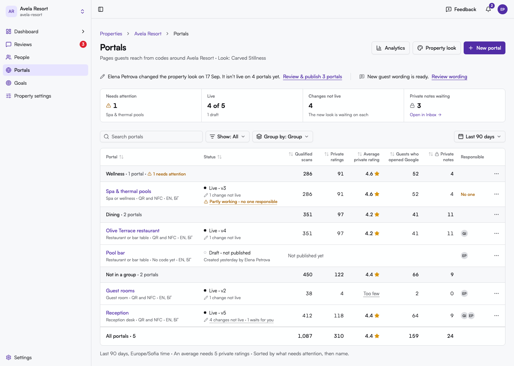        | 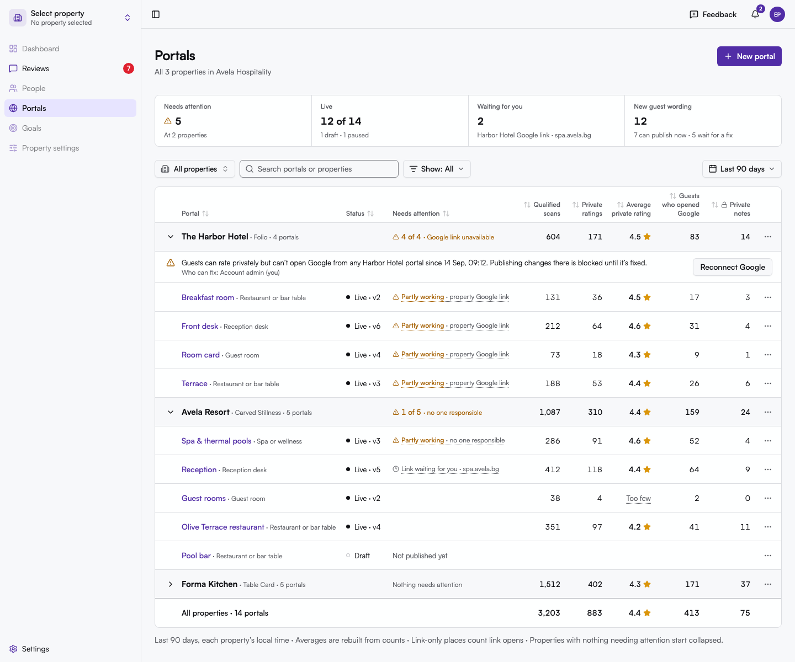              |
| 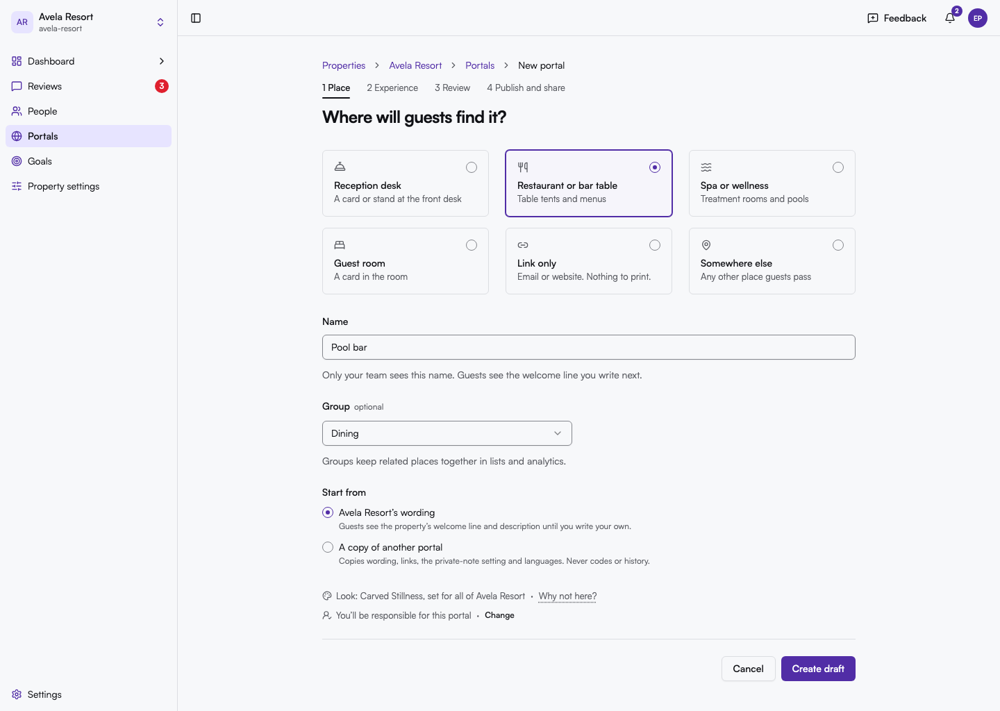      | 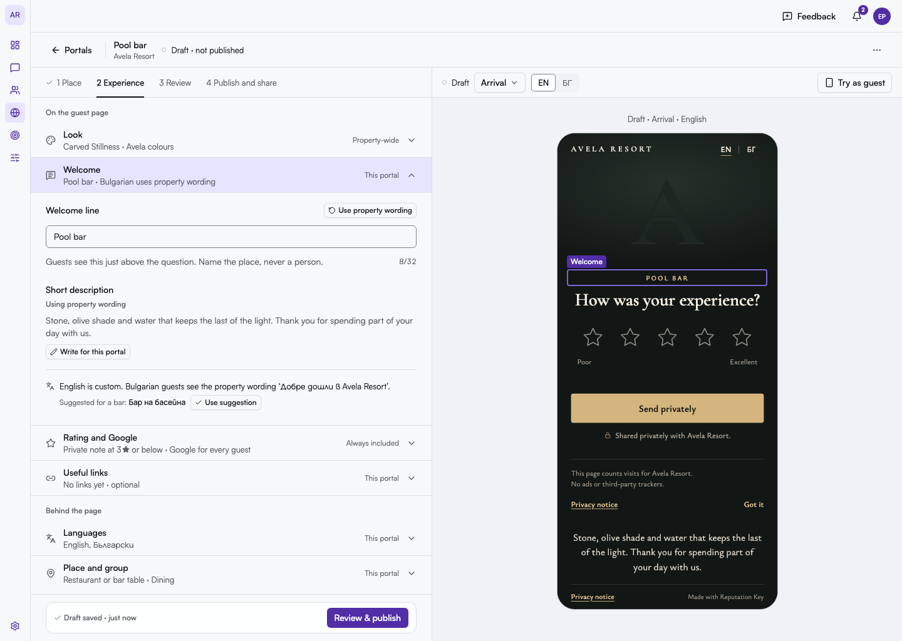      |
| 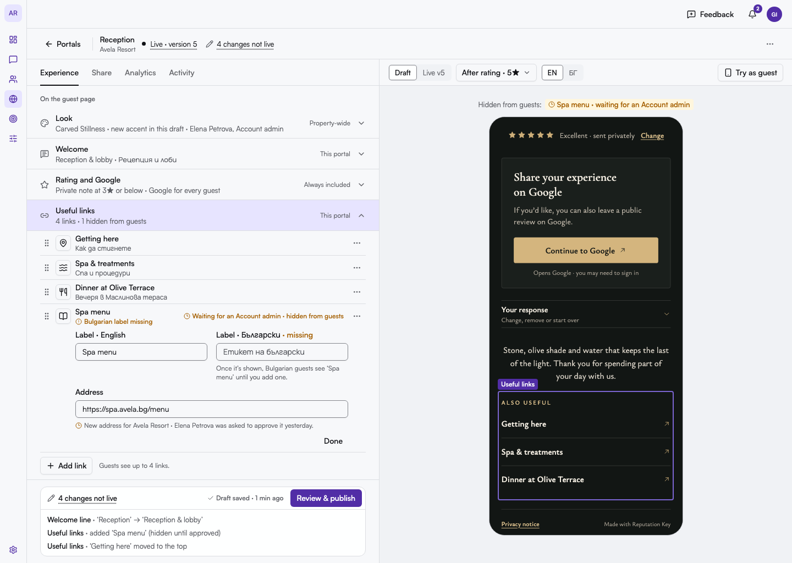 | 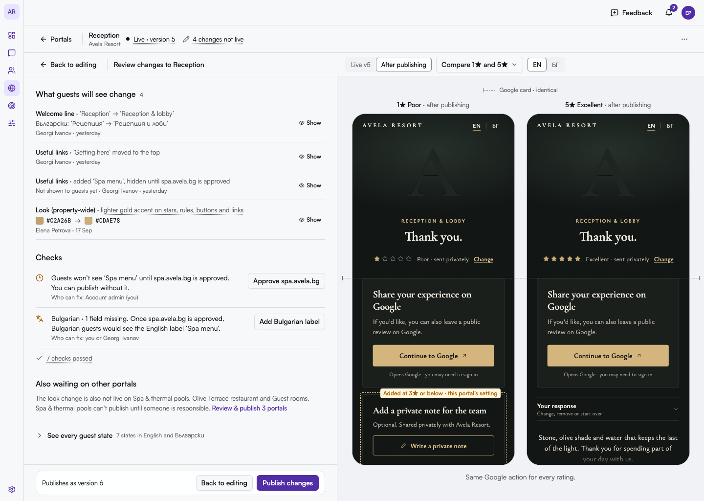                |
| 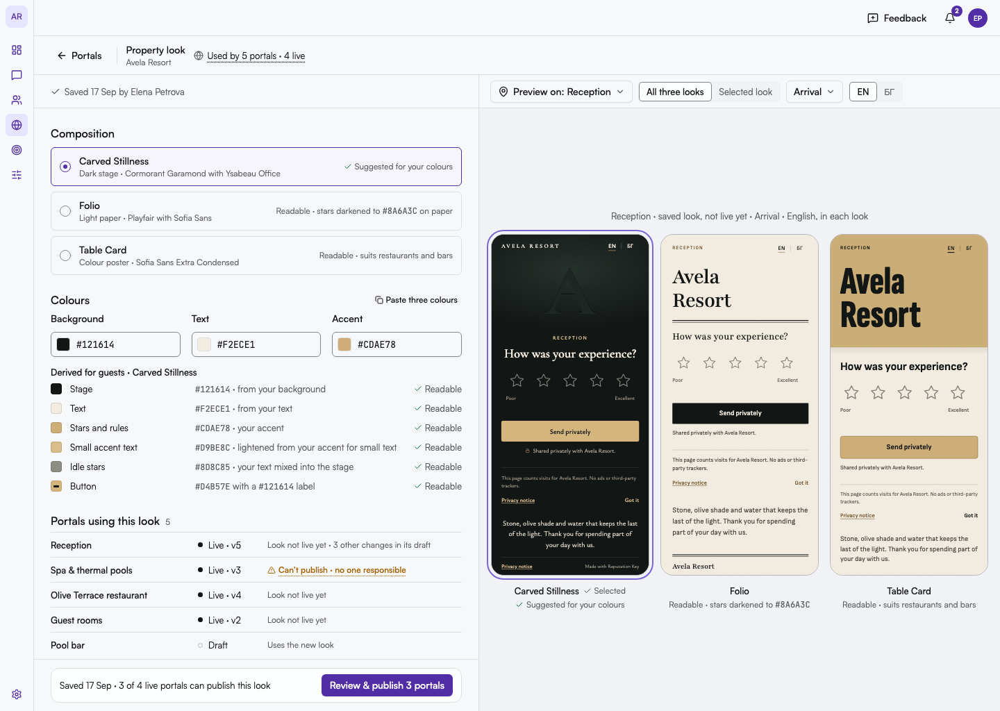              | 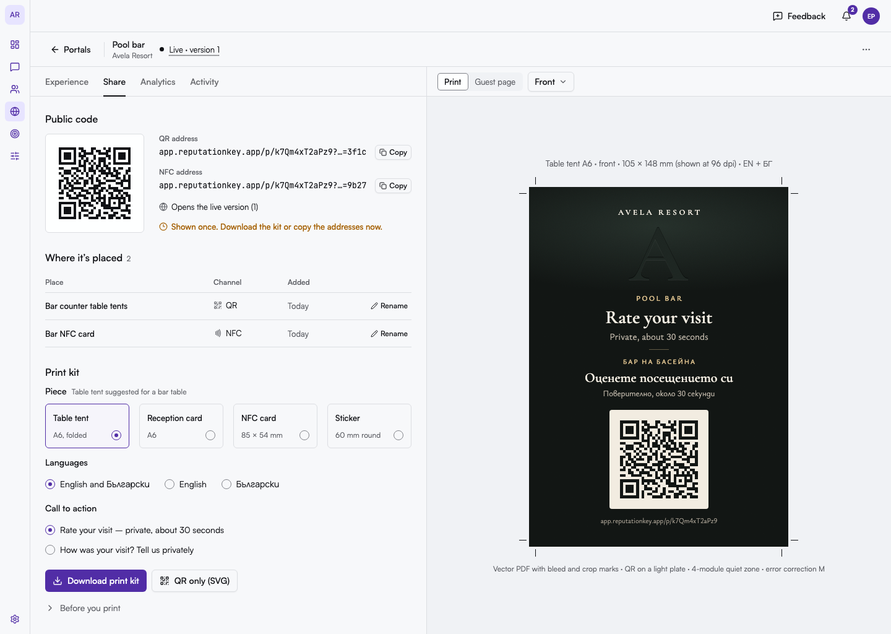                  |
| 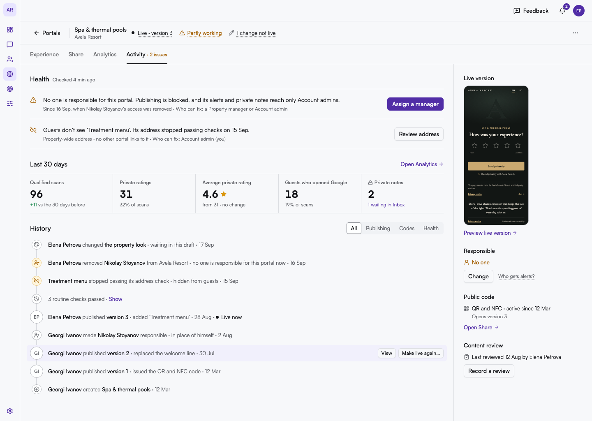        | 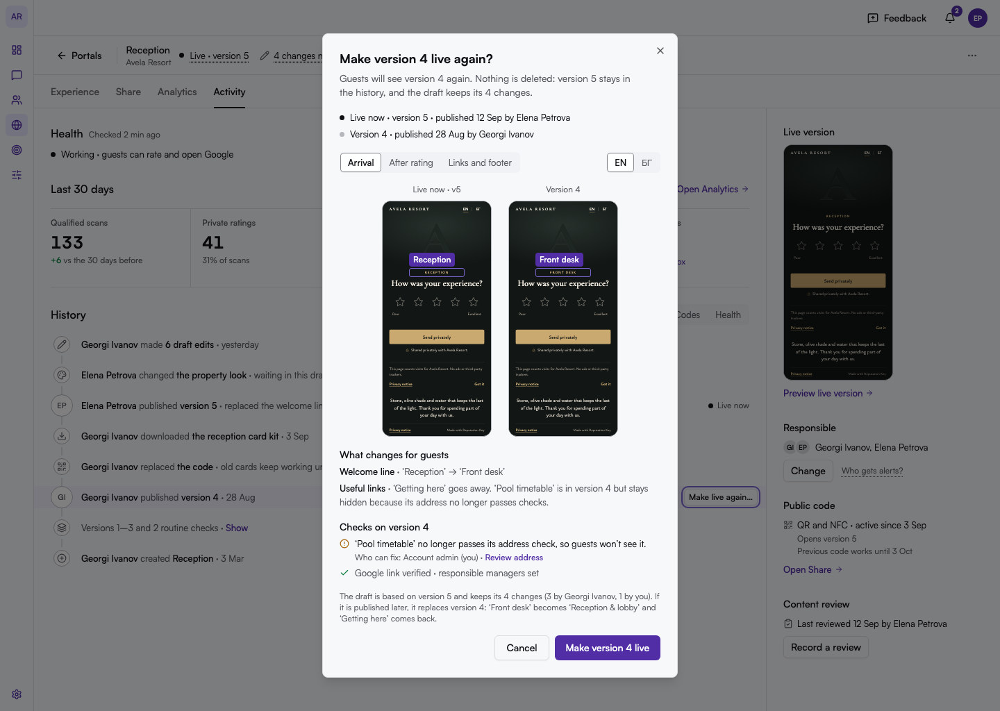 |
| 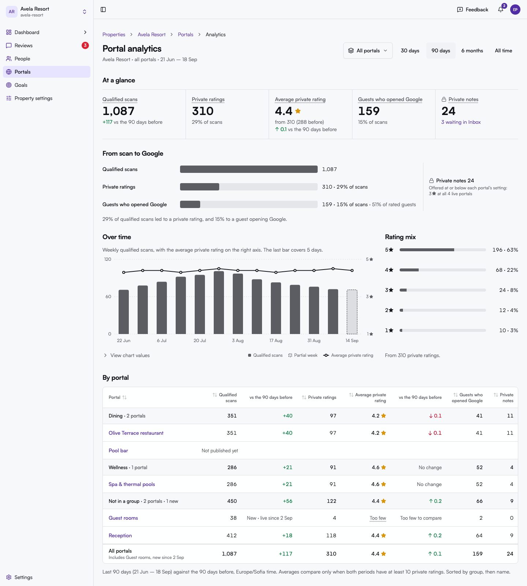  | 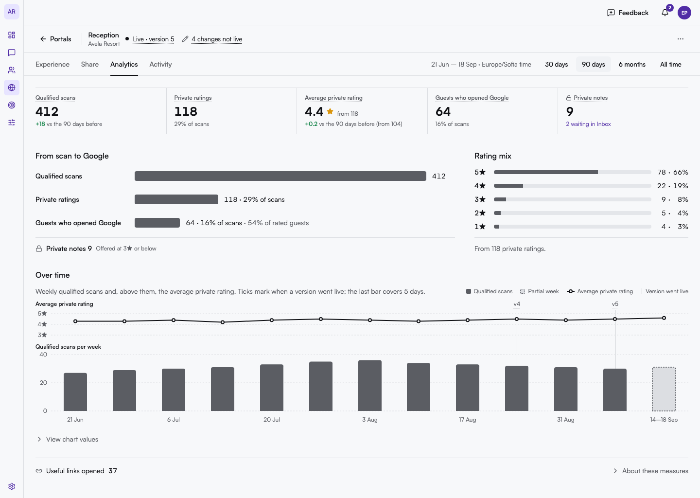            |
| 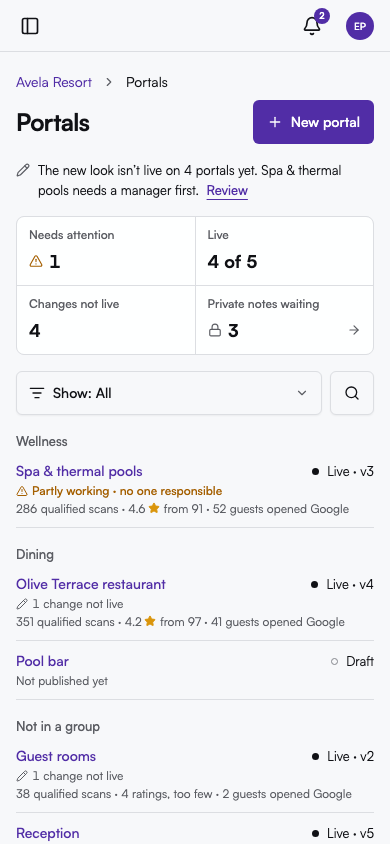            | 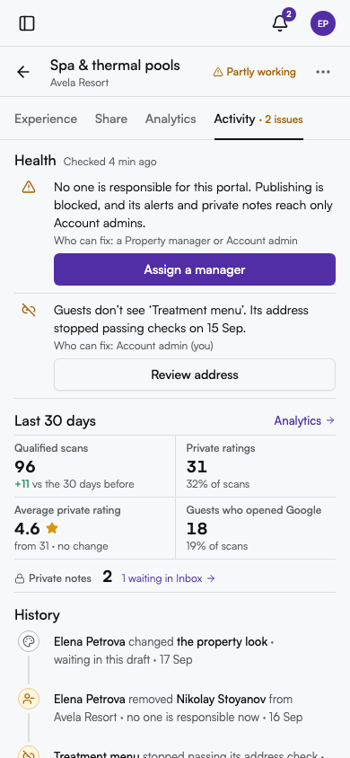           |

### A finding from building the boards: Bulgarian in the admin

Satoshi, the admin's font, has no Cyrillic. Today every Bulgarian string in the admin (link labels, welcome lines, "Български") silently falls back to the system font, which looks off next to Satoshi. The boards use **Manrope** as Satoshi's Cyrillic fallback (`'Satoshi', 'Manrope', system-ui`). The guest research verified that Manrope has Bulgarian letterforms, and it is close to Satoshi in proportion and colour. Recommended for the app: self-host a Cyrillic-only Manrope subset (`unicode-range`) behind Satoshi. It is a small change that fixes every bilingual admin screen, not just portals.

## Delivery phasing

Capabilities are classed as **A** (UI only, the server already supports it), **B** (new reads, no new domain rules) and **C** (new commands or model changes that need a product decision). The detail is in [capability-map.md](capability-map.md#gaps-the-redesign-will-need).

| Phase                            | What ships                                                                                                                                                                                                                                                                                        | Classes                |
| -------------------------------- | ------------------------------------------------------------------------------------------------------------------------------------------------------------------------------------------------------------------------------------------------------------------------------------------------- | ---------------------- |
| P1 · Honest overview and history | Portals overview and All properties with the batched list projection and health read; restore UI over `rollbackPortalPublication`; one checks model with who-can-fix; link approval shown in place; honest labels and the shared `?range=`; retire theme presets, the swatch and the purple badge | A1–A10, B1–B3, B9, B11 |
| P2 · The workspace               | Publish changes while live (C1, the hard gate: the workspace does not ship without it); preview through the `/p` renderer with a field-level diff; Try as guest; localized link labels and icons; Discard draft; place type and duplicate                                                         | C1, B4, C9, C3, C5     |
| P3 · Look and print              | Composition on the brand profile, the derived colour-role engine and the accent contrast gate; affected-portals read and batch publish; print kits and place names on codes; health reconciliation; `needs_admin` setup state                                                                     | C2, B5, C4, C7, C8     |
| P4 · Measures                    | Qualified scans in bounded windows; Guests who opened Google separated from link selections; property- and group-scope rating measures; dashboard attention chip and tile; notification templates that name the reason and fix                                                                    | B6, B7, A4             |

## Decisions for the owner

1. **Publish changes while live** (C1): approve the new command and its ADR (concurrency with property-wide changes, version numbering, a guard that stops a publish if the draft changed since review). The workspace waits for it.
2. **Undo after a restore**: allow making a _higher_ version live again? Without this rule change, restoring version 4 cannot be undone to version 5.
3. **Code re-download**: the beta keeps the address shown once and binds the print kit to the issue and replace moments. After the beta, decide whether Account admins and responsible managers may retrieve an encrypted token, with every retrieval in the ledger.
4. **Placements**: V1 names the existing QR and NFC artifacts. Several named codes per portal (one per table or room, which would also give per-placement and QR-versus-NFC figures) is a model change.
5. **Batch publish** after a property-wide look change or a new guest wording pack: one batch review with per-portal checks and opt-out, or one review per portal?
6. **A neutral default look** (Folio, #1E1C1A / #F6F2EA / #7A5C3E) and default property wording created at property setup, so a missing look never blocks a Property manager's first publish.
7. **Per-portal composition**: one look per property in the beta, or an allowed alternate (for example Table Card for a restaurant or bar portal at a hotel on Carved Stillness)?
8. **Property- and group-scope rating measures**: widen the `portal.rating` registry scope, or expose the goal metric query (monthly only).
9. **Admin test scans**: exclude signed-in admin sessions from qualified scans, or say in the print checklist that a test scan counts once.
10. **Unverified Google link**: while a property's Google link is unverified (including "refreshing"), nothing there can publish. Keep the rule, or allow wording-only fixes to publish?
11. **Permission mismatches**: relax link and category removal to `portal.update`, and let Property managers archive portals (the server already allows it).
12. **Org scope collapse**: collapse healthy properties from 3 properties (proposed) rather than 6.
13. **Later, not beta**: a weekly digest to responsible managers, CSV export, scheduled publishing, per-link analytics, "Copy look to another property".

## What was rejected, and why

- **Portal Desk as the frame.** An operator console for 10–200 portals (seven queues, a groups rail, keyboard triage) for properties that mostly have 1–5. It splits editing from operations and mixes scope with state in one rail. Its case pattern, restore semantics, dock change lines, Discard draft, publish guard, "Mine" filter, notification policy and phasing were kept.
- **Journey Studio as the frame.** Editing by guest state makes an occasional manager hunt for fields, and a state-first canvas can be read as a routing builder. Identity-first sequencing stalls Property managers. Its fairness pair, every-state contact sheet, the three looks side by side, the neutral default look and resume-through-review were kept.
- **Inside the winner**: "restored as version 7" and an Undo toast (they contradict `rollbackPortalPublication`); retrievable encrypted tokens as the beta recommendation (it weakens the hash-only token invariant); a landing tab that changes with health; percentage deltas on portal-sized counts.
- **Never**: uptime percentages (RepKey does not probe portals), Google opens split by star, staff/shift/person dimensions, ranks or "top property" copy, a second alert threshold beside the private-note setting, per-portal colour pickers and theme presets, photo slots in previews while uploads are blocked.
