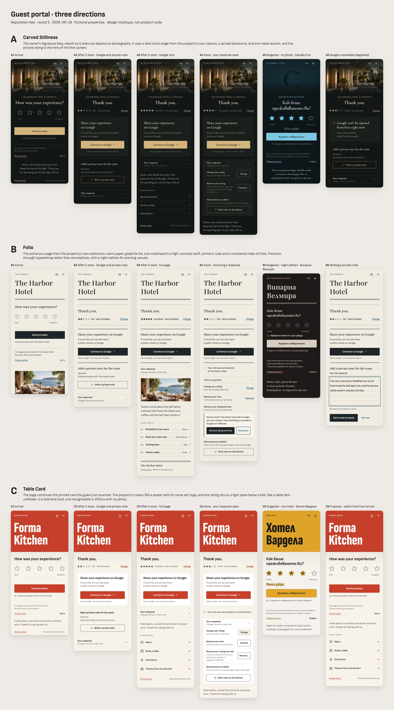

# Guest portal, round 3: research and three directions

Date: 2026-09-19. Branch: `ux/portal-redesign`. Design only; no product code.

Canvas: [Guest Portal Directions](https://claude.ai/artifact/XJc13AbPKbxZZgcL6AuuT9), one row of phone boards per direction. Nothing here is an approved product decision; behaviour changes are marked as proposals. The admin pages (creation, management, analytics and monitoring) come next. Their research notes are under "Admin implications" in [research.md](research.md#admin-implications).

Files in this folder:

- `README.md` — this summary.
- [briefs.md](briefs.md) — the full build brief per direction: type, palette, layout, rating control, every board's spec, guards and shared rules.
- [research.md](research.md) — Ratestar findings, pattern library, policy rules, competitors, today's guest portal, admin implications.
- `research.json` — the raw output of every research agent, with sources and evidence labels.
- `overview.jpg` and `boards/` — screenshots of the 18 boards (390 CSS px at 2x).
- `canvas/` — the board sources (`.dc.html`), the per-direction component references and the shared rules the boards were built from.

Rounds 1 and 2 (2026-09-14, image-generated concepts) are in [../README.md](../README.md) and [../admin-round-2.md](../admin-round-2.md). The owner picked **Signature Stay** in round 1. Direction A is that choice, rebuilt so it no longer depends on photography.

## How this was produced

1. Seven research agents ran in parallel: the current codebase; Ratestar (its live portals and shipped JavaScript); review-collection SaaS; hospitality guest apps and surveys; restaurant and in-venue tools; rating-UX patterns and aesthetics; and review-solicitation policy. A completeness critic then sent three follow-ups: Bulgarian Cyrillic type, real brand inputs, and the analytics notice.
2. A synthesis produced a pattern library and six candidate directions. Three judges scored them, one each for guest and brand, product truth and feasibility, and buyer and market. All three picked the same three directions.
3. A design director wrote the build briefs. Designers built six boards per direction, and three reviewers per direction (product truth, accessibility, craft) sent findings back for a revision pass.

## Executive summary

_In this summary C1–C6 number the six candidate directions. The boards use A, B and C for the three chosen directions._

RepKey can take a position no competitor in the Bulgarian/EU hospitality market holds: a guest page as beautiful as the property's own printed stationery that is also provably fair. The research covers Ratestar's live portals and its shipped JavaScript, about 14 review SaaS tools, about 14 hospitality guest apps and survey suites, about 17 restaurant and link-hub tools, primary UX and policy sources, and three gap studies (Bulgarian Cyrillic type, real BG brand palettes, the analytics notice). It converges on six findings.

(1) Premium in this category is bought with photography and video. No competitor has a designed no-photo state: Ratestar shows black boxes when images fail, and TrustYou's default is a plain form. RepKey's upload block (SAFE-01) turns into an advantage if every direction is type-, colour- and texture-led first and photo-ready second.

(2) Review gating is the industry default, often sold as a headline feature. Ratestar auto-redirects ratings above 3 stars to the platform after 200ms, despite marketing that says it doesn't gate. me&u, Canary, Akia, Touch Stay, Tablein and sunday gate by score, and so does a TrustYou toggle. Google's Maps policy, FTC Example 11, EU UCPD 23c and its Guidance, Bulgarian consumer law (ЗЗП чл. 68ж), UK DMCC Sch. 20, CMA208 and Tripadvisor's identical-UI rule all condemn selective solicitation. RepKey's score-invariant Google card is compliance, a sales argument ('the version that cannot get your Google profile flagged') and a visual design rule at once.

(3) The winning first screen is identity plus one question with five large empty stars, visible word anchors, an explicit submit, and a one-line privacy promise at the action. There is no gate, no overlay, no video and no platform grid.

(4) Bulgarian is a design constraint, not a translation. Satoshi has zero Cyrillic, and most 'premium' serifs (Playfair Display, EB Garamond, Prata, Forum) show Russian letterforms to Bulgarian readers. The verified shortlist with Bulgarian forms is Cormorant Garamond, Playfair 2, Ysabeau, Source Serif 4, Lora, Sofia Sans, Manrope and Commissioner, self-hosted. BG labels render up to 1.6x wider than EN.

(5) On brand inputs, real BG property palettes pass text/background contrast at 15 to 21:1. But their primaries fail as stars or accent text on a light stage for 6 of 15 inputs, while gold, tan and orange brands pass on a dark stage. The real design choice is polarity per brand plus derived colour roles, not a set of preset themes.

(6) Guest copy must be honest: 'Opens Google, you may need to sign in', never 'Thanks for your review'.

The six candidates below share one invariant rating core: the same star geometry, the same Google card for every score, the private-note card added below it at or under the threshold, a one-line receipt with Change, and a quiet 'Your response' area. They differ in structure and visual system:

- C1 Carved Stillness: Signature Stay evolved; dark tonal cover, carved serif, grain.
- C2 Folio: editorial paper page with an index of links.
- C3 Table Card: brand colour-field poster with a light rating plate, continuous with print.
- C4 Pass: placement card object with a tear-off receipt.
- C5 One Thing at a Time: thumb-zone steps with pure type.
- C6 Window: place pattern seen through an architectural frame that later holds a photo.

Recommendation: prototype C1 (default for hotels and spas), C3 (restaurants and loud brands) and C2 (light boutique, and the polarity twin C1 needs for deep brand colours) as a curated beta family over one shared component. Keep C4 to C6 as alternates.

Separately from the redesign, fix the defects in today's guest page:

- The selected star has no visual state.
- Manager policy copy is shown to guests.
- The app's dark theme leaks into /p.
- Deadlines are shown in UTC with no zone label.
- The fixed analytics bar covers the submit button.
- Primary colour contrast is never enforced at publish.
- The admin preview does not render what guests actually see.

## The three directions

|                                          | A. Carved Stillness                                                                                                                                                                                                                    | B. Folio                                                                                                                                                                                                                                                              | C. Table Card                                                                                                                                                                                                                                                          |
| ---------------------------------------- | -------------------------------------------------------------------------------------------------------------------------------------------------------------------------------------------------------------------------------------- | --------------------------------------------------------------------------------------------------------------------------------------------------------------------------------------------------------------------------------------------------------------------- | ---------------------------------------------------------------------------------------------------------------------------------------------------------------------------------------------------------------------------------------------------------------------- |
| In one line                              | The owner's Signature Stay, rebuilt so it does not depend on photography. It uses a dark tonal stage from the property's own colours, a carved Garamond, and one metal accent, and the private rating is the hero of the first screen. | The portal as a page from the property's own stationery: warm paper, graphite ink, one masthead in a high-contrast serif, printer's rules and a numbered index of links. Premium through typesetting rather than atmosphere, with a night edition for evening venues. | The page continues the printed card the guest just scanned. The property's colour fills a poster with its name set huge, and the rating sits on a light plate below a fold, like a table tent unfolded. It is bold and local, and recognisable in 200ms with no photo. |
| Demo property                            | Avela Resort (brand flex: Сарива Спа)                                                                                                                                                                                                  | The Harbor Hotel (brand flex: Винарна Велмира)                                                                                                                                                                                                                        | Forma Kitchen (brand flex: Хотел Вардела)                                                                                                                                                                                                                              |
| Type                                     | Cormorant Garamond + Ysabeau Office                                                                                                                                                                                                    | Playfair: the 2023 'Playfair 2' family, listed as 'Playfair' on Google Fonts, NOT Playfair Display, which lacks Bulgarian forms + Sofia Sans                                                                                                                          | Sofia Sans Extra Condensed 800, used only for the wordmark and the chosen-word caption + Sofia Sans                                                                                                                                                                    |
| Judges' total (of 30)                    | 22.5                                                                                                                                                                                                                                   | 21                                                                                                                                                                                                                                                                    | 21                                                                                                                                                                                                                                                                     |
| Structure                                | Centred column under a 232px atmosphere band; the page transforms in place after rating.                                                                                                                                               | Flush-left editorial column (28/24 margins) held together by printer's rules: masthead, stub, double-ruled panel, index, colophon.                                                                                                                                    | Poster (0–280) over a light plate joined by a card-stock fold; only the plate changes state.                                                                                                                                                                           |
| First-screen focus (390x844, EN / BG)    | Only identity, band and placement sit above the question. Submit bottom 514 / 552.                                                                                                                                                     | Masthead (56px wordmark) above the question. Submit bottom 470 / 502. The most headroom.                                                                                                                                                                              | Poster and wordmark above the question. Submit bottom 556 / 588. The tightest of the three, so the auto-fit poster cap matters.                                                                                                                                        |
| Polarity                                 | Dark ink stage only; brands that cannot reach 3:1 on dark are routed to B.                                                                                                                                                             | Light paper by default, plus a night edition for evening venues.                                                                                                                                                                                                      | Brand colour field over a light plate; black or white poster text chosen automatically.                                                                                                                                                                                |
| Identity carrier with no photo           | Tonal field from the brand plus the property's initial carved tone-on-tone; spaced-caps wordmark.                                                                                                                                      | Typesetting: two-line serif masthead, Oxford rule, numbered index with leaders.                                                                                                                                                                                       | The brand colour itself plus a 96px extra-condensed wordmark.                                                                                                                                                                                                          |
| Typography (Google Fonts, Cyrillic-safe) | Cormorant Garamond 600 / 500 italic with Ysabeau Office 400/600 (same designer).                                                                                                                                                       | Playfair (2) 400–600 with optical sizing, plus Sofia Sans 400/600.                                                                                                                                                                                                    | Sofia Sans Extra Condensed 800 plus Sofia Sans 400/600/700 (one Bulgarian superfamily).                                                                                                                                                                                |
| No-photo strength                        | Good now that the carved initial replaces the gradient blob. The weakest of the three for memorability; shown in A5.                                                                                                                   | Strongest: finished on day one and designed around type. Shown in B2, B4, B5 and B6.                                                                                                                                                                                  | Strong and instantly recognisable; no C board uses a photo.                                                                                                                                                                                                            |
| Photo slot                               | Full-bleed band, 390x232, with scrims; text only on the 82% top scrim.                                                                                                                                                                 | Column-width figure (338x156) below the rating; never full-bleed.                                                                                                                                                                                                     | Future duotone inside the poster; not drawn this round.                                                                                                                                                                                                                |
| Links strategy                           | Hairline rows, label plus arrow, at most 3–4; quiet luxury.                                                                                                                                                                            | Numbered index ('01 … ··· Menu ↗') using admin category titles; relies on localized labels.                                                                                                                                                                           | 60px icon rows from a curated iconKey set; the proposal (C6) puts them under the rating from arrival.                                                                                                                                                                  |
| Receipt metaphor and motion              | The settle: stars condense into a one-line receipt (280ms View Transition); cards rise 8px.                                                                                                                                            | The stub between perforated rules (perforation draws in 300ms); no timestamp.                                                                                                                                                                                         | Plain receipt row on the plate; 200ms crossfade; poster static.                                                                                                                                                                                                        |
| Google action treatment                  | Raised ink card with a champagne button at y394–658, identical for 1–5.                                                                                                                                                                | Double-ruled panel with a graphite button at y402–633, identical for 1–5.                                                                                                                                                                                             | White card with a brand-colour button at y424–644, identical for 1–5.                                                                                                                                                                                                  |
| Best-fit properties                      | Resorts, spa and thermal hotels, mountain lodges, fine dining; gold, bronze, tan, thermal-blue or sage brands.                                                                                                                         | Boutique and design hotels, B&Bs, guesthouses, wine bars, cafés; deep or monochrome brands; the neutral default palette; evening venues via the night edition.                                                                                                        | Restaurants, bars, grills, food halls, city and lifestyle hotels, pool-bar placements; loud or saturated brands.                                                                                                                                                       |
| Poor fit                                 | Deep red, purple or black brands (routed to B); casual bistros feel overdressed.                                                                                                                                                       | Owners who want a big photo hero; very long unlocalized link labels.                                                                                                                                                                                                  | Calm luxury hotels; night-time glare with saturated fields; monochrome brands look severe.                                                                                                                                                                             |
| Beta feasibility                         | High: uses only today's data, plus derived colour roles, font self-hosting, pack v2 and the carved-initial helper.                                                                                                                     | High, though the index works best with localized labels (new schema and admin field); rules and leaders are plain CSS.                                                                                                                                                | Medium-high: needs wordmark auto-fit, the iconKey enum and picker, and print templates; its best form needs links from arrival.                                                                                                                                        |
| Main risk and mitigation                 | Two gold properties look alike, and it reads as generic spa. Mitigate with the carved initial, the placement line and the owner's own photo slot.                                                                                      | May read as 'a typeset form'. Mitigate with the 56px masthead, the index, the night edition and a paper tone for white brands.                                                                                                                                        | Delivery-app or Linktree look. Mitigate with the flat fold (no sheet or shadow), the as-entered wordmark, no sublines and at most 4 rows.                                                                                                                              |

### A. Carved Stillness

This direction has the highest total (22.5). The truth judge ranked it first as the best balance of premium and buildable, it is the kindest to a night-time scan, and it continues the direction the owner already chose.

All three judges named the no-photo band ('radial gradient plus grain plus optional monogram') as its weak point. It is replaced by a mandatory carved initial: the first letter of displayName, set in the display serif at 176px and debossed into the tonal field. It is specific to each property, works in Latin and Cyrillic, needs no uploads and no pattern library, and literally delivers the 'carved' in the name.

Other changes:

- The light-stage twin is removed. Brands whose accent cannot reach 3:1 on dark are routed to Folio, so the family stays distinct.
- 'Send privately' fixes Signature Stay's misleading 'Share my rating'.
- Endpoint words and an italic caption word replace the digit labels.

**Trade-off.** - **Brand fit:** this only suits brands whose accent reaches 3:1 on dark (gold, bronze, tan, thermal blue, sage). Deep, red and near-black brands must use Folio, and admins need to be told that the stage follows their brand.

- **Looking alike:** two gold properties will look similar, differing only in initial, name and photo.
- **Genre:** Cormorant is a familiar spa face.
- **Payload:** the heaviest fonts of the three (about 95KB self-hosted with unicode-range splits).
- **First screen:** tight on a 375x667 phone with a two-line Bulgarian question, so the measured gate is mandatory.

Boards: `A1-arrival` (Arrival · EN); `A2-after-low` (After rating · 2 stars (Fair)); `A3-after-high` (After rating · 5 stars (Excellent)); `A4-done` (Done · 4 stars (Very good)); `A5-flex-bg-no-photo` (Brand flex · Bulgarian (lang=bg)); `A6-google-unavailable` (After rating · 3 stars (Good))

### B. Folio

The guest judge ranked it highest (7.5): it has the strongest no-photo answer, and it is the only direction credible for both a boutique hotel and a bistro or wine bar. The truth and market judges keep it as the necessary light twin that deep and monochrome brands need (oxblood, purple, olive-grey on cream all pass here and fail on dark). It is also where the neutral hospitality default palette lands.

Judges' fixes applied:

- No numerals under the stars.
- The wordmark (56px) and question (26px) clearly differ, so there is one serif moment.
- The submit is full-width.
- The stub carries no timestamp.
- A night edition exists for evening placements.
- It keeps its paper and flush-left identity so it never collapses into A's light stage.

**Trade-off.** - **Owner perception:** owners expecting a 'wow' photo may read it as a beautifully typeset document. The masthead has to be generous.

- **Links depend on data:** the index shines only with localized link labels and category titles (a new capability). With today's single-string labels a BG guest can see mixed-language rows.
- **Unfamiliar layout:** flush-left is less familiar than centred pages in this market.
- **White brands:** white-background brands need the paper tone, or they look cold.
- **Night edition:** it is a second colourway to QA.

Boards: `B1-arrival` (Arrival · EN); `B2-after-low` (After rating · 2 stars (Fair)); `B3-after-high` (After rating · 5 stars (Excellent)); `B4-done` (Done · 2 stars (Fair)); `B5-flex-bg-night` (Brand flex · Bulgarian (lang=bg)); `B6-note-writing` (After a 2-star rating · private note composer expanded with guest text)

### C. Table Card

This is the only strong answer for restaurants, bars, grills, city and lifestyle hotels and loud brands, roughly half the buyers. All three judges put it in the best three, and it is the direction that beats Ratestar most visibly without photography.

Print-to-screen continuity (the table tent and the page share one composition) is a concrete sales tool. It needs only three hex values and displayName, set in one Bulgarian-designed superfamily.

Judges' fixes applied:

- The Wolt/Glovo bottom sheet is removed: no 24px overlap radius, no soft shadow. Instead there is a flat crease with a 16px fold shade, like folded card stock.
- The wordmark is set as entered, never forced to lowercase.
- Link rows carry no fact-like sublines and no tel: links.
- Errors never use red, because red can be the brand.
- The derived plate accent is shown openly (C5), so owners see why their stars are darker than their poster.

**Trade-off.** - **Fit:** too loud for calm luxury hotels; hotels will mostly use it for pool-bar and restaurant placements.

- **Colour:** a saturated field can glare at night. The derived plate accent is visibly darker than the brand colour for light brands such as orange, gold and ochre. Monochrome brands get a severe black poster.
- **Engineering:** wordmark auto-fit for Latin and Cyrillic names up to 120 characters is real algorithm and visual-QA work. iconKey needs a curated enum and a picker.
- **Links:** the concept is strongest with links from arrival (C6), which is a contract change.
- **Photos:** no photos are shown this round.

Boards: `C1-arrival` (Arrival · EN); `C2-after-low` (After rating · 2 stars (Fair)); `C3-after-high` (After rating · 5 stars (Excellent)); `C4-done` (Done · 3 stars (Good)); `C5-flex-bg-city-hotel` (Brand flex · Bulgarian (lang=bg)); `C6-links-from-arrival-proposal` (PROPOSAL (not current behaviour) · arrival)

### Why these three

Chosen: Carved Stillness (C1, 22.5 total: guest 7, truth 8, market 7.5), Folio (C2, 21: 7.5 / 7 / 6.5) and Table Card (C3, 21: 7 / 7 / 7). The runners-up scored Window 17.5, Pass 16.5 and One Thing at a Time 16. All three judges independently named these same three as the best distinct set.

The three differ on four axes at once:

- **Polarity:** a dark ink stage, light paper, or a brand colour field over a light plate.
- **Composition:** a centred stage under an atmosphere band, a flush-left editorial column, or a poster over a plate joined by a fold.
- **Identity carrier:** atmosphere (a photo, or the property's initial carved into the stage), typesetting (masthead, printer's rules, a numbered index), or colour plus a giant wordmark.
- **Type voice:** Garamond with its companion humanist sans, a high-contrast transitional serif with a Bulgarian grotesque, or an extra-condensed Bulgarian grotesque used alone.

Together they cover resorts and spas, boutique hotels and evening venues, and restaurants, bars and loud brands. Every brand hex has a home without adding colour pickers.

**What was taken from the runners-up:**

- **Window:** its idea of 'place without photography' became A's carved initial. This is typographic, derived from displayName and needs no pattern library. Window's contour patterns remain a possible post-beta layer for A's band.
- **Pass:** its placement line became every direction's h1 (the portal's localized title). Its rule of 'no guest name, room or booking' became a shared guard.
- **One Thing at a Time:** its thumb-zone discipline and large caption word became the reserved caption slot in every rating block and the measured submit gate.
- **Folio's perforated stub** stays in Folio only, so each direction has exactly one receipt metaphor. Pass's tear is dropped.

**Judges' fixes applied:**

- **A:** replaces the 'gradient blob' band with the carved initial. It gives up its own light stage: brands that cannot carry a dark stage go to Folio, which is what the truth judge asked for.
- **B:** drops the numerals under the stars, separates wordmark (56px) and question (26px) sizes, makes the submit full-width, removes the submission timestamp from the stub, and gains a night edition for evening venues.
- **C:** drops the 24px bottom-sheet radius, the soft shadow and the forced lowercase in favour of a flat fold like a table tent. It removes fact-like link sublines and any tel: link.

**Truth fixes adopted by all three:**

- The note button reads 'Send note privately', which is different from 'Send privately'.
- The privacy line reads 'Shared privately with {name}.' rather than claiming no one else can see it.
- 'No ads or third-party trackers' is subject to counsel sign-off.
- The drawn baseline keeps links after the rating. Links from arrival appears only as a labelled proposal (C6).

Runners-up:

- **Pass (placement card)** (16.5 of 30): Give the guest one object instead of a web page: a pass for this place, like a key card or a boarding pass. It carries the placement ('Spa · Reception'), the property and the rating. After rating, a stub tears off the pass and becomes the receipt. Modern and calm, with product-grade depth, and honest about where the guest is without pretending to know who they are.
- **One Thing at a Time (thumb-zone steps)** (16 of 30): Each moment gets the whole screen and one decision. Very large type sets the question high on the screen; the thumb zone holds the stars and one button. Nothing competes, so a guest at the reception desk or leaving a café finishes in two taps. Swiss restraint rather than hospitality decoration.
- **Window (place pattern in a frame)** (17.5 of 30): Replace missing photography with a sense of place drawn as pattern. Each property picks a pattern family (mountain contours, sea lines, geometric weave, ink marbling, vineyard rows, carved stone) tinted by its own colours and seen through one architectural frame. The same frame later holds an owned photo and surrounds the QR code on print, so the no-photo and photo versions are one design.

## Recommendation

**Build the three board sets as one family: one shared rating core and one language pack, three compositions.** Nothing guests read differs between them, only how it looks.

**Recommended beta: ship Carved Stillness and Folio together as the default pair**, picked automatically by polarity:

- Carved Stillness when the brand's derived accent reaches 3:1 against its text colour.
- Folio otherwise, with Folio's night edition for evening placements.

This pair covers every brand hex without new colour pickers, keeps the owner's Signature Stay lineage, and gives deep and monochrome brands a page that flatters them. **Add Table Card as the second composition for restaurants, bars and loud brands** once wordmark auto-fit and the curated iconKey set exist. It is the strongest restaurant demo against Ratestar.

**Before any direction is called done:**

1. Measure the arrival gate at 375x667 with Safari toolbars (submit at or below 548px) and at 320px width, in EN and BG, with a 35+ character name.
2. Replace the #2563EB (Brand Profile) and #6366F1 (Portal) defaults with one neutral hospitality default: text #1E1C1A, background #F6F2EA, primary #7A5C3E. It passes at 5.5:1 and lands on Folio.
3. Have a native speaker review every BG string, including the с / със preposition rule in 'Споделя се поверително с/със {name}'.
4. Get counsel sign-off on 'No ads or third-party trackers' and on removing the sessionStorage marker that the inline analytics region depends on.
5. Decide links-from-arrival using C6 as the evidence. It needs a BETA.md / ADR 0044 reconciliation and an e2e change.
6. Ship all new copy as one guest-ui v2 pack with the e2e accessible-name renames ('Send privately', 'Send note privately').

**Fix today's defects regardless of which direction wins:**

- The selected star has no visible state.
- Manager policy copy is shown to guests.
- The app's dark theme leaks into /p.
- Deadlines show in UTC with no zone label.
- The fixed analytics bar covers the submit button.
- The primary colour is never contrast-checked at publish.
- The admin preview does not render what guests see.

## Review and polish

Each direction went through three reviews that read the board sources (product truth, accessibility, craft). A revision pass followed, then a polish pass by an art director who worked from the rendered screenshots. All 18 boards pass the structural checks: fixed size, nothing clipped, no horizontal overflow, no console errors.

| Direction           | Product truth | Accessibility | Craft | Findings (high / medium) |
| ------------------- | ------------- | ------------- | ----- | ------------------------ |
| A. Carved Stillness | 8.5           | 7.5           | 7     | 41 (5 / 13)              |
| B. Folio            | 8.5           | 7.5           | 7.5   | 44 (1 / 18)              |
| C. Table Card       | 8             | 7             | 7.5   | 42 (5 / 19)              |

Scores are out of 10 and were given before the revision.

### Decided during review

- **One Google card.** In each direction the Google card is byte-identical, at the same position, on the after-low, after-high and done boards. The reviewers checked this by hash. Nothing on the card depends on the score.
- **No brand-coloured stars beside Google.** Filled receipt stars use a neutral colour (Stone in A, espresso in C), so no gold or tomato stars sit next to "Continue to Google". Google's brand guidance says not to add stars by the Google name.
- **Carved initial.** The rule is "first letter of the display name". A name that starts with a generic word gives a useless letter ("Хотел …" gives Х), so the Bulgarian demo property is called "Сарива Спа". Skipping a leading generic word (Хотел, Hotel, Resort, Spa, Къща за гости) would need a product decision.
- **Glossary amendments.**
  - The Google-unavailable body reads "Your rating reached {name} privately.", with no second thank-you.
  - Every deadline carries its time zone: "Until 14:32 tomorrow, Sofia time."
- **The C5 arrival shows 4 of 5 stars selected.** An arrival board should never look like a pre-filled five-star lockup.
- **Narrow screens.** Every board reflows down to 320 px, with fluid widths and a clamped star gap. On the 390×844 arrival boards the submit button's bottom edge is at 514 px (A1) and 552 px (A5), and B1 and C1 are also above the 640 px gate. Hover styles apply only on pointer devices.

### Still to settle before implementation

- **Radio pattern.**
  - A lays an invisible, full-size radio over each 56 px star cell, so touch screen readers land on the radio itself.
  - B and C use visually hidden radios with visible labels.
  - Both are accessible. Production should use one; A's is the stronger choice.
- **Bulgarian accessible names.**
  - The shared rules keep the English name "Portal analytics information" for the analytics region because an e2e helper pins it.
  - A5 already uses a Bulgarian name.
  - Production should translate it and update the helper.
- **Fonts.** The boards load Google Fonts because the canvas only allows that host. "No ads or third-party trackers" is true only if production self-hosts the fonts, as the proposals say.
- **Not drawn yet:**
  - A Bulgarian after-rating board.
  - Google-unavailable boards for B and C.
  - Save-failed states (only B5 shows a validation error).
  - The note composer in A and C.
  - The unavailable-portal page.
  - Real 320 px renders.
  - A with its no-photo band on the after-rating boards.

The `.dc.html` files in `canvas/` are design files for the canvas runtime, not production components.

## What every direction keeps

- The first screen shows the property identity, one question, five large empty stars with word labels at each end, and an explicit **Send privately** button. There is no gate, splash, video or platform grid.
- After rating, the Google card is the same for every score: same copy, size, position, colour and motion. It shows no stars and no Google logo. A private note is offered below it at 3 stars or fewer.
- The copy is honest. The page never thanks the guest for a review, because it cannot know one was written. Before leaving for Google it says "you may need to sign in". The privacy promise sits next to the button.
- Each direction is finished without a photo and has a slot for owned photography later (uploads are safety-blocked in the beta).
- Bulgarian gets fonts with real Bulgarian letterforms and gets full content, not just translated interface text.
- Change, remove and start over sit behind a quiet "Your response" disclosure rather than in a console of guest rights.

## Open questions for the owner

The research surfaced these. Each would change a product rule, so none of the boards assumes an answer:

- Should the Google action be reachable without first giving the private rating (e.g. a quiet 'Go straight to Google' link on arrival)? FTC Example 11 and Google allow a rating-first flow when everyone is invited. Making the rating optional before Google would remove the remaining appearance of pre-screening. This would change a product rule, so the owner decides.
- Should optional private written feedback be offered to every score in the same position, instead of only at or below the threshold? That would make the post-rating screen identical for all scores. It satisfies Tripadvisor's 'must be identical' rule, removes the only score-dependent difference, and avoids the CMA 4.4–4.5 perception of diverting unhappy guests. The threshold could then drive only internal alerting, not guest UI. This changes the Private Feedback Threshold's guest-facing meaning in docs/BETA.md.
- Google branding: may RepKey, as a vendor, render Google's official G mark on customer portals under the Partner Marketing Hub 'Customer reviews' guidance, which is written for the business itself? Or should the beta use a text-only 'Google' label until Google confirms? The Partner Marketing Hub brand terms say use of brand features requires approval.
- Should the portal ever show the property's rating on Google (e.g. '4.6 on Google, as of <date>')? The recommendation for beta is no. Showing it triggers UCPD Art 7(6), ЗЗП чл. 68е ал. 7 and DMCC 'consumer review information' duties, and it adds social-proof pressure.
- Photo source: confirm with Google, through the existing policy correspondence in docs/external/google, whether GBP Media API content may be shown on the owner's own feedback page. The default assumption is no. The alternative is property-supplied originals with a rights attestation once image upload is unblocked.
- EAA scope: counsel should confirm per customer whether any portal links into an embedded booking or ordering flow that RepKey hosts. That would make those pages e-commerce services under Directive 2019/882 and the Bulgarian law.
- UK: if UK customers are planned, the DMCC Sch 20 para 13(4) 'offering services to traders' exposure means gating must remain technically impossible in RepKey, not merely discouraged.
- Watch item: the EU Digital Fairness Act proposal (expected around 2026) may add dark-pattern and review rules. Re-check before general availability.
- Bulgarian copy: a native-speaker legal or copy review of the BG strings for neutrality, e.g. avoiding imperatives like 'Оценете ни с 5 звезди' ('Rate us 5 stars') and any wording that implies a reward or pressure.
- Android 17 NFC 'open link' notification behaviour and iOS background reading should be verified on real devices before printing NFC cards, because the printed instructions depend on it.
- Useful links before rating (board C6) is a proposal. Today the links appear only after the guest rates.
- The analytics notice becomes an inline line instead of a bar fixed over the button. That depends on counsel agreeing to drop the non-exempt sessionStorage marker.
- The "Send privately" label and other copy changes would ship together as one versioned guest language pack. Several e2e accessible names would change with it.
