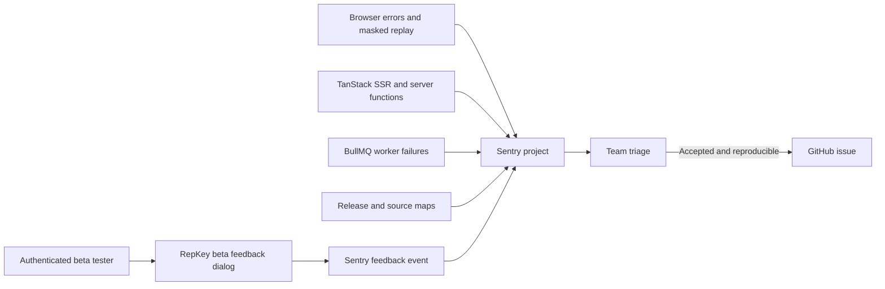

# Sentry beta feedback and diagnostics implementation plan

**Status:** Proposed  
**Date:** 2026-07-15  
**Estimated implementation:** 4–6 engineering days plus a 2–3 day staged observation window  
**Primary owner:** Assign before staging rollout

## 1. Outcome

Give authenticated RepKey beta testers a persistent **Beta feedback** action that can submit either a bug or a suggestion without leaving the page. Give developers enough safe context to reproduce failures by connecting each report to the current route, release, pseudonymous user/organization context, frontend and server errors, and a privacy-masked replay when available.

Use Sentry Cloud Free for the beta. Keep Sentry behind the existing `src/shared/observability` boundary so this beta integration does not replace the provider-neutral OpenTelemetry work planned in PRE17C/B3.5.



## 2. Fixed implementation decisions

1. Use the official `@sentry/tanstackstart-react` SDK. It is currently beta, so pin an exact tested version and upgrade deliberately rather than using a floating range. RepKey's TanStack Start version is above the SDK's documented minimum. The official SDK now supports client/server errors, distributed tracing, server-function naming and the TanStack Start Vite integration ([SDK package](https://www.npmjs.com/package/@sentry/tanstackstart-react), [official SDK release notes](https://github.com/getsentry/sentry-javascript/releases)).
2. Use one Sentry project for the beta and distinguish runtime surfaces with `service=web-client`, `service=web-server`, and `service=worker` tags. This keeps related client/server traces and feedback together and fits the Free plan's small-team use case.
3. Build a RepKey-native dialog instead of using Sentry's floating launcher. Submit through `Sentry.captureFeedback`, which supports replay association and attachments ([feedback API and custom UI](https://docs.sentry.io/platforms/javascript/guides/tanstackstart-react/user-feedback/configuration/)).
4. Show the launcher only inside the authenticated application shell and only when `SENTRY_FEEDBACK_ENABLED=true`. Do not show it on public guest portals, login/register/reset flows, tests, Storybook or local development unless explicitly enabled.
5. Treat suggestions and bugs differently in the UI but store both in Sentry with a bounded `feedback.kind=bug|suggestion` tag. Do not automatically create GitHub issues. Triage first; only accepted, reproducible work enters GitHub.
6. Send opaque internal IDs only. Do not send tester name, email, IP address, organization name, property name, review text or arbitrary request bodies. Use the authenticated user ID and organization ID as restricted identifiers where required for support correlation.
7. Start replay conservatively: no continuous sampled sessions, buffered replay only for errors and explicit feedback. Keep all text and inputs masked, all media blocked, and network bodies disabled. Increase sampling only after the privacy and quota review.
8. Sentry must always fail open. A missing DSN, blocked ingestion request, quota exhaustion or SDK exception must never block rendering, navigation, feedback-independent application actions or worker shutdown.

## 3. Scope

### Included

- automatic browser, hydration and React error capture;
- TanStack Start SSR, request and server-function error capture;
- manual capture of original exceptions currently converted into safe `ServerFunctionError` values;
- BullMQ worker startup and terminal job-failure capture;
- RepKey-native beta feedback dialog with bug/suggestion classification;
- privacy-masked replay attached to errors and feedback when available;
- release, environment and source-map configuration for web and worker builds;
- privacy sanitizer tests, integration tests, staging smoke tests, alerts and an operator runbook;
- quota monitoring and an immediate remote disable switch.

### Excluded from this slice

- full PRE17C OpenTelemetry metrics and durable trace-context propagation;
- copying Pino logs wholesale into Sentry Logs;
- product analytics, feature voting or a public roadmap;
- automatic GitHub issue creation;
- capture on public guest portal pages;
- raw database queries, request/response bodies, Google payloads, review/reply content or local variables.

## 4. Repository starting point

RepKey already has useful foundations:

- `src/shared/config/env.ts` and `.env.example` reserve `SENTRY_DSN` and `SENTRY_TRACES_SAMPLE_RATE`;
- `vite.config.ts` already externalizes `@sentry/*` during production Nitro builds and deliberately excludes Nitro in development under ADR 0012;
- `src/shared/observability` owns Pino logging, request IDs, request-scoped identity attributes and custom spans;
- `src/shared/security/error-redaction.ts` prevents internal errors from reaching clients;
- `src/routes/_authenticated.tsx` exposes the authenticated user, role and active organization at the correct UI boundary;
- `src/components/layout/app-top-bar.tsx` is the shared authenticated desktop/mobile action surface;
- `src/shared/jobs/worker.ts` has one terminal BullMQ failure listener;
- CI already runs production web and worker builds.

The main complication is `catchUntagged`: it replaces the original exception with a generic `ServerFunctionError` before an outer framework integration can see it. The original exception must therefore be captured inside the observability/error boundary before replacement.

## 5. Work plan

### Phase A — Sentry project, policy and configuration

1. Create one Sentry project named `repkey-beta` in the preferred EU/Germany data region.
2. Assign a named owner and enable MFA for the Sentry account.
3. Configure these environments: `staging`, `beta`, and later `production`. Do not send `development`, `test` or Storybook telemetry by default.
4. Configure organization/project data controls before installing the DSN:
   - prevent storage of IP addresses;
   - enable server-side data scrubbing;
   - add scrub rules for authorization, cookies, tokens, email, review/reply text and Google payload field names;
   - restrict replay access to the named operator;
   - choose the shortest practical retention available on the plan;
   - document Sentry in the subprocessor/data-flow inventory.
5. Create:
   - a public project DSN for runtime ingestion;
   - a least-privilege organization auth token for release/source-map upload only;
   - optional GitHub integration for manually creating/linking accepted issues.
6. Add Railway/protected CI variables. Never expose the auth token to PR jobs or the browser:
   - `SENTRY_DSN`;
   - `SENTRY_AUTH_TOKEN` (build only);
   - `SENTRY_ORG` and `SENTRY_PROJECT` (build only);
   - `SENTRY_ENVIRONMENT=staging|beta|production`;
   - `SENTRY_RELEASE` from the immutable Git commit SHA;
   - `SENTRY_ENABLED` and `SENTRY_FEEDBACK_ENABLED` kill switches;
   - replay and trace sample rates.

   Evaluate `SENTRY_FEEDBACK_ENABLED` on the server and expose only the resulting boolean through the authenticated route context. This lets an operator hide the launcher after a variable change/restart without rebuilding the client. `SENTRY_ENABLED` controls server and worker initialization; browser ingestion can also be stopped immediately by disabling the project key in Sentry and then removed from the next build.

**Acceptance:** The project owner can explain who can access events/replays, where data is stored, how long it is retained and how to disable ingestion without deploying code.

### Phase B — SDK compatibility spike and runtime bootstrap

1. Install and pin the exact current `@sentry/tanstackstart-react` version. Record the version and tested TanStack/Vite/Nitro versions in the plan's implementation PR.
2. Add the official TanStack Start integration to `vite.config.ts` after the framework/React plugins while preserving ADR 0012's production-only Nitro behavior. The official integration is `sentryTanstackStart` from `@sentry/tanstackstart-react/vite` ([official example](https://github.com/getsentry/sentry-javascript/blob/develop/dev-packages/e2e-tests/test-applications/tanstackstart-react/vite.config.ts)).
3. Add explicit entry/instrumentation files based on the official integration pattern:
   - `src/instrument.client.ts` — client `Sentry.init`;
   - `src/client.tsx` — imports client instrumentation before hydration;
   - `instrument.server.mjs` — server `Sentry.init`, copied into `.output/server`;
   - `src/server.ts` — wraps the TanStack fetch handler with `wrapFetchWithSentry`;
   - update `src/start.ts` to include `sentryGlobalRequestMiddleware` and `sentryGlobalFunctionMiddleware`;
   - update `build`/`start` scripts so the server instrument module is copied and preloaded with Node `--import`.

   Sentry's official TanStack example initializes before client hydration, wraps the server fetch entry and installs global request/function middleware ([client example](https://github.com/getsentry/sentry-javascript/blob/develop/dev-packages/e2e-tests/test-applications/tanstackstart-react/src/client.tsx), [server example](https://github.com/getsentry/sentry-javascript/blob/develop/dev-packages/e2e-tests/test-applications/tanstackstart-react/src/server.ts), [middleware example](https://github.com/getsentry/sentry-javascript/blob/develop/dev-packages/e2e-tests/test-applications/tanstackstart-react/src/start.ts)).

4. Inject only client-safe values into the browser build: DSN, environment, release and numeric sample rates. The DSN is public by design; `SENTRY_AUTH_TOKEN` must never enter Vite `define`, `import.meta.env`, client chunks or source maps.
5. Initialize only when both `SENTRY_ENABLED` and a DSN are present. Initialization must be a no-op in test, Storybook and normal local development.
6. Configure one shared release value for browser, SSR and worker events. Add the explicit `service` tag per runtime.
7. Add a small server-only adapter such as `src/shared/observability/error-reporter.ts` exposing provider-neutral operations:
   - `captureException(error, safeContext)`;
   - `setRequestIdentity({ userId, organizationId, role })`;
   - `flush(timeoutMs)`.

   Only this adapter and the runtime instrument files may import Sentry directly outside UI feedback code.

**Compatibility gate:** A clean `pnpm dev`, `pnpm build`, `pnpm start`, SSR page load and server-function call must work with Sentry enabled and disabled. If the beta SDK breaks Nitro/Vite 8, stop and pin/reduce to browser feedback and manual server capture rather than patching framework internals.

### Phase C — Privacy-safe event and replay policy

1. Implement the same allowlist-oriented event sanitizer in client, server and worker `beforeSend` hooks. At minimum:
   - remove `user.email`, `user.username`, `user.ip_address` and names;
   - remove request cookies, authorization headers, query strings and bodies;
   - remove response bodies and arbitrary `extra` objects;
   - allow only route templates, release/environment, safe error class/code, request ID, service, role and approved opaque IDs;
   - filter breadcrumbs so fetch/XHR URLs retain origin + route template only and never query parameters or bodies;
   - drop known expected 4xx/domain validation events and browser-extension noise.
2. Configure replay with:
   - `maskAllText: true`;
   - `maskAllInputs: true`;
   - `blockAllMedia: true`;
   - no `unmask` or `unblock` selectors initially;
   - no network request/response bodies or headers;
   - `replaysSessionSampleRate: 0`;
   - `replaysOnErrorSampleRate: 1` for the small beta, reduced if quota requires it.
3. Do not enable `sendDefaultPii`, local-variable capture, database query text, console capture or Sentry Logs in this slice.
4. Add `data-sentry-mask`/`data-sentry-block` markers to particularly sensitive authenticated components as defense in depth, including inbox source content, reviewer identity, reply editors, integration credential/status surfaces and settings identity fields.
5. Extend the existing PII/security tests with sentinel values for:
   - email and phone;
   - session cookie, bearer token and OAuth token;
   - review and reply text;
   - property/organization display names;
   - signed URLs and URL query parameters.

   Send representative errors, feedback, breadcrumbs and replay DOM through a test transport and assert the sent payload contains none of the sentinel values.

**Acceptance:** A security reviewer can inspect captured staging payloads and confirm that no raw tester/customer content, credentials or request bodies leave RepKey.

### Phase D — Error capture and safe correlation

1. Browser/React:
   - rely on the framework SDK for unhandled browser, hydration, React and navigation errors;
   - retain the existing user-facing TanStack error component;
   - capture expected validation/permission failures only as breadcrumbs or bounded result tags, not issues.
2. Authenticated browser identity:
   - add a small component under `_authenticated` that calls `Sentry.setUser({ id })` and sets bounded tags for role and opaque organization ID;
   - clear the user and tenant tags on sign-out and organization switch;
   - never set name or email in Sentry global scope.
3. Server functions:
   - connect `resolveTenantContext`'s existing request-scoped attributes to the error-reporter/Sentry isolation scope;
   - add request ID, use-case name and safe error code to captured events;
   - in `catchUntagged`, capture the original exception before replacing it with the generic public `ServerFunctionError`;
   - do not report normal 400/401/403/404/409/422 outcomes as Sentry errors;
   - report unexpected 500s and infrastructure failures once, avoiding duplicate capture by the outer SDK middleware.
4. API routes/webhooks:
   - verify unhandled route errors are captured by the wrapped server fetch entry;
   - manually capture caught-and-converted 500 paths where the original error would otherwise be lost;
   - keep malformed/unauthorized webhook traffic as metrics/logs, not Sentry issues, unless it indicates a server defect.
5. Worker:
   - initialize Sentry before worker application imports;
   - add `service=worker`, queue and bounded job-name tags;
   - capture worker startup failure, terminal BullMQ job failure and shutdown failure;
   - never attach `job.data`;
   - flush Sentry with a short bounded timeout during graceful shutdown and fatal startup exit.

**Acceptance:** One controlled client exception, SSR exception, server-function exception and terminal worker failure each appear once with a readable stack, correct release/environment/service, request or job correlation, and no prohibited data.

### Phase E — RepKey beta feedback dialog

1. Add `src/components/features/beta-feedback/beta-feedback-dialog.tsx` and a small launcher component.
2. Place a clearly labelled `Beta feedback` action in `src/components/layout/app-top-bar.tsx`. Keep an icon-only mobile presentation with an accessible name and a text label when space permits.
3. Dialog fields:
   - type: **Report a problem** or **Suggest an improvement**;
   - short summary;
   - description;
   - for bugs: expected result, actual result, and `This blocks my work` checkbox;
   - optional screenshot file selected by the tester, with a reminder to remove customer/personal information;
   - explicit `Include masked diagnostic replay` checkbox, enabled by default for bug reports and off by default for suggestions.
4. Do not ask for name/email; the tester is already authenticated. Show a short notice explaining what diagnostics are sent and link to the beta privacy notice.
5. Validate client-side with strict length and attachment limits. Accept only PNG/JPEG/WebP screenshots, cap the file size, and do not accept arbitrary documents.
6. On submit, call `Sentry.captureFeedback` with the composed message and optional attachment/replay. Use a temporary scope containing only:
   - `feedback.kind`;
   - `feedback.blocks_work`;
   - route template, not raw query string;
   - release/environment;
   - role;
   - opaque user/organization/property IDs when available;
   - request/session correlation ID if safely available.
7. Display deterministic sending, success and retry states. Preserve the tester's text if submission fails. Sentry failure must not crash the page.
8. Add a remote kill switch and hide the action when the SDK is unavailable or the beta capability is disabled.
9. Component/Storybook tests:
   - keyboard/focus management and accessible labels;
   - conditional bug fields;
   - validation and attachment rejection;
   - success, error and retry flows;
   - correct category/replay options passed to a mocked capture adapter;
   - launcher hidden when disabled.

**Acceptance:** A tester can submit both kinds of feedback in under one minute from desktop or mobile, receives clear confirmation, and the resulting event is filterable by kind and release.

### Phase F — Releases, source maps, triage and alerting

1. Configure `sentryTanstackStart` with organization/project and a build-only auth token. Upload source maps only from protected staging/beta deployment builds, never from untrusted PRs.
2. Use the Railway/Git commit SHA as `SENTRY_RELEASE` for browser, SSR and worker.
3. Upload web source maps through the TanStack/Vite integration. Upload `dist-worker` maps under the same release using the Sentry CLI or a build-plugin step.
4. Delete source-map files from public/deployed artifacts after successful upload or otherwise ensure they are not publicly served. Sentry recommends protecting or deleting uploaded maps ([source-map guidance](https://docs.sentry.io/platforms/javascript/guides/tanstackstart-react/sourcemaps/uploading/esbuild)).
5. Make builds succeed without Sentry credentials; source-map upload should be skipped in ordinary PR CI. A failed upload should fail a protected release job but not a local build.
6. Configure low-noise alerts for `environment=beta`:
   - new or regressed unhandled error;
   - repeated server 500 issue;
   - worker startup/fatal issue;
   - terminal job failures crossing a small threshold;
   - new feedback notification to the named triager.
7. Triage workflow:
   - acknowledge and classify feedback in Sentry;
   - reproduce using the safe context/replay;
   - merge duplicates;
   - create/link a GitHub issue only when accepted;
   - paste the Sentry event/feedback link into the GitHub issue, without copying sensitive payloads;
   - close the loop with the tester through the agreed beta channel.
8. Add `docs/runbooks/sentry-beta-feedback.md` covering access, searching by release/request/user ID, triage, quota response, source-map failures, privacy incident response and both kill switches.

**Acceptance:** A minified staging exception resolves to the correct TypeScript source for browser/SSR/worker, and every configured alert reaches the named owner with a runbook link.

### Phase G — Staged rollout

1. **Local/test transport:** verify payload shape with synthetic data only and no network ingestion.
2. **Staging:** enable Sentry for internal developers. Run the full smoke matrix and inspect actual events/replays manually.
3. **Small beta cohort:** enable the feedback action for 3–5 testers for two working days. Review false positives, event volume, replay volume, form completion and privacy.
4. **Full beta:** expand only after the privacy gate passes and alerts are actionable.
5. Review usage weekly during beta. If Free-plan replay volume approaches its allowance, keep feedback/errors at 100% but lower replay-on-error sampling or disable replay before dropping error/feedback events.
6. Upgrade the plan only when actual volume, additional Sentry seats or required workflow/security features justify it.

## 6. Verification matrix

| Scenario                      | Expected evidence                                                                  |
| ----------------------------- | ---------------------------------------------------------------------------------- |
| Sentry disabled or DSN absent | App, SSR, server functions and worker behave normally; feedback action hidden      |
| Browser exception             | One issue with beta environment, release, client service and readable source       |
| SSR/server-function exception | Original exception captured once; client still receives generic safe error         |
| Expected 4xx/domain error     | No noisy Sentry issue; existing safe UX remains                                    |
| Terminal worker failure       | One issue with queue/job-name tags and no job payload                              |
| Bug feedback                  | `feedback.kind=bug`, safe route/release context, optional masked replay/screenshot |
| Suggestion                    | `feedback.kind=suggestion`; replay excluded unless tester opts in                  |
| Organization switch/sign-out  | Sentry identity/tags update or clear; no stale tenant attribution                  |
| Ad blocker/network failure    | Feedback form preserves content and offers retry; app remains usable               |
| Source maps                   | Browser, SSR and worker stack frames resolve to repository TypeScript              |
| Privacy canary                | No sentinel customer, tester, credential, query or body content in event/replay    |
| Quota/ingestion rejection     | No application error; operator can disable replay/feedback remotely                |

Run before rollout:

```text
pnpm format:check
pnpm typecheck
pnpm lint
pnpm test
pnpm build
pnpm build:worker
pnpm test-storybook
pnpm test:e2e
```

Add a protected staging smoke script or Playwright spec that triggers only synthetic sentinel errors and feedback. It must be impossible to enable those routes/actions in beta or production without a test-only secret and environment guard.

## 7. Definition of done

- Sentry can be enabled/disabled independently for staging and beta without code changes.
- Browser, SSR/server functions and worker failures are captured once with readable stacks and one release ID.
- Expected user/domain errors do not create alert noise.
- The authenticated feedback dialog supports bugs and suggestions, mobile/keyboard use, retry, optional screenshot and explicit masked replay consent.
- Events contain only allowlisted metadata; the privacy sentinel suite and manual staging inspection pass.
- Public guest portals and unauthenticated pages are excluded.
- Source maps are uploaded from protected builds and are not publicly exposed.
- Alerts have an owner and runbook; accepted feedback is triaged before GitHub creation.
- Free-plan usage remains within budget during the staged observation window.
- The implementation PR records the pinned beta SDK version and a rollback procedure.

## 8. Rollback

1. Set `SENTRY_FEEDBACK_ENABLED=false` and restart the web service to hide only the tester-facing feature; no client rebuild is required.
2. Set replay sample rates to zero to stop replay while keeping error/feedback capture.
3. Set `SENTRY_ENABLED=false` or remove `SENTRY_DSN` for server/worker ingestion. For an immediate browser-side stop, disable the project key in Sentry; remove the client DSN in the next build.
4. If the beta TanStack SDK destabilizes the build/runtime, revert the framework middleware/entry integration while retaining the provider-neutral adapter and feedback UI behind the disabled flag.
5. Confirm rollback by loading an authenticated page, invoking a server function, starting the worker and verifying no new Sentry envelope is sent.
