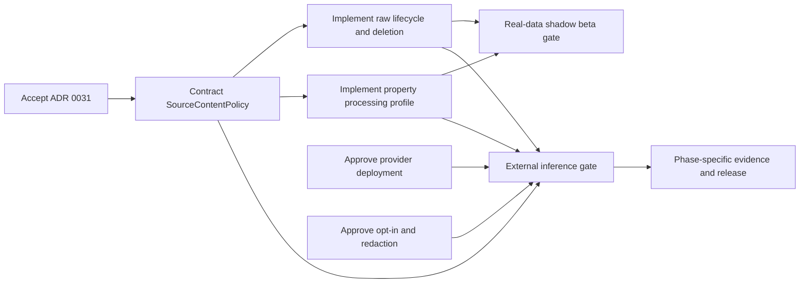

# AI and Google Source Governance Package

**Status:** Proposed implementation baseline; acceptance and evidence gates remain open  
**Decision:** [ADR 0031](../../adr/0031-google-source-content-and-ai-processing-boundary.md)  
**External disposition:** [Google support response, 2026-07-14](../google-business-profile-ai-policy-response-2026-07-14.md)  
**Scope:** Real Google review data, future external AI processing, and per-property derived intelligence  
**Not in scope:** Phase 17/18 product behavior, prompts, model selection, UI design, quotas, or pricing

## 1. Purpose

This package turns the program's internal engineering and governance gates into one authoritative set of contracts. It prevents the PRE17, beta, and later AI plans from independently redefining raw content, retention, regional routing, provider eligibility, merchant opt-in, PII redaction, or release proof.

It is deliberately split between:

- **decisions and specifications created now**, before schemas and infrastructure make them expensive to change; and
- **evidence populated during implementation**, because a document is not proof that a control works.

The package does not authorize AI runtime enablement. `ENABLE_GBP_AI` remains false throughout PRE17 and until the relevant release gate in the evidence index is signed.

## 2. Authority and conflict resolution

Apply the following order when two artifacts disagree:

1. applicable law, signed contract/DPA, current Google terms/policies, and preserved case-specific Google response;
2. accepted ADRs and approved exceptions;
3. the current version of these governance specifications;
4. executable policy/configuration and database constraints;
5. implementation plans and tickets;
6. code comments and historical documents.

An implementation conflict fails closed for new AI work and is recorded as a policy defect. It must not silently choose the more permissive interpretation. Product plans may narrow these rules but may not broaden them without a recorded policy change and the required privacy/security review.

## 3. Canonical terminology

| Term                         | Meaning                                                                                                                                                                                                     |
| ---------------------------- | ----------------------------------------------------------------------------------------------------------------------------------------------------------------------------------------------------------- |
| Raw Google Content           | Google-sourced review/reply content or source identifiers that reproduce or expose the underlying source fact: text, exact rating, reviewer data, Google review ID/name, reply text, and equivalent copies. |
| Transient Inference Material | The minimized, redacted input and model output held only long enough to complete and validate one AI operation.                                                                                             |
| Derived Review Metadata      | Property-scoped sentiment, score, category, theme, trajectory, or summary fact that does not reproduce Raw Google Content or PII.                                                                           |
| Property Processing Profile  | The property's versioned country, time zone, provider-neutral processing region, source, and resolution state.                                                                                              |
| Merchant AI Opt-in           | A property administrator's product authorization to enable named AI capabilities. It is not a guest's privacy consent or an assertion of GDPR lawful basis.                                                 |
| AI Enablement Epoch          | A monotonic property value changed whenever AI enablement, policy notice, provider/region, or allowed capabilities materially change; stale work cannot cross epochs.                                       |
| Provider Deployment          | One approved provider service/model deployment in one processing region with a verified contract, retention/training posture, configuration, and evidence version.                                          |
| AI Reply Draft               | A non-published suggestion returned for manager review/edit. It is never a command to publish.                                                                                                              |
| Release Evidence             | Reproducible proof that a control operated in the target environment for the candidate release, not merely a policy statement or screenshot without provenance.                                             |

Existing plans sometimes use “merchant consent.” New work uses **Merchant AI Opt-in** to avoid confusing product enablement with privacy consent from a reviewer or guest.

## 4. Package contents

| Artifact                                                                                | What it decides or records                                                             | Needed before                                       | Current state   |
| --------------------------------------------------------------------------------------- | -------------------------------------------------------------------------------------- | --------------------------------------------------- | --------------- |
| [ADR 0031](../../adr/0031-google-source-content-and-ai-processing-boundary.md)          | Hard-to-reverse source/AI boundary                                                     | Real GBP lifecycle migration; any AI implementation | Proposed        |
| [Source-content policy specification](source-content-policy-specification.md)           | Executable capabilities, data classes, versions, and fail-closed evaluation            | PRE17B source-policy schema                         | Proposed        |
| [Data lifecycle and deletion standard](data-lifecycle-and-deletion-standard.md)         | Retention clocks, propagation, backups, restore, disconnect, and proof                 | First real Google content                           | Proposed        |
| [Property-region routing standard](property-region-routing-standard.md)                 | Property routing unit, cells, resolution, deployment mapping, and no-fallback rules    | Processing-profile schema; any regional AI call     | Proposed        |
| [AI provider assessment template](ai-provider-assessment-template.md)                   | Provider hard gates, comparison criteria, evidence, and re-verification                | Selecting/contracting an AI provider                | Ready template  |
| [Merchant AI opt-in and revocation specification](merchant-ai-opt-in-and-revocation.md) | Property enablement states, authority, epochs, UX facts, and revocation semantics      | Phase 17 schema/use-case planning                   | Proposed        |
| [PII-redaction specification](pii-redaction-specification.md)                           | Minimization, supported-language gate, redaction pipeline, test corpus, and thresholds | Sending any real review to an external model        | Proposed        |
| [AI release-evidence index](ai-release-evidence-index.md)                               | Candidate-release stages, required proof, owners, exceptions, and signatures           | Real-data beta and each later AI capability release | Ready template  |
| [Primary-source research](../ai-governance-primary-sources-2026-07-14.md)               | Official-source basis, design inferences, and unresolved questions                     | Governance review                                   | Research record |

## 5. Control ownership

Roles are responsibilities, not necessarily separate people during internal beta. One person may hold multiple roles, but the candidate-release record must show who performed each review.

| Role              | Accountable for                                                                                                                                      |
| ----------------- | ---------------------------------------------------------------------------------------------------------------------------------------------------- |
| Product owner     | Approved capabilities, property-local product boundary, notices, retention purpose, and user-facing limitations                                      |
| Engineering owner | Source policy, lifecycle, routing, consent epochs, idempotency, migrations, and failure behavior                                                     |
| Privacy owner     | Data map, lawful-role analysis with counsel where needed, notices, retention, subprocessors/transfers, regional claims, and rights/deletion behavior |
| Security owner    | Provider security review, secrets, least privilege, redaction threat model, logging restrictions, incident controls, and exception risk              |
| Operations owner  | Deployment registry, alerting, deletion/reconciliation operation, regional capacity, backup/restore controls, and incident readiness                 |
| Release approver  | Confirms evidence completeness and records go/no-go; cannot waive a hard denial merely because the implementation is complete                        |

## 6. Implementation order

### Required before real-property beta

- accepted raw-content/cache interpretation in ADR 0031;
- executable source policy for non-AI Google ingestion and serving;
- explicit property processing profile, even if AI is disabled;
- tested refresh, hard expiry, disconnect, deletion, backup-restore, and no-convenience-copy behavior;
- preservation of the Google response and applicable public policy version; and
- Stage A evidence from the release index.

### May remain incomplete until Phase 17 planning

- named model/provider selection and commercial quota;
- final prompts, output schemas, model-quality corpus, and AI UX;
- final supported-language list, provided unsupported languages fail closed;
- populated provider assessment and redaction benchmark results; and
- AI capability release evidence beyond Stage A.

## 7. Change control

Every governance artifact has a stable identifier or filename, status, owner, effective version, and review trigger. A material change must:

1. identify the policy/capability/data class affected;
2. record the reason and primary-source or contractual basis;
3. assess migration, deletion, consent notice, regional, provider, and evidence effects;
4. update the executable policy and tests atomically with the behavior change;
5. increment the relevant policy/notice/routing/redaction/deployment version; and
6. re-run the affected release gates.

Material broadening includes cross-property analysis, organization summaries, automated publication, provider training, longer provider retention, new raw copies, a new processing cell, a new language, or review-derived staff scoring. Those changes require explicit product/privacy/security review and, where the Google disposition no longer covers the design, new written clarification.
