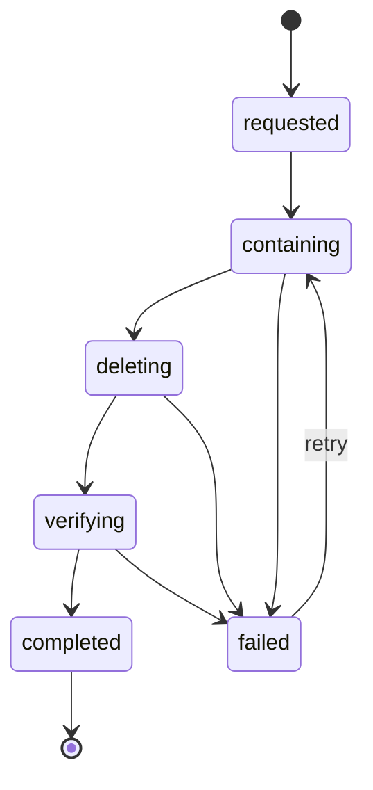

# Data Lifecycle and Deletion Standard

**Status:** Proposed normative standard  
**Applies to:** Google review/reply content, future AI inference material and derivatives, all copies and storage systems  
**Owners:** Engineering, privacy, operations  
**Related:** [ADR 0031](../../adr/0031-google-source-content-and-ai-processing-boundary.md), [source-content policy](source-content-policy-specification.md)

## 1. Objective

Every source fact, copy, transformation, job, cache entry, provider object, backup, and control record must have an owner, data class, purpose, region, retention clock, deletion trigger, and verifiable deletion path. Deletion is a durable workflow, not a best-effort ORM cascade.

Google's written response states that raw review content—including review text, star ratings, reviewer information, and replies—must be refreshed or removed under the applicable 30-day policy, while separately stored derivative metadata is not subject to that same limit. “Not subject to the same limit” does not authorize indefinite retention; product and privacy policy still apply.

## 2. Lifecycle invariants

1. The review context owns the only canonical application copy of Raw Google Content.
2. Raw content cannot be copied into domain events, ordinary job payloads, notifications, activity bodies, logs, traces, error tools, exports, analytics/read-model tables, or fixtures.
3. Raw content is unavailable for reads and AI at hard expiry, even if asynchronous purge has not completed.
4. A successful authorized Google fetch is the only event that may advance the conservative raw-cache observation clock.
5. Deletion, disconnect, source replacement, property deletion, and organization deletion increment/close the relevant source epoch before destructive work begins.
6. New work checks current state; queued work cannot outlive the epoch or Merchant AI Opt-in under which it was created.
7. Derivatives must be independently classified and purged under their own schedule; embedding raw content makes them raw.
8. Backups are disaster-recovery media, not archives or alternative query stores.
9. Restore never makes data serviceable before current expiry/deletion reconciliation runs.
10. Completion evidence is content-free, immutable, and sufficient to prove scope, steps, time, outcome, and exceptions.

## 3. Data inventory and proposed retention schedule

The raw-content limit is externally constrained. Other values below are initial internal defaults that require product/privacy acceptance before Phase 17 release and may be shortened.

| Data class / record                                       | System of record                     | Proposed retention                                                                                             | Trigger and deletion behavior                                                                        |
| --------------------------------------------------------- | ------------------------------------ | -------------------------------------------------------------------------------------------------------------- | ---------------------------------------------------------------------------------------------------- |
| Raw Google review fields and Google identifier            | Review context                       | Hard maximum 30 days from latest successful authorized fetch under conservative baseline                       | Refresh before due date; deny at expiry; purge canonical row/fields and lifecycle-owned children     |
| Google-observed/published reply mirror                    | Review context                       | Same raw-content clock as the fetched representation                                                           | Refresh or remove with review/source lifecycle                                                       |
| Raw content in memory                                     | Request/worker process               | One operation only                                                                                             | Release references after operation; never heap-dump intentionally; restart/incident rules apply      |
| Redacted inference input and raw model output             | AI adapter/process                   | One operation only; no application persistence                                                                 | Discard after validated derivative/draft or terminal failure                                         |
| Provider request/response/batch object                    | Approved provider deployment         | Shortest contract/configuration-supported period; zero/abuse-monitoring exception must be explicitly evidenced | Provider deletion/expiry plus periodic configuration verification                                    |
| AI reply draft                                            | Future AI context                    | Until publish, discard, opt-in revocation, source invalidation, or 30 days, whichever occurs first             | Purge abandoned/stale draft; published Google mirror follows raw Google lifecycle                    |
| Per-review sentiment/category/priority derivative         | Future AI context                    | Proposed 24 months while property remains active; reassess before Phase 17                                     | TTL; property/org deletion; customer erase policy; no raw fields/Google ID                           |
| Daily property sentiment/priority aggregate               | Future property analytics/read model | Proposed 24 rolling months                                                                                     | TTL; property/org deletion; source-policy withdrawal if required                                     |
| Property theme/trend report and weekly summary derivative | Future AI context                    | Proposed 24 rolling months                                                                                     | TTL; property/org deletion; no raw excerpts or cross-property content                                |
| AI usage, cost, latency, and policy-decision metadata     | Future AI/control store              | Proposed 24 months; billing records may require separately approved schedule                                   | TTL; identifiers minimized; financial/legal schedule documented separately                           |
| Merchant AI Opt-in history                                | Future AI/control store              | Property life plus proposed 24 months                                                                          | Property/org deletion subject to required compliance evidence; privacy owner approves final period   |
| Deletion-run evidence                                     | Lifecycle control store              | One year initial internal-beta default                                                                         | Content-free TTL; legal/incident hold is separately approved and scoped                              |
| Review sync/webhook operational metadata                  | Review/integration control stores    | 30 days                                                                                                        | Scheduled TTL; no Google payload/review ID lists                                                     |
| Logs/traces/error events                                  | Observability systems                | 30 days initial beta default                                                                                   | Provider TTL/rotation; content scanner and access control                                            |
| Database backups                                          | Backup system                        | At most 30-day rolling initial beta default, subject to restore-time purge design                              | Expire media; restored copy runs deletion ledger and current expiry before traffic; no archival copy |
| Synthetic test corpus                                     | Test/evaluation store                | Until replaced or no longer needed                                                                             | Versioned deletion; must contain no real source/reviewer data                                        |

### Retention decisions still requiring acceptance

Before Phase 17 implementation planning closes, product/privacy must accept or replace the 24-month derivative defaults and the post-revocation behavior. Until then, derivative persistence is disabled in production; tests use synthetic data.

## 4. Raw-content timestamps

Each canonical raw review representation requires:

| Field                       | Rule                                                                              |
| --------------------------- | --------------------------------------------------------------------------------- |
| `firstFetchedAt`            | First successful validated Google fetch; immutable                                |
| `lastSuccessfullyFetchedAt` | Most recent successful validated authorized Google fetch                          |
| `refreshDueAt`              | Initially `lastSuccessfullyFetchedAt + 25 days`; reliability target only          |
| `expiresAt`                 | `lastSuccessfullyFetchedAt + 30 days`; hard serving and processing boundary       |
| `sourceEpoch`               | Monotonic property/source connection generation                                   |
| `deletionState`             | `active`, `deleting`, or `deleted`; non-active content is not served or processed |
| `policyId`                  | Policy bundle that classified the representation                                  |
| `sourceUpdatedAt`           | Google's content update timestamp, distinct from cache observation                |

No grace period follows `expiresAt`. Operational refresh must start with enough margin and alerting to avoid losing otherwise valid reviews, but availability pressure never extends retention.

## 5. Deletion triggers and outcomes

| Trigger                              | Immediate containment                                                                        | Durable outcome                                                                                                                                         |
| ------------------------------------ | -------------------------------------------------------------------------------------------- | ------------------------------------------------------------------------------------------------------------------------------------------------------- |
| Raw content reaches hard expiry      | Deny serving/inference; mark deletion due                                                    | Purge raw review/reply and source-owned projections; record completion                                                                                  |
| Google returns not found/deleted     | Stop serving; mark source fact deleting                                                      | Purge raw record and source-owned children; correct allowed derivative/read models                                                                      |
| Google connection disconnected       | Increment/close source epoch; revoke tokens/subscriptions; stop sync and AI                  | Purge raw content and pending provider/job material; apply approved derivative disconnect policy                                                        |
| Connection replaced/reconnected      | New source epoch; old jobs deny                                                              | Old epoch content follows disconnect lifecycle; no implicit reuse under new authorization                                                               |
| Merchant AI Opt-in revoked           | Increment enablement epoch; deny new AI; neutralize pending jobs/provider batches            | Purge transient material and unpublished drafts; prior derivatives follow disclosed retention unless erase is requested/required                        |
| Property archived                    | Disable new external work; keep only explicitly permitted read-only period                   | Product policy decides archive window; raw Google content still obeys shorter cache limit                                                               |
| Property deleted                     | Mark deleting; stop all jobs and access                                                      | Purge raw, derivatives, drafts, usage linkage, caches, object storage, and lifecycle participants; preserve only approved content-free compliance proof |
| Organization deleted                 | Mark org deleting; deny all tenant operations                                                | Same as property across all properties, identity/integrations, backups/restore ledger, and subprocessors                                                |
| Data/privacy erase request           | Authenticate and scope request; place subject/property lifecycle hold against new processing | Execute approved data map across stores/providers and record content-free result/exceptions                                                             |
| Policy becomes narrower              | Retire old authorization; deny newly prohibited operations                                   | Migrate/purge affected records before activating behavior that assumes new policy                                                                       |
| Provider deployment approval expires | Deny new calls; do not fail over globally                                                    | Finish/neutralize per approved rule; delete provider objects; reapprove or migrate through an explicit plan                                             |

Disconnect and Merchant AI Opt-in revocation are different. Disconnect removes source authorization and therefore raw Google processing. Opt-in revocation disables AI while non-AI review synchronization may continue.

## 6. Durable deletion workflow

### Required algorithm

1. Persist a deletion run with scope, reason, organization/property/internal subject IDs, source/enablement epochs, requested actor/system, policy ID, and deadline.
2. Atomically transition the owning resource to a non-serviceable state and increment/close the relevant epoch.
3. Publish an identifier-only durable lifecycle event through the transactional outbox.
4. Each registered context executes its idempotent deletion/scrub command and records a content-free step receipt.
5. Neutralize pending/delayed jobs; active workers re-read state before provider invocation and persistence.
6. Delete provider batch/files/objects when applicable and capture provider deletion result/reference without content.
7. Invalidate caches/read models and recompute aggregates where deletion changes allowed facts.
8. Verify all required participants for that lifecycle-policy version acknowledged completion.
9. Record completion or escalate an overdue/failed step; never mark complete solely because the canonical row disappeared.

### Initial participants

- review and reply;
- inbox and notes/views tied to the deleted source item;
- integration connection/subscription state;
- metric/dashboard/read-model projections;
- future AI derivatives, drafts, usage lineage, and provider objects;
- notification and activity records that could contain copied content;
- Redis caches and BullMQ jobs;
- logs/error tooling deletion where supported and required;
- export/object storage; and
- backup/restore deletion ledger.

Every context that begins persisting source-linked data must register a participant before its feature can be enabled.

## 7. Jobs, events, caches, and observability

### Jobs

- Payloads contain only job/organization/property/internal subject IDs, capability, source/enablement epochs, and configuration versions.
- Workers load raw content just-in-time inside the canonical boundary.
- Completed/failed job retention must not preserve return values or errors containing review/prompt/reply content.
- Dead-letter tools expose sanitized metadata only.

### Events

New durable events are identifier/fact-minimized. Existing review events that include rating, reviewer name, or review text must be migrated before the real-content gate. Consumers fetch authorized current data through bounded ports only when needed.

### Caches/read models

- Raw source content is not cached outside the canonical owner.
- A derived cache declares source data class, property scope, policy version, TTL, and lifecycle invalidation participant.
- Cache miss or cache outage falls back to an authorized source read or unavailable state, never a broader region/tenant/source.

### Logs/traces/errors

- Prohibited: review/prompt/reply text, reviewer data, exact rating, Google ID, provider request/response body, tokens, headers, and URLs containing credentials/query data.
- Allowed: internal IDs where approved, capability, policy/deployment/region/redaction versions, counts, token/cost/latency, status/error class, timestamps, and trace correlation.
- Automated canaries and fixture markers must prove prohibited content does not appear across application logs, queue UI, traces, error tools, and provider telemetry.

## 8. Backup and restore

Backup retention cannot make an expired raw cache practically recoverable for ordinary use.

### Minimum controls

1. Backups are encrypted, access-restricted, monitored, and unavailable to application queries.
2. Backup cadence and retention are documented by region and environment.
3. Deletion runs produce a content-free deletion ledger or use an approved cryptographic-erasure design.
4. Restore occurs into an isolated environment with outbound integrations and user traffic disabled.
5. Before service, the restore process applies every deletion/closed epoch after the backup point and purges all raw records expired at current time.
6. It re-evaluates property regions, provider/opt-in state, tokens, scheduled jobs, and source policies; old workers/schedules do not start automatically.
7. Verification queries and content canaries confirm no expired/deleted source content is served.
8. The restore evidence records backup identifier, time, policy/ledger checkpoint, rows/objects affected as counts, verification result, and approver—never content.

If these controls cannot be demonstrated, real Google content must not enter the backup set. An alternative such as isolated short-retention storage or key-scoped cryptographic erasure must be selected first.

## 9. Legal/incident holds

A hold is not a general escape from Google source limits. Any proposed hold involving Raw Google Content requires privacy/legal and source-policy review; if source terms do not permit it, the raw content is still removed. Holds are scoped, access-controlled, time-bounded, reviewed, and never silently applied by an engineer.

## 10. Operational objectives

| Control                             | Initial objective                                                                                      |
| ----------------------------------- | ------------------------------------------------------------------------------------------------------ |
| Refresh dispatcher                  | All eligible raw rows scheduled before `refreshDueAt`; alert on forecasted miss                        |
| Hard-expiry enforcement             | 100% of reads/model calls denied at or after expiry                                                    |
| Canonical purge                     | Start immediately after expiry/deletion observation; complete within 24 hours unless stricter deadline |
| Disconnect/opt-in containment       | New external work denied immediately after committed epoch change                                      |
| Lifecycle step backlog              | No unknown/overdue participant; page on deadline risk                                                  |
| Backup restore reconciliation       | Complete and verified before network/user traffic                                                      |
| Prohibited-content telemetry canary | Zero known occurrences in release test and continuous scanning                                         |

The purge completion objective is operational; it does not create permission to serve or process data after hard expiry.

## 11. Required tests and evidence

- Boundary tests for refresh due/hard expiry and failure to refresh.
- Integration test proving local writes and backup restore cannot move source expiry.
- Cross-store deletion test covering every registered lifecycle participant.
- Queue tests for delayed, active, retried, stalled, and dead-letter work after epoch change.
- Disconnect/reconnect race and source replacement tests.
- Property/org deletion drill with counts reconciled to a precomputed inventory.
- Restore drill from a backup older than at least one deletion/expiry event.
- Content-marker scan across logs, traces, job UI, errors, notifications, activities, and exports.
- Provider-object deletion proof when batch/file features are introduced.
- Signed inventory showing every data class and store has an owner, schedule, and deletion mechanism.

Evidence is registered in the [AI release-evidence index](ai-release-evidence-index.md).
