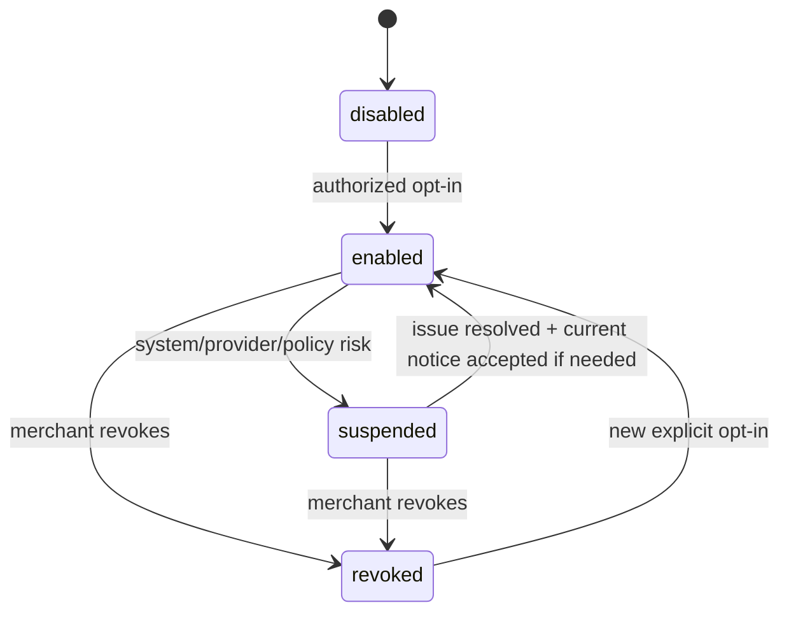

# Merchant AI Opt-in and Revocation Specification

**Status:** Proposed product and application contract  
**Scope:** Property-level authorization for future Google-review AI capabilities  
**Owners:** Product, privacy, engineering  
**Related:** [ADR 0031](../../adr/0031-google-source-content-and-ai-processing-boundary.md), [source-content policy](source-content-policy-specification.md)

## 1. Terminology and legal boundary

The canonical term is **Merchant AI Opt-in**: an authorized merchant administrator enables named RepKey AI capabilities for one property after receiving the required product/data-use notice.

It is not:

- consent from the reviewer whose public review may contain personal data;
- consent from a guest or staff member;
- proof of RepKey's or the customer's GDPR lawful basis;
- approval for cross-property processing, provider training, or automatic publication; or
- permanent authorization that survives revocation, policy change, property transfer, or source reconnect.

Privacy/legal owners must separately document roles, lawful bases, notices, processor/transfer terms and rights handling where applicable. This distinction follows the [primary-source research](../ai-governance-primary-sources-2026-07-14.md#51-gdpr-confirmed-principles).

## 2. Scope and capability granularity

Opt-in is recorded per property and per capability group:

| Capability group         | What the merchant enables                                                              | Additional condition                                               |
| ------------------------ | -------------------------------------------------------------------------------------- | ------------------------------------------------------------------ |
| `review_analysis`        | Sentiment/category inference and pure-domain priority score for newly received reviews | Approved property route/provider/redaction profile                 |
| `reply_drafting`         | Manager-requested AI reply draft                                                       | Direct manager request; draft only; separate manual publish        |
| `property_trends`        | Property-local themes/trends/summaries                                                 | Phase 18 plan/evidence; no cross-property inputs/output            |
| `historical_backfill`    | Bounded analysis of policy-valid historical reviews                                    | Separate explicit opt-in due to cost/volume and conservative scope |
| `current_reply_examples` | Same-property, currently policy-valid published replies used transiently as examples   | Disabled by default; no durable corpus; separately enabled         |

Enabling one group does not enable another. Cross-property summaries, organization summaries, automatic reply publication, provider training and review-based staff scoring are unavailable and cannot appear as opt-in choices.

## 3. State model

```ts
type MerchantAiState = 'disabled' | 'enabled' | 'suspended' | 'revoked'

type MerchantAiOptIn = Readonly<{
  propertyId: string
  state: MerchantAiState
  capabilities: readonly MerchantAiCapability[]
  enablementEpoch: number

  noticeVersion: string
  sourcePolicyId: string
  routingPolicyVersion: number
  processingRegion: 'us' | 'europe' | 'global'
  providerDeploymentApprovalVersion: string
  redactionProfileFamily: string

  enabledByUserId?: string
  enabledAt?: Date
  disabledOrRevokedByUserId?: string
  disabledOrRevokedAt?: Date
  reason?: string
}>
```



- **Disabled:** default; no AI jobs/calls/persistence.
- **Enabled:** named capabilities may run only while every other policy control passes.
- **Suspended:** system-imposed containment; no new AI work. Used for expired provider approval, unresolved region, incident, policy change, or control failure.
- **Revoked:** explicit merchant withdrawal. Re-enabling is a new opt-in, not a state rollback.

Every transition that can invalidate work increments `enablementEpoch`. In-place edits that broaden capability, provider/region, notice, or policy are forbidden; create a new epoch and evidence record.

## 4. Who may opt in

Only an authenticated organization owner/admin with effective manage authority for the property may enable or change AI. A product role label alone is insufficient; the server use case must resolve current organization membership, role permission, property assignment/authority, property/source state and step-up authentication policy.

The following cannot opt in:

- staff/read-only users;
- unauthenticated portal visitors;
- a background worker or migration;
- the Google OAuth callback;
- an organization-level default that silently enables existing/new properties; or
- customer-support/operator personnel acting without the documented impersonation/approval procedure.

Internal beta operators may assist, but the merchant administrator performs the explicit property action unless the signed beta agreement defines another authorized mechanism and preserves equivalent evidence.

## 5. Notice requirements

Before confirmation, show concise, layered information specific to the property and selected capabilities:

1. what review data is used and that free text may contain personal information;
2. what outputs are generated and that they can be inaccurate;
3. that structured identity is removed and free text is redacted before external inference, while redaction cannot guarantee anonymization;
4. the provider/service or accurate subprocessor category and a link to the current subprocessor/privacy information;
5. the property's processing cell and the limits of any regional/data-residency claim;
6. provider training/retention posture, including meaningful exceptions;
7. RepKey raw and derived retention behavior;
8. the exact enabled capability groups;
9. that reply drafts require review/edit and a separate manual publish action;
10. how to disable AI, what stops immediately, and what previously derived data is retained/deleted; and
11. where to find privacy/contact/request information.

The final action must be unambiguous, such as **Enable selected AI features for Hotel Sofia**. Do not use preselected checkboxes, bundling with Google connection, passive continued-use consent, or a vague “Improve my experience” control.

## 6. Enable command

`EnableMerchantAiForProperty` must:

1. authenticate and authorize the actor for the exact organization/property;
2. verify active property, source connection and non-deleting state;
3. resolve a supported Property Processing Profile;
4. resolve the current source policy, provider deployment approval, redaction profile family and notice;
5. validate selected capability groups and deny unavailable/prohibited groups;
6. require an idempotency key and current-state version;
7. atomically persist the new opt-in/epoch and content-free activity/outbox event; and
8. return the captured versions and effective state.

It must not enqueue historical backfill unless that capability was separately selected and the later phase-specific command confirms quota/scope.

### Evidence record

Persist:

- organization/property and actor IDs;
- authorization decision/session assurance reference;
- state transition and selected capabilities;
- notice/source-policy/routing/provider-approval/redaction-profile versions;
- processing region;
- previous/new enablement epoch;
- timestamp, user agent category and request correlation where approved; and
- idempotency key/result.

Do not store review/prompt/reply content in the opt-in record.

## 7. Runtime checks

Every future AI job or interactive call must check the opt-in:

1. before enqueue/acceptance;
2. when a worker starts;
3. immediately before provider invocation; and
4. after provider return, before result persistence or delivery.

Job payloads contain the expected `enablementEpoch`, not the full opt-in document or review content. A mismatch terminates as `policy_skip.enablement_epoch_changed`, not a retryable provider failure.

For an interactive reply draft, the initiating manager must still be authorized at invocation. Merchant property opt-in does not grant an individual permission.

## 8. Revocation and suspension

### Merchant revocation

`RevokeMerchantAiForProperty` must commit the state/epoch change before asynchronous cleanup. Immediately after commit:

- deny new AI requests and scheduling;
- make active workers fail their next current-state check;
- neutralize waiting/delayed/retry/backfill jobs;
- cancel/delete provider batch/files where supported;
- purge transient inference material and unpublished AI drafts;
- stop property trend schedules; and
- record a content-free lifecycle event.

Existing raw Google review management may continue because Google connection authorization and Merchant AI Opt-in are independent. Existing derived metadata follows the disclosed/approved retention schedule unless the merchant also requests erasure or policy/law requires deletion. The UI must state this rather than implying all historical metadata disappears automatically.

### System suspension

The system may suspend without waiting for merchant action when:

- provider assessment/contract/configuration expires or drifts;
- property region becomes unresolved or mismatched;
- source policy is retired or narrowed;
- redaction/quality monitoring breaches a stop threshold;
- source connection/epoch is invalid;
- a security/privacy incident affects processing; or
- quota/budget controls require a capability stop.

Suspension has the same no-new-work effect but does not falsely record a merchant revocation. Re-enablement may require fresh opt-in if the notice, provider/region, retention, data use, or capability changed materially.

## 9. Manual reply publication boundary

Reply drafting and publication are separate commands, permissions, idempotency keys, audit events and UI actions.

The AI context may:

- accept an authorized draft request;
- return/store an `AI Reply Draft` under its short lifecycle; and
- provide provenance/limitations to the manager.

It may not:

- hold a Google reply-publish port or credential;
- call the manual publication use case;
- schedule publication;
- interpret draft acceptance, viewing, editing, timeout or opt-in as publication approval; or
- place an auto-publish toggle in configuration.

The existing review reply publication command receives the final manager-controlled text, current authorization, explicit confirmation and idempotency key. It does not need AI to function.

## 10. UX and API failure behavior

| Condition                         | User-facing behavior                                                                          |
| --------------------------------- | --------------------------------------------------------------------------------------------- |
| Property not opted in             | Explain that an authorized manager can enable the capability; do not expose data to provider  |
| User lacks permission             | Normal authorization denial; do not reveal hidden property settings                           |
| Region/provider unavailable       | Graceful temporary unavailable state; manual workflow remains available; no global fallback   |
| Redaction language unsupported    | AI unavailable for that review/language; do not drop or translate externally without approval |
| Quota/budget exhausted            | Explain plan/usage limit without breaking inbox/manual reply                                  |
| Opt-in revoked while request runs | Discard result and report capability state changed; no persistence                            |
| AI draft produced                 | Label as AI-generated suggestion; require review/edit and explicit manual publish             |

## 11. Verification requirements

### Authorization and state

- Default is disabled for existing and newly created properties.
- Organization-level enablement cannot silently enable properties.
- Cross-tenant/property IDs and stale assignments deny.
- Concurrent enable/revoke commands are versioned/idempotent.
- Every material change increments the epoch.

### Race tests

- Revoke before enqueue, while waiting, during redaction, during provider execution and before persistence.
- Suspend after provider configuration expiry and region change.
- Disconnect/reconnect changes source epoch independently of enablement epoch.
- User permission revocation during an interactive draft request denies delivery/persistence as designed.

### Publication tests

- No AI route/use case/worker can reach the Google publish adapter.
- Publishing always requires an authenticated manager command after draft display/edit.
- Retrying draft generation cannot publish; retrying publish is idempotent.
- Activity evidence distinguishes generated, edited, discarded, approved and published actions without storing content beyond its approved lifecycle.

### Notice/accessibility

- Notice content matches the captured version and exact enabled capabilities/provider/region.
- Keyboard/screen-reader users can understand and operate opt-in/revocation.
- Revocation is at least as easy to find and complete as opt-in.
- Product copy does not claim anonymization, zero retention or regional residency unless assessment evidence supports it.

## 12. Decisions to finalize during Phase 17 planning

- Which capability groups ship in Phase 17 versus remain disabled.
- Final notice text and legal/privacy disclosures.
- Whether provider name is shown directly or through a maintained subprocessor view.
- Final retention/erasure behavior for prior derivatives after revocation.
- Step-up authentication and support-assisted administration policy.
- Supported languages and how the UI communicates unsupported analysis.

These decisions may narrow functionality. They may not remove property scope, explicit opt-in, epochs, current-state checks, or manual publication.
