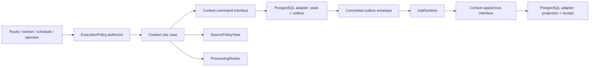
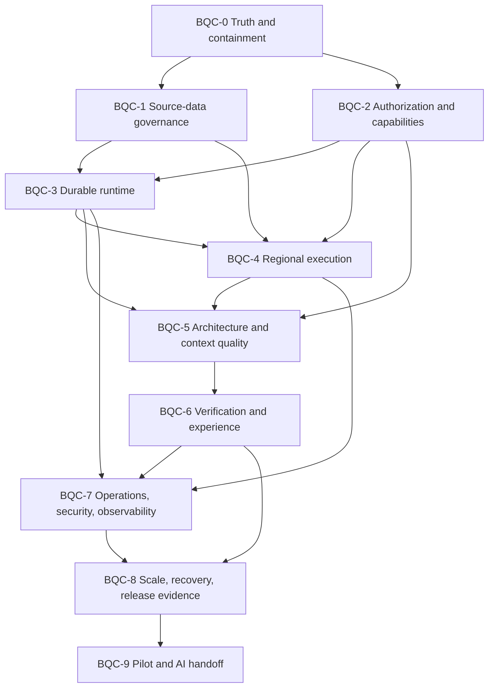

# Beta Quality Completion — Master Plan

**Program:** BQC-0…BQC-9  
**Status:** Proposed  
**Date:** 2026-07-17  
**Starting evidence:** BQR validation at `29b02187`  
**Target:** internal beta suitable for real, allowlisted properties  
**Scale:** 5,000 properties / 500,000 new reviews per month

## 1. Outcome

Produce one immutable beta release candidate in which:

- every enabled capability works through one authoritative production path;
- every dark capability is inaccessible through routes, commands, events, jobs, schedules, operators, and public edges;
- raw Google content refreshes or disappears under one executable lifecycle regardless of where it was copied;
- state changes and durable facts cannot be separated by a crash;
- consumer effects and idempotency receipts cannot be separated by a crash;
- authorization, property access, suspension, consent, cohort, and region decisions fail closed;
- the property's processing region selects the actual queue, worker, data, and provider execution target;
- tests fail on runtime, browser, accessibility, policy, architecture, retry, and recovery defects;
- production topology, alerts, security gates, target-scale behavior, restore, and release evidence have been exercised;
- the codebase concentrates complexity in deep context-owned modules instead of shared barrels and composition glue.

This program is complete only when evidence is accepted. Merging its implementation is not sufficient.

## 2. Starting baseline

The [validation report](../bqr-implementation-validation-report-2026-07-16.md) records 25 findings:

| Axis                         |  P0 |  P1 |  P2 | Total |
| ---------------------------- | --: | --: | --: | ----: |
| Standards adherence          |   2 |   6 |   6 |    14 |
| Plan/specification adherence |   3 |   6 |   2 |    11 |
| Combined inventory           |   5 |  12 |   8 |    25 |

The implementation has valuable foundations: typed event envelopes, an atomic review tracer bullet, real inbox consumers, lifecycle/region domain fields, policy vocabulary, tests, health primitives, and operational templates. BQC deepens and completes these modules; it does not replace them with a new architecture.

## 3. Beta capability contract

The capability posture from the BQR master plan remains authoritative unless a separate promotion plan is accepted.

| Context      | Beta posture                       | Required state at BQC acceptance                                                                            |
| ------------ | ---------------------------------- | ----------------------------------------------------------------------------------------------------------- |
| Identity     | Enabled                            | Invite-only, verified sessions, built-in roles, explicit property grants, last-owner protection             |
| Property     | Enabled                            | Operator allowlist, lifecycle, suspension, disconnect/purge, processing profile                             |
| Integration  | Enabled for allowlisted properties | OAuth, bounded sync, verified/deduplicated notifications, reconnect/disconnect, visible provider failures   |
| Review       | Enabled                            | Fresh source cache, bounded incremental sync, manual reply workflow, idempotent publication, reconciliation |
| Inbox        | Enabled                            | Durable projection, cursor reads, triage, assignment, notes, escalation, repair/replay                      |
| Dashboard    | Limited                            | Property-local, policy-permitted, bounded/cached governed reads                                             |
| Metric       | Internal projection                | Idempotent permitted rollups only                                                                           |
| Notification | In-app only                        | Durable privacy-filtered in-app notifications; non-auth email dark                                          |
| Activity     | Limited                            | Privacy-filtered collaboration facts; security audit separately owned                                       |
| Staff        | Minimal                            | Participation/display only; never an inferred authorization source                                          |
| Team         | Dark                               | Negative evidence at every execution path                                                                   |
| Portal       | Dark                               | Reads, writes, uploads, and public surfaces denied independently                                            |
| Guest        | Dark                               | Sessions, submissions, media, scans, clicks, and feedback denied                                            |
| Goal         | Dark                               | Reads, commands, events, schedules, and reconciliation denied                                               |
| Badge        | Dark                               | Evaluation, awards, configuration, events, and workers denied                                               |
| Leaderboard  | Dark                               | Reads, recomputation, events, and exports denied                                                            |
| AI           | Dark                               | Provider calls, analysis, drafting, trends, batches, and dashboards absent/denied                           |

## 4. Architecture target

### 4.1 Deep modules at context-owned seams

Each enabled context exposes a small interface that hides transaction, schema, outbox, receipt, retry, and provider details. The interface is also the main test surface.



The named interfaces are design targets, not permission to create generic pass-through wrappers. An interface earns its seam only when it hides meaningful behavior and has at least production and test adapters where variability is real.

### 4.2 Target modules

| Module                     | Small interface responsibility                                            | Complexity hidden in implementation                                                                             |
| -------------------------- | ------------------------------------------------------------------------- | --------------------------------------------------------------------------------------------------------------- |
| `ExecutionPolicy`          | Authorize an actor/execution against an action and resource               | capability state, cohort, property grant, suspension, consent, assigned scope, policy versions, audit decision  |
| `ReviewSourceLifecycle`    | Observe a successful fetch; read eligible content; expire bounded batches | fetch clock, hashes, retention classification, copy inventory, transactional scrub/delete, pagination, evidence |
| Context command modules    | Execute one context command and return its result                         | invariants, optimistic concurrency, state mutation, outbox insert, post-commit local notification               |
| Context projection modules | Apply one durable event once                                              | projection mutation, receipt, deduplication, ordering, repair metadata                                          |
| `JobRuntime`               | Run a registered job with declared policy                                 | parsing, retry taxonomy, heartbeat, timeouts, attempts, quarantine, telemetry, unknown-job rejection            |
| `ProcessingRouter`         | Resolve a workload to an approved target                                  | property region, provider availability, queue/data cell, no-fallback policy, decision evidence                  |
| `OperationsSnapshot`       | Return an authorized operational view                                     | DB/Redis readers, queue age, source freshness, version/config metadata, redaction                               |

### 4.3 Dependency direction

- Domain imports only domain/shared pure primitives.
- Application imports domain and application ports.
- Infrastructure implements context-owned ports.
- Server modules call application interfaces and policy seams; they do not query databases.
- Shared runtime knows event/job envelopes and generic delivery mechanics, not context domain events or context repositories.
- Cross-context consumers reload protected data through explicit owning-context lookup interfaces.
- Composition instantiates modules; it does not contain business policy.

## 5. Non-negotiable engineering rules

1. **Replace, do not layer.** Every temporary dual path has a comparison metric, owner, expiry, rollback, and removal slice committed to the phase plan.
2. **One externally visible effect.** Shadow paths may compare decisions but cannot publish replies, send email, or mutate an external provider twice.
3. **Expand → backfill → verify → switch → contract.** Database and event contracts use reversible staged cutovers.
4. **Failure is data.** Retryable, terminal, ambiguous, rejected, and operator-required outcomes are stored and observable; catch/log/return is not a failure policy.
5. **Policy at execution time.** Delayed jobs re-evaluate policy immediately before protected reads and side effects.
6. **No content in transport facts.** Events, jobs, logs, traces, metrics, and evidence carry identifiers and stable content-free facts only.
7. **The interface is the test surface.** Tests verify behavior through deep module interfaces and real adapters; source scans are supplemental only.
8. **No phase-sized PRs.** Each PR closes one invariant or one vertical slice and leaves the repository releasable under the current dark/enabled posture.
9. **No required soft gates.** Required evidence cannot use `continue-on-error`, log-only failure, or an unowned exception.
10. **No real data in unsafe intermediate states.** A partial migration never activates its path for real Google content.

## 6. Phase dependency map



BQC-1 and BQC-2 can proceed in parallel after BQC-0 if they do not edit the same policy/event family. BQC-5 may start local characterization and inventory work earlier, but production cutovers wait for the BQC-2/3 interfaces.

## 7. Delivery slices

Every slice follows this template:

1. State the invariant and the current authoritative path.
2. Add a failing behavior/contract test.
3. Introduce or deepen the smallest context-owned interface.
4. Implement the production adapter and the local test adapter where the seam is real.
5. Migrate/backfill if required.
6. Shadow/compare without duplicate external effects.
7. Switch the authoritative path behind a default-off capability when applicable.
8. Observe defined metrics for the slice.
9. Delete the superseded path and tests that inspect its internals.
10. Attach evidence and update the finding/gate state.

## 8. Quality policy and measurable budgets

These are beta gates, not aspirational dashboards.

### 8.1 Correctness and architecture

- Zero unresolved P0/P1 findings.
- Zero confirmed cross-context/layer violations on enabled production paths.
- Zero route-to-database access.
- Zero Node-only imports reachable by browser/domain modules.
- Zero duplicate authoritative models for schema, authorization, capability, lifecycle, or routing.
- Semantic migration parity covers tables, columns, types, nullability, defaults, constraints, foreign keys, indexes, order, predicates, and migration journal continuity.
- Every enabled command producing a durable fact has a state+outbox atomicity test.
- Every enabled projection has a projection+receipt atomicity test.

### 8.2 Test quality

- Bare documented test commands pass from a clean clone without secret/provider access.
- Pure domain rules: 100% statement and branch coverage unless an explicit unreachable branch is documented.
- Changed production code: minimum 90% statement and 85% branch coverage, with repository baseline ratcheted upward.
- Required browser/component gates fail on uncaught errors, unhandled rejections, `console.error`, failed network mutations, and accessibility violations.
- Critical tests assert a meaningful state transition or fail-closed decision, not only page chrome.
- No flaky-test retries used to conceal nondeterminism; trace/video/screenshot artifacts exist for failures.

### 8.3 Maintainability

- Fallow health reaches at least A/90 for enabled-path modules; repository-wide score is ratcheted from the measured 71/B.
- No new function exceeds configured cognitive/cyclomatic thresholds without an approved explanation.
- All 120 existing complexity findings are triaged; P0/P1-path hotspots are refactored before beta.
- Confirmed unused production controls and all stale suppressions are removed or wired with tests.
- Duplication drops below 7% for beta, with zero duplicated policy/domain invariants; a post-beta ratchet targets 5%.
- `.fallowrc.json` has one unambiguous regression policy and CI gates both new violations and the agreed burn-down baseline.

### 8.4 Performance and operations

- No unbounded tenant/fleet query or job.
- Cursor/batch loops prove progress and terminate safely.
- Queue oldest age, lag, retry, stalled, quarantine, and redrive SLOs are measured.
- Source refresh/purge completes within policy windows at the target dataset.
- Initial RPO ≤15 minutes and RTO ≤4 hours are observed in a restore rehearsal.
- Detailed metrics are private; liveness is shallow and dependency-free; readiness is dependency-aware.

Budgets may be tightened during BQC-0. They may not be weakened merely to make the existing baseline green.

## 9. CI and evidence model

### 9.1 Required CI lanes

1. **Fast correctness:** format, typecheck, lint, architecture boundaries, changed-code coverage.
2. **Unit/domain:** hermetic unit and property-based domain rules.
3. **PostgreSQL:** fresh/upgrade migrations, semantic schema parity, repositories, transactions, tenancy.
4. **Redis/BullMQ:** job runtime, leases, retry, duplicate, stalled, quarantine, redrive.
5. **Component/accessibility:** one authoritative Storybook/Vitest browser gate with console failure.
6. **Critical browser:** enabled workflows and dark-path negative tests.
7. **Full browser:** hard gate before release-candidate promotion.
8. **Build/artifact:** web, worker, Storybook, production container, SBOM/content inspection.
9. **Security/supply chain:** secrets, dependencies, licenses, static security, container/artifact scan.
10. **Release evidence:** validates that required evidence files refer to the same immutable release identity.

### 9.2 Release evidence structure

```text
docs/release-evidence/beta/<release-id>/
  manifest.md
  finding-closure.md
  quality-gates.md
  migration-and-schema.md
  source-data-governance.md
  authorization-and-capabilities.md
  event-and-job-reliability.md
  regional-execution.md
  security-and-privacy.md
  accessibility-and-performance.md
  scale-and-recovery.md
  pilot-observations.md
  exceptions.md
  approval.md
```

The manifest binds commit SHA, lockfile hash, artifact/container digest, migration version, capability-policy version, source-policy version, routing-policy version, environment/cell, test dataset identity, CI run URLs, and evidence owners.

## 10. Exception policy

- P0: no exception.
- P1: no beta acceptance exception. A temporary containment exception may exist only while the capability remains provably dark.
- P2/P3: written owner, impact, mitigation, expiry, target phase, and approval.
- Required evidence cannot be waived by marking its CI step soft.
- External/environment blocks use `blocked`, not `complete`; the evidence deadline and accountable owner remain visible.

## 11. Rollout policy

| Stage                  | Data/actions                                  | Entry gate                                    | Exit gate                                                               |
| ---------------------- | --------------------------------------------- | --------------------------------------------- | ----------------------------------------------------------------------- |
| 0 Local/CI             | Generated fixtures                            | BQC-0                                         | BQC-1…6 deterministic locally/CI                                        |
| 1 Production synthetic | Synthetic org/property; no Google             | BQC-7 topology and controls                   | Deploy, queues, retention, alerts, restore paths work                   |
| 2 Google shadow        | One owned US property; read/sync only         | BQC-1…8 accepted                              | Freshness, retention, reconciliation, region, disconnect/purge observed |
| 3 Controlled publish   | Same property; named managers; manual reply   | Reply workflow and ambiguity runbook accepted | Publish success/failure/retry/reconciliation accepted; no duplicate     |
| 4 Small cohort         | 3–5 allowlisted US properties                 | First property accepted                       | ≥14 stable observed days; no P0/P1; owner acceptance                    |
| 5 Internal beta        | Broader allowlist; EU only after EU cell gate | Go/no-go approval                             | Continued SLO and product acceptance                                    |

Rollback disables new work through policy, stops schedules, preserves canonical data/evidence, and drains or quarantines queues. It never silently changes region or deletes diagnostic evidence.

## 12. Estimate and staffing

| Phase     |                         Engineering estimate |
| --------- | -------------------------------------------: |
| BQC-0     |                                     2–3 days |
| BQC-1     |                                    8–12 days |
| BQC-2     |                                    8–12 days |
| BQC-3     |                                   12–18 days |
| BQC-4     |                                     6–9 days |
| BQC-5     |                                   10–16 days |
| BQC-6     |                                    8–12 days |
| BQC-7     |                                    8–13 days |
| BQC-8     |                                    6–10 days |
| BQC-9     |             3–5 days plus 14-day observation |
| **Total** | **71–110 engineering days plus observation** |

One experienced engineer should expect approximately 18–26 focused weeks. Two senior engineers split between runtime/data and product/security/verification may reduce calendar time to roughly 12–17 weeks plus observation. Atomic cutovers, migrations, region activation, and pilot stages remain sequential.

Re-estimate after BQC-0 and at every accepted phase using actual slice throughput. Do not compress by overlapping edits to the same event, schema, or policy family.

## 13. Program acceptance

BQC is accepted only when:

1. all 25 findings map to accepted closure evidence;
2. every phase exit matrix is accepted for the same immutable release candidate;
3. the beta capability matrix matches deployed policy and negative tests;
4. no P0/P1 remains;
5. BQC-8 load, fault, restore, RPO/RTO, security, and release evidence passes;
6. BQC-9 completes one-property shadow, controlled manual publication, and 3–5-property observation;
7. engineering, product/property, security/privacy, Google-project, and operations owners sign the same manifest;
8. Phase 17/18 receives a new planning baseline rather than inheriting unresolved BQR assumptions.
