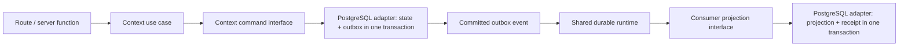
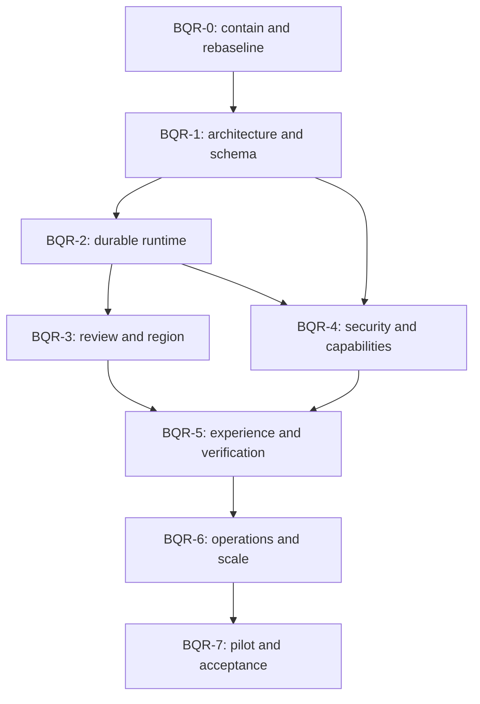

# Beta Quality Remediation — Master Plan

**Status:** Active — BQR-0…1 complete; BQR-2 durable runtime in progress  
**Date:** 2026-07-16  
**Target:** Internal beta with real, allowlisted US properties  
**Scale model:** 5,000 properties and 500,000 new reviews/month  
**Regional model:** Property-region routing with no silent cross-region fallback  
**AI posture:** Phases 17–18 remain disabled

## 1. Outcome

Produce a codebase and operating environment in which every enabled beta capability works through its production path, every disabled capability fails closed, and every clean-architecture, data-integrity, policy, security, accessibility, performance, recovery, and operational claim has executable evidence.

The program is corrective, not cosmetic. It concentrates complexity inside deep context-owned modules, removes parallel runtime truths, and proves behavior across database, Redis/BullMQ, web, worker, Google, and deployment seams.

## 2. Starting assessment

The July review established a mixed baseline:

- format, typecheck, lint, fresh migrations, web/worker builds, 2,738 unit tests, and 158 integration tests pass;
- migration discipline, incremental rollups, local scale tooling, security documentation, test-suite separation, and several pure domain rules are useful improvements;
- the transactional outbox is not atomic, the relay and dispatcher disagree on the queued shape, consumers are not registered in production, and some consumers acknowledge no-op work;
- application use cases import shared outbox infrastructure, bypassing the documented dependency direction;
- review lifecycle and processing-profile migrations are not represented in the canonical Drizzle schemas or production use cases;
- raw review/reviewer content remains in events and denormalized copies without a complete refresh-or-remove lifecycle;
- capability and centralized authorization modules are not authoritative production seams;
- several beta controls, health/telemetry modules, Core Web Vitals, operational commands, and post-beta models are scaffolds or prototypes;
- critical E2E and Storybook build gates are non-blocking, and staging recovery/scale/pilot evidence is absent.

This plan treats those as current facts. Each claim must be re-audited at implementation time because the repository may change.

## 3. Non-negotiable principles

### 3.1 One truth per concern

- One event authority per migrated event family.
- One canonical schema model matching the migrated database.
- One authorization decision path for permissions and property scope.
- One capability decision path shared by web, commands, workers, consumers, schedules, and operators.
- One owner for each aggregate, projection, source-content copy, and derived datum.
- One release artifact identity across build, migration, deployment, evidence, and rollback.

### 3.2 Deep modules at clean seams

The target is not another global helper. Each owning context exposes a small interface that hides its transaction, invariant, outbox, receipt, retention, or workflow implementation.



Callers must not know Drizzle transaction types, outbox tables, receipt tables, BullMQ jobs, Redis keys, or retry internals.

### 3.3 Enabled-and-proven or disabled-and-inaccessible

No third state is permitted. A capability cannot be considered “off” merely because navigation is hidden, a scheduled job is not normally triggered, or no manager currently uses it.

### 3.4 Evidence before status

No phase is complete because its PR merged. Completion requires its exit matrix, evidence files, owner, date, release SHA, schema version, environment, and unresolved-exception register.

### 3.5 No real data during unsafe intermediate states

Synthetic and disposable data only until BQR-0 through BQR-6 are complete. The current outbox dispatcher must not process real work. No Google review content enters an environment that has not passed the source-lifecycle and regional gates.

## 4. Beta capability posture

The default beta remains deliberately narrow. “Dark” means server-disabled across all execution paths and covered by negative tests.

| Context      | Initial beta posture               | Required working surface                                                                                                      |
| ------------ | ---------------------------------- | ----------------------------------------------------------------------------------------------------------------------------- |
| Identity     | Enabled                            | Invite-only users, verified email, built-in roles, sessions, explicit property access, last-owner protection                  |
| Property     | Enabled                            | Allowlisted property creation/import, lifecycle, processing profile, suspension/disconnect/purge                              |
| Integration  | Enabled for allowlisted properties | Google OAuth, account/location selection, encrypted token lifecycle, notification receipt, bounded sync, reconnect/disconnect |
| Review       | Enabled                            | Fresh Google review cache, incremental sync, source lifecycle, manual reply draft/approval/publication, visible failures      |
| Inbox        | Enabled                            | Durable review projection, cursor pagination, triage, assignment, notes, escalation, replay/repair                            |
| Dashboard    | Limited                            | Property-local, policy-permitted, bounded cached reads from governed projections                                              |
| Metric       | Internal projection only           | Idempotent permitted rollups needed by the limited dashboard; no staff gamification from Google reviews                       |
| Notification | In-app only                        | Durable in-app notifications; non-auth outbound email dark                                                                    |
| Activity     | Limited                            | Privacy-filtered collaboration activity; security audit is separately owned                                                   |
| Staff        | Minimal enabled slice              | Direct property participation needed for access/display; no inferred authorization from team/portal roles                     |
| Team         | Dark                               | All routes, commands, events, jobs, and schedules denied                                                                      |
| Portal       | Dark                               | Authenticated and public reads/writes denied unless separately promoted after its public-edge gate                            |
| Guest        | Dark                               | Public submissions, sessions, media, scans, clicks, and feedback denied                                                       |
| Goal         | Dark                               | Commands, reads exposed to users, schedules, and reconciliation jobs denied                                                   |
| Badge        | Dark                               | Evaluation, awards, configuration, and workers denied                                                                         |
| Leaderboard  | Dark                               | Reads, recomputation, and exports denied                                                                                      |
| AI           | Dark                               | Analysis, draft generation, trends, batch jobs, and dashboards denied until separate Phase 17/18 acceptance                   |

If product scope changes, the affected context must pass its post-beta vertical-slice plan and all BQR gates before activation. It is not added opportunistically to the pilot.

## 5. Program phases and dependencies

| Phase | Outcome                                                                                   |                         Engineering estimate | Hard dependency                   |
| ----- | ----------------------------------------------------------------------------------------- | -------------------------------------------: | --------------------------------- |
| BQR-0 | Unsafe paths contained; truthful baseline and capability inventory                        |                                     3–5 days | None                              |
| BQR-1 | Architecture rules executable; schemas and domain conventions coherent                    |                                    7–11 days | BQR-0                             |
| BQR-2 | Atomic commands/events/projections and reliable jobs/external workflows                   |                                   14–22 days | BQR-1                             |
| BQR-3 | Review refresh/removal and property-region routing work end to end                        |                                   10–16 days | BQR-2 review slice                |
| BQR-4 | Authoritative authorization/capabilities, tenancy, privacy, security, context containment |                                   10–16 days | BQR-1; selected BQR-2 primitives  |
| BQR-5 | Blocking browser/component/a11y/performance verification                                  |                                    8–13 days | BQR-3 and BQR-4 user paths stable |
| BQR-6 | Production-like topology, telemetry, recovery and target-scale proof                      |                                   10–17 days | BQR-2 through BQR-5               |
| BQR-7 | Staged real-property pilot and recorded beta acceptance                                   | 14-day observation plus 3–5 engineering days | All earlier gates                 |

Total implementation effort is approximately **65–105 engineering days**, excluding legal/vendor waiting and the mandatory observation window. One experienced engineer should plan roughly 14–22 focused weeks. Two senior engineers with separate runtime and product/security ownership may reduce calendar time to roughly 9–14 weeks, but BQR-0/1, event-family cutovers, migrations, and pilot stages remain sequential.

## 6. Delivery topology



BQR-3 and the non-runtime parts of BQR-4 can proceed in parallel only after their shared interfaces are fixed in BQR-1. No team should edit the same event family, schema family, authorization entry point, or migration at the same time.

## 7. Implementation method

### 7.1 Tracer-bullet vertical slices

Implement one full production path at a time:

1. Domain rule and tagged outcome.
2. Application use case and small context-owned interface.
3. PostgreSQL/Google/Redis adapter.
4. Migration and integrity constraint.
5. Event/job/consumer behavior where applicable.
6. Server function and UI states.
7. Unit, integration, contract, crash, browser, telemetry, and operator evidence.
8. Remove the superseded implementation and its tests.

Do not add another parallel model and defer the cutover.

### 7.2 PR discipline

- One invariant or vertical slice per PR; avoid phase-sized PRs.
- Every PR states the authoritative path before and after the change.
- Database changes use expand → backfill/reconcile → switch → contract.
- Event changes use record-only → shadow verification → consumer switch → legacy removal.
- Capability changes default off until after deployment and verification.
- Every temporary dual path has an owner, expiry, metric, comparison method, and removal PR linked before merge.
- No temporary path may silently perform the same external effect twice.

### 7.3 Evidence structure

Each candidate build creates:

```text
docs/release-evidence/beta/<release-id>/
  manifest.md
  quality-gates.md
  migration-and-schema.md
  event-and-job-reliability.md
  security-and-privacy.md
  accessibility-and-performance.md
  scale-and-recovery.md
  pilot-observations.md
  exceptions.md
  approval.md
```

`manifest.md` records commit SHA, lockfile hash, web/worker artifact digests, Node/pnpm versions, migration journal/version, capability-policy version, routing-policy version, source-policy version, environment, test data identity, and evidence owners.

## 8. Cross-phase quality gates

The following are blocking before a beta release candidate can be deployed:

- clean install with frozen lockfile;
- formatting, typecheck, lint, dependency-boundary and schema-drift checks;
- unit, PostgreSQL integration, Redis/BullMQ integration, component/Storybook, and critical Playwright suites;
- web, worker, Storybook, and production-container builds;
- fresh migration, upgrade migration from the last supported schema, and rollback/forward-recovery rehearsal;
- secret, dependency, static-security, license and artifact-content scans;
- event crash-boundary, duplicate, reorder, poison, stalled-worker and redrive tests;
- authorization/capability negative matrix for every entry point;
- source-content retention and regional no-fallback tests;
- accessibility, responsive, theme, reduced-motion, long-content and real-browser tests;
- target-scale, burst, backlog, cache-outage, Redis-outage and database-recovery evidence;
- liveness/readiness, worker heartbeat, queue age, source freshness, publish ambiguity and error-budget alerts;
- zero unresolved P0/P1 findings and an approved, expiring disposition for every lower-risk exception.

No CI job that supplies required evidence may use `continue-on-error`.

## 9. Stop-the-line conditions

Any of these halts rollout and returns the program to the owning phase:

- cross-tenant or wrong-property access;
- source state committed without its required durable event;
- projection state committed without its receipt, or receipt committed without required state;
- unexplained loss, duplicate externally visible reply/email, or ambiguous publish without reconciliation;
- source content served after expiry or processed in an unapproved region;
- leaked OAuth token, secret, reviewer identity, review text, session, or presigned URL in telemetry/evidence;
- disabled capability executable through any non-UI path;
- failed restore, RPO/RTO miss, unbounded backlog, or unavailable operator containment;
- Google policy, merchant authorization, privacy, or manual-publication violation.

## 10. Final acceptance

Internal beta is ready only when:

1. BQR-0 through BQR-6 evidence is complete for one immutable release candidate.
2. One owned US property completes read-only shadow and controlled manual reply stages.
3. Three to five allowlisted US properties operate for at least 14 stable observed days.
4. No unresolved P0/P1 exists; lower findings have accountable, time-bounded dispositions.
5. Engineering, product/property, security/privacy, Google-project and operational owners sign the same evidence manifest.
6. The capability matrix in production matches the documented beta posture.
7. Phase 17/18 and post-beta activation remain separately gated.
