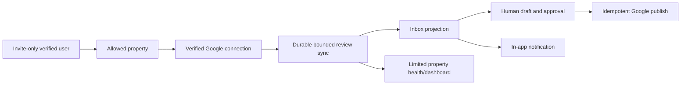
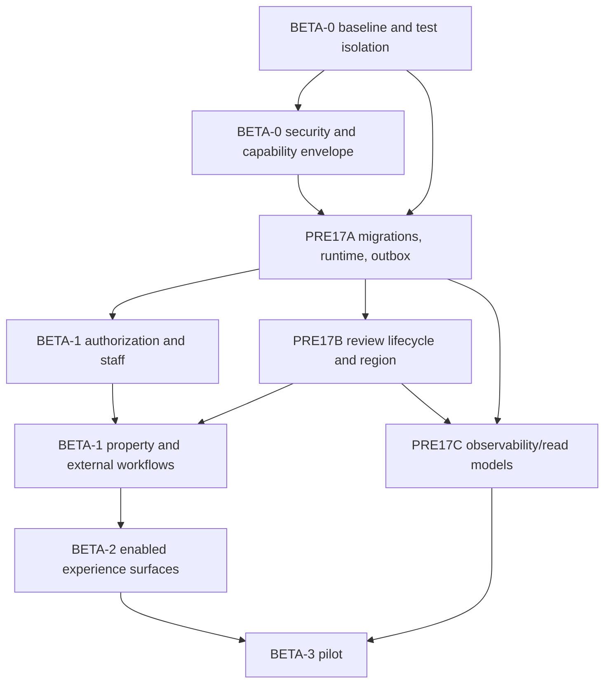

# Beta Readiness Program — Master Plan

**Status:** Proposed; ready to sequence after the current inbox/goal redesign is isolated in reviewed commits  
**Date:** 2026-07-14  
**Target:** Internal-team beta with real properties  
**Capacity target:** 5,000 properties and 500,000 new reviews/month  
**Regional decision:** Property-region routing; no silent cross-region fallback  
**AI decision:** Phases 17/18 remain blocked by PRE17 and the written Google policy disposition

## 1. Outcome

Move Reputation Key from a broad development build to a deliberately controlled beta that the internal team can use with real properties without risking lost reviews, unauthorized access, irreversible deletion, duplicate external effects, accidental email, or unrecoverable infrastructure.

This program is broader than Phase PRE17. PRE17 remains the authoritative plan for durable events, Google review lifecycle, property-region routing, scale, and observability. The beta program absorbs that work and adds product scope control, security, identity, public-edge safety, lifecycle across every context, accessibility, operational readiness, legal/privacy preparation, and staged real-property onboarding.

The first beta is not “all implemented features turned on.” It is this evidence-backed path:

Goals, badges, leaderboards, custom roles, public guest writes, portal uploads, and external notification email remain server-disabled until their independent gates pass. Disabling UI navigation is insufficient: routes, mutations, events, schedules, and workers must also honor the capability.

The deferred product contexts are completed after beta through the [Post-Beta Product Completion Program](post-beta-product-completion-master-plan.md). The beta plan deliberately does not treat those contexts as implementation-complete.

## 2. Source material

- [Beta readiness audit](beta-readiness-audit-2026-07-14.md)
- [Beta readiness primary research](beta-readiness-primary-research-2026-07-14.md)
- [PRE17 master plan](phase-pre17-master-plan.md)
- [PRE17A platform reliability](phase-pre17a-platform-reliability-plan.md)
- [PRE17B review data and regional readiness](phase-pre17b-review-data-and-regional-readiness-plan.md)
- [PRE17C scale, observability, and closure](phase-pre17c-scale-observability-and-closure-plan.md)
- [Google policy clarification request](google-business-profile-ai-policy-clarification.md)
- [Post-beta product completion master plan](post-beta-product-completion-master-plan.md)

Official-doc-backed requirements and their links live in the two research files so implementation tickets can cite stable evidence without turning this plan into a link catalogue.

## 3. Beta definition and defaults

### 3.1 Cohort

- Internal team members only at first.
- Organizations and properties are allowlisted by an operator; public registration and self-service organization creation are disabled.
- Start with one US property, then three to five US properties. Admit European properties only after the Europe data/processing cell and privacy review pass their gate.
- A named internal property owner and engineering owner exist for every connected property.
- Reply publication is human initiated/approved. No auto-reply, AI analysis, or historical AI backfill.
- External email is off except explicitly allowlisted identity emails until delivery safety is proven.

### 3.2 Feature posture

| Capability                           | Initial state                                     | Owner gate                                                                   |
| ------------------------------------ | ------------------------------------------------- | ---------------------------------------------------------------------------- |
| Identity, sessions, built-in roles   | On                                                | BETA-0 security/identity                                                     |
| Custom/dynamic roles                 | Off                                               | Complete repository-wide `AuthorizationPolicy` migration and custom-role E2E |
| Property and staff direct assignment | On                                                | BETA-1 core data integrity                                                   |
| Teams                                | Off unless beta workflow proves necessary         | Team assignment/deletion gate                                                |
| Google OAuth/import/sync/status      | On for allowlisted properties                     | BETA-1 external workflow gate                                                |
| Reviews, inbox, manual replies       | On                                                | PRE17A/B + BETA-1                                                            |
| Dashboard                            | Limited property-local, policy-permitted sections | PRE17C query/policy gate                                                     |
| In-app notifications                 | On                                                | Durable delivery gate                                                        |
| Notification email                   | Off except allowlisted auth mail                  | BETA-2 email gate                                                            |
| Portal/guest/QR/NFC                  | Off by default                                    | BETA-2 public-edge/upload/accessibility gate                                 |
| Goals, badges, leaderboards          | Off                                               | Independent correctness, authorization, jobs, and product gates              |
| AI 17/18                             | Off                                               | PRE17 complete + ADR 0031 + Phase-specific plan                              |

### 3.3 Initial internal service objectives

These are operating objectives, not customer promises:

| Journey/signal                                                | Initial objective                                                                                         |
| ------------------------------------------------------------- | --------------------------------------------------------------------------------------------------------- |
| Authenticated page/API availability during pilot              | ≥99.5% measured monthly; planned maintenance excluded and recorded                                        |
| GBP notification accepted → review committed                  | p95 ≤60 seconds under healthy Google/dependencies                                                         |
| Review committed → inbox visible                              | p99 ≤30 seconds                                                                                           |
| Human reply publish action → terminal success/failure visible | p95 ≤10 seconds normally; durable retry/status if slower                                                  |
| Common property/inbox server response                         | p95 ≤750 ms at pilot data; target-scale dashboard budgets remain PRE17C's stricter values                 |
| Data loss from committed source state                         | Zero in tested failures                                                                                   |
| Duplicate externally visible reply/email                      | Zero in tested failures                                                                                   |
| Error acknowledgement                                         | P0 immediately/page; P1 same working day; every alert links to a runbook                                  |
| Backup recovery                                               | Initial RPO ≤15 minutes and RTO ≤4 hours, verified by restore drill; revise to actual provider capability |

## 4. Program phases

### BETA-0 — Stop-the-line safety and controlled scope

Detailed plan: [BETA-0 safety, security, and scope](beta-0-safety-security-and-scope-plan.md)

1. Isolate the active worktree into reviewable commits and define the release revision.
2. Fix web build, goal contract drift, format scope, and blocking CI.
3. Replace unsafe test DB fallback with disposable, identity-checked PostgreSQL/Redis environments.
4. Patch critical/high dependencies and add supply-chain controls.
5. Add `BetaCapabilities`, environment validation, invite-only registration, built-in-role-only posture, verified email, safe request/proxy/error/header handling, and kill switches.
6. Establish privacy/data inventory, beta agreement, Google access disclosure, and operator allowlists.

**Gate:** A clean clone builds/tests through blocking CI; no destructive test can reach a non-disposable database; no non-allowlisted user/org/property can enter beta; no critical/high reachable dependency advisory remains without a signed time-bound exception.

### BETA-1 — Reliable real-property core

Detailed plan: [BETA-1 real-property core](beta-1-real-property-core-plan.md)

1. Implement PRE17A migration authority, job runtime, transactional outbox, and idempotent consumers.
2. Deepen authorization and staff assignment as transactional modules.
3. Replace property hard deletion with archive and durable lifecycle.
4. Implement PRE17B bounded Google ingestion, content lineage/expiry, webhook receipts, connection health, disconnect, and property-region profile.
5. Make import, review sync, reply publish, invitation assignment, and deletion explicit durable workflows.
6. Make inbox, activity, metrics, dashboard, and in-app notifications replay-safe projections.

**Gate:** Synthetic and sandbox failure injection proves no lost source event or duplicate visible effect; one allowlisted property can connect, sync, triage, publish, disconnect, archive, and recover with complete operator visibility.

### BETA-2 — Conditional surfaces and human experience

Detailed plan: [BETA-2 experience, public edge, and communication](beta-2-experience-public-edge-plan.md)

1. Close core journey usability, accessibility, responsive, theme, and performance gaps.
2. Bound high-cardinality property/member selectors and route payloads.
3. Harden external email and enable it only by recipient cohort.
4. Either keep portal/guest dark or complete signed sessions, rate limiting, privacy, safe upload/image processing, public accessibility, and abuse tests.
5. Decide whether teams are required; keep recognition contexts dark unless separately accepted.

**Gate:** Critical workflows pass blocking keyboard/mobile/desktop E2E, approved browsers, Storybook accessibility, and performance budgets. Enabled public/email surfaces have abuse, privacy, delivery, and kill-switch evidence.

### BETA-3 — Operations, scale evidence, and pilot

Detailed plan: [BETA-3 operations and pilot](beta-3-operations-scale-and-pilot-plan.md)

1. Implement PRE17C telemetry, readiness/liveness, worker heartbeats, safe logging, read models/cache, and capacity tests.
2. Codify web, worker, relay/scheduler where separated, database, queue Redis, cache Redis, object storage, and migration deployment.
3. Configure backups/PITR, restoration, secrets/key rotation, least privilege, dashboards, alerts, runbooks, incident roles, and support workflow.
4. Run staged cohorts: synthetic → shadow/read-only → one real US property → controlled replies → three to five properties → broader internal beta.
5. Run a go/no-go review and record exceptions with owner, expiry, mitigation, and rollback.

**Gate:** Pilot acceptance matrix in section 8 is signed; monitoring is quiet under normal load and actionable under injected failures; restore and rollback drills pass; the first property owner accepts the workflow.

## 5. Dependency map

PRE17A is a beta prerequisite. PRE17B is required before a real Google property. PRE17C may develop in parallel after the runtime seam exists but must close before expansion beyond the first controlled property.

## 6. Implementation method

### 6.1 Work shape

- Use vertical, reversible commits with one migration/behavioral seam at a time.
- Write the ADR or invariant first where a decision changes architecture.
- Add characterization tests before changing active inbox/goal behavior.
- Use expand → backfill → verify → cut over → contract for data changes.
- Every temporary flag has owner, default, observation period, removal issue, and a single active path for external side effects.
- No deployment combines an irreversible migration, a large backfill, and an application cutover.

### 6.2 Required new ADRs beyond PRE17

| ADR                                               | Decision                                                                                                                            |
| ------------------------------------------------- | ----------------------------------------------------------------------------------------------------------------------------------- |
| 0032 — Beta capability and cohort controls        | Server-side organization/property/user capabilities own feature, route, mutation, event, and schedule availability.                 |
| 0033 — Authorization policy                       | Action, target resource, property data scope, and owner invariants are one identity-owned decision; contexts do not branch on role. |
| 0034 — Property and organization lifecycle        | Archive, suspend, disconnect, export, purge, evidence, and recovery states.                                                         |
| 0035 — Public request identity and abuse controls | Trusted proxy, address derivation, signed guest session, layered throttling, origin, and fail behavior.                             |
| 0036 — Safe upload pipeline                       | Capability-bound private objects, validation, isolation, variants, quarantine, and deletion.                                        |
| 0037 — Outbound email                             | Environment allowlist, idempotency, provider status, webhooks, suppression, unsubscribe, and kill switch.                           |
| 0038 — Beta service objectives and recovery       | Initial SLOs, RPO/RTO, alert severity, ownership, and exception process.                                                            |

### 6.3 Deep modules, not more global glue

Deepen these seams: `AuthorizationPolicy`, `BetaCapabilities`, `ClientRequestIdentity`, context command stores, `JobRuntime`, `ExternalWorkflow`, `SourceContentLifecycle`, `SafeUpload`, `OutboundEmail`, and `TestEnvironmentLease`.

Do not introduce a generic unit-of-work/repository framework, Kafka, a workflow platform, a service mesh, Elasticsearch, or microservices for beta. PostgreSQL + outbox + BullMQ are sufficient at the stated scale when bounded and observable.

## 7. Staged real-property rollout

| Stage                    | Data/actions                                       | Entry proof                                                                                                                            | Exit proof                                                                                   |
| ------------------------ | -------------------------------------------------- | -------------------------------------------------------------------------------------------------------------------------------------- | -------------------------------------------------------------------------------------------- |
| 0 — Local/CI             | Generated fixtures only                            | BETA-0 green                                                                                                                           | Deterministic build/test/migration and fault suites                                          |
| 1 — Production synthetic | Synthetic org/property, no Google                  | Production envelope and monitoring                                                                                                     | Deploy, queue, email-off, backup, alerts, purge work                                         |
| 2 — Google shadow        | One internal property; read/sync only; no publish  | Written Google policy disposition permits the implemented storage/derivation model; Google project/access; privacy agreement; PRE17A/B | Freshness, reconciliation, retention, disconnect and purge verified                          |
| 3 — Controlled publish   | Same property; named managers; manual replies      | Reply workflow/E2E, audit, rollback, operator present                                                                                  | Publish success/failure/retry status accepted; no duplicate replies                          |
| 4 — Small cohort         | Three to five US properties                        | First property's controlled-publish stage is accepted                                                                                  | At least 14 stable observed days; no unresolved P0/P1; support/runbook feedback incorporated |
| 5 — Internal beta        | Broader allowlist; Europe only after regional gate | Go/no-go review                                                                                                                        | Four-week stability and product acceptance before external beta/AI                           |

At each stage, rollback means disable new work through capabilities, stop schedulers, preserve canonical data, drain or quarantine queues, and follow the runbook. It does not mean deleting evidence or silently switching regions/providers.

## 8. Final beta acceptance matrix

| Area               | Required proof                                                                                                                                                                              |
| ------------------ | ------------------------------------------------------------------------------------------------------------------------------------------------------------------------------------------- |
| Scope              | Server-enforced allowlist and capability tests prove disabled routes, writes, event consumers, and schedules cannot run.                                                                    |
| Baseline           | Clean clone passes format, type, lint, unit, PostgreSQL integration, Redis/BullMQ integration, web/worker/Storybook build, component tests, critical E2E, migrations, and dependency gates. |
| Test safety        | Destructive integration tests refuse ordinary/remote non-leased databases; CI creates and destroys isolated resources.                                                                      |
| Identity           | Invite-only, verified email, built-in roles, property scopes, last-owner protections, session invalidation, and sensitive-operation policy pass.                                            |
| Tenancy            | Negative cross-org/property tests cover every repository/server surface; high-risk relationships enforce tenant consistency in code/DB.                                                     |
| Google             | OAuth scopes/account choice, token rotation, webhook verification/dedupe, bounded sync, freshness, quotas, reconnect, disconnect, and support status pass.                                  |
| Review/inbox/reply | No lost event, correct lifecycle/expiry, cursor reads, projection repair, conditional transitions, manual approval, idempotent publish, and visible terminal failures.                      |
| Deletion           | User/member, connection, property, and organization workflows are retryable, observable, and delete all owned copies/derived work according to policy.                                      |
| Security           | Dependency/secret/static scans, headers/CSP, proxy/origin/rate/body/time controls, redacted errors/logs, key/secrets rotation, upload/public gates, and least privilege pass.               |
| Privacy/policy     | Current data map, retention/deletion schedule, notices/agreements, subprocessors, request procedure, and Google capability disposition are approved by accountable owners.                  |
| UX                 | Critical paths pass keyboard, screen-reader smoke, 200%/400% zoom, mobile/tablet/desktop, light/dark, reduced motion, long text, loading/empty/error/permission states.                     |
| Performance        | Target dataset and burst/backlog tests meet documented budgets; root/property selectors and queries are bounded; no unused fleet-wide jobs remain.                                          |
| Operations         | Versioned deploy, separate roles, readiness/liveness, heartbeats, dashboards/alerts, backups/PITR restore, rollback, incident/support runbooks, and ownership are exercised.                |
| Pilot              | Named property owner signs off; at least 14 stable observed days at small cohort; every exception has owner, expiry, mitigation, and approved go/no-go disposition.                         |

## 9. Estimate

The estimate includes PRE17 work and the general beta work described here. It excludes calendar waiting for Google, legal/privacy review, vendor account approval, and real-property observation windows.

| Phase                             |                                      Engineering effort |
| --------------------------------- | ------------------------------------------------------: |
| BETA-0                            |                                               7–11 days |
| BETA-1 including PRE17A/B overlap |                                              20–30 days |
| BETA-2                            | 8–13 days, less if portal/guest/email/teams remain dark |
| BETA-3 including PRE17C overlap   |                                              10–15 days |
| **Total**                         |                              **45–69 engineering days** |

One experienced engineer should plan roughly 10–15 focused weeks plus external waiting and pilot observation. Two engineers with clear ownership can reduce calendar time to roughly 7–10 weeks, but migration/runtime and core workflow paths remain sequential. Do not trade the first three beta gates for calendar compression.

## 10. Decisions to record before implementation reaches them

The defaults let BETA-0 start without another interview.

| Decision              | Planning default                                                                                                                                          | Deadline                  |
| --------------------- | --------------------------------------------------------------------------------------------------------------------------------------------------------- | ------------------------- |
| Beta signup           | Invite-only; operator creates/allows organizations                                                                                                        | BETA-0                    |
| Roles                 | Built-in owner/admin/member only; custom roles off                                                                                                        | BETA-0                    |
| Strong auth           | Verified email required; require MFA/passkey for owners once supported/tested                                                                             | Before controlled publish |
| Public portal/guest   | Dark in initial beta                                                                                                                                      | BETA-2 planning           |
| Teams                 | Dark unless direct assignments cannot cover pilot                                                                                                         | BETA-1 workflow review    |
| Notification email    | Auth mail to allowlist only; digests/urgent mail dark                                                                                                     | BETA-0/BETA-2             |
| Property deletion     | Archive immediately; purge after explicit operator-confirmed grace workflow                                                                               | ADR 0034                  |
| US pilot region       | US property cell; global control metadata only if documented/approved                                                                                     | Before Stage 2            |
| European pilot        | No EU real property until EU processing/data flow, DPA/privacy, backup/log/support access are verified                                                    | Before any EU property    |
| Google source content | No real-content storage or derived processing until the written Google disposition is translated into an approved, executable retention/capability policy | Before Stage 2            |
| Google aggregates/AI  | Disabled until written Google disposition and ADR 0031                                                                                                    | Before Phase 17/18        |
| Browser support       | Current and previous major Chrome/Safari/Firefox; mobile Safari/Chrome smoke                                                                              | BETA-2                    |
| Initial RPO/RTO       | ≤15 minutes / ≤4 hours, verified rather than merely configured                                                                                            | BETA-3                    |

## 11. Definition of done

Beta readiness is complete when the acceptance matrix is evidenced, one real US property has completed the shadow and controlled-publish stages, the small cohort has operated for at least 14 stable observed days, and the internal go/no-go group records approval. A green unit suite alone, a successful demo, or a quiet error log is not sufficient.
