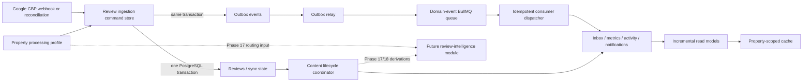
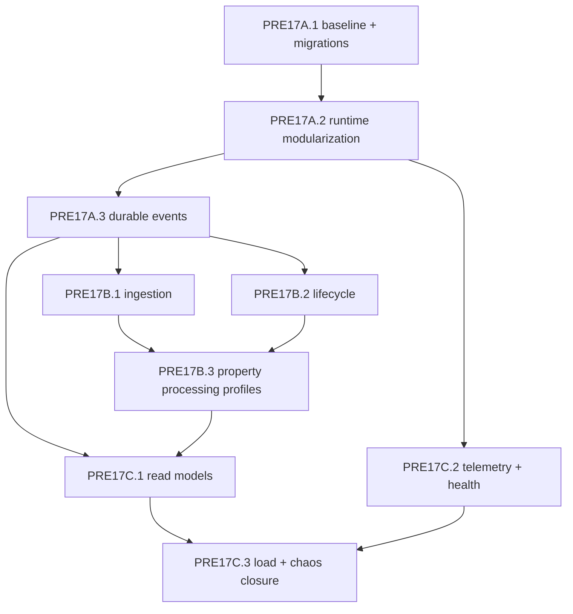

# Phase PRE17 — AI Readiness Master Plan

**Status:** Ready for implementation after the current inbox/goal redesign is committed  
**Date:** 2026-07-14  
**Type:** Dedicated prerequisite phase before Arc 7 Phases 17–18  
**Capacity target:** 5,000 properties and 500,000 new reviews per month  
**Routing decision:** Property-region routing; no silent cross-region fallback  
**Product constraint:** AI summaries and reports are property-scoped only  
**Google disposition:** Written response received; submitted per-property architecture is conditionally permitted

The routing decision means future model requests are selected from the property's processing profile. It is not, by itself, a promise that the primary database, queues, logs, backups, support access, and web runtime all reside in that region. End-to-end regional data residency is a separate infrastructure scope that must be decided before making residency claims.

## 1. Outcome

Make the application safe to extend with review intelligence without introducing lost work, uncontrolled copies of Google content, cross-region processing, unbounded batch queries, or an operational blind spot.

PRE17 is complete only when the existing application can prove the following without invoking an AI provider:

- A committed business change cannot lose its downstream event when Redis or a worker is unavailable.
- Duplicate or replayed events do not duplicate projections, metrics, notifications, activity, or scheduled work.
- Every Google review and every copy of it has an enforceable source lifecycle and deletion path.
- Raw Google content and retained derived metadata have separate schemas, lineage, retention, and deletion behavior.
- Every property has an explicit country, valid IANA time zone, and processing region.
- Review ingestion uses targeted or bounded incremental synchronization instead of repeatedly fetching all reviews.
- Production schema is reproducible from versioned migrations; CI uses the same migration path as deployment.
- Web, worker, unit, integration, component, and critical E2E gates are green and blocking.
- Queue delay, delivery progress, deletion progress, and dashboard performance are observable without logging review content.
- Load and failure tests pass at the selected capacity target.

PRE17 does **not** implement sentiment, priority scoring, categorization, reply generation, provider adapters, prompt templates, AI quotas, trend reports, or the AI dashboard. Those remain Phase 17/18 work behind the foundations delivered here.

## 2. Evidence and current baseline

The detailed primary-source review is in [PRE17 AI-readiness research](pre17-ai-readiness-primary-research-2026-07-14.md), and Google's direct answer is preserved in the [response and executable disposition](google-business-profile-ai-policy-response-2026-07-14.md). The core references are the official [AWS transactional-outbox guidance](https://docs.aws.amazon.com/prescriptive-guidance/latest/cloud-design-patterns/transactional-outbox.html), [BullMQ Job Scheduler and idempotency guidance](https://docs.bullmq.io/guide/job-schedulers), [Google Business Profile content policy](https://developers.google.com/my-business/content/policies), [Google review API reference](https://developers.google.com/my-business/reference/rest/v4/accounts.locations.reviews/list), [Drizzle migration guidance](https://orm.drizzle.team/docs/migrations), [PostgreSQL materialized-view behavior](https://www.postgresql.org/docs/current/sql-refreshmaterializedview.html), [OpenTelemetry messaging conventions](https://opentelemetry.io/docs/specs/semconv/messaging/messaging-metrics/), and [OWASP prompt-injection guidance](https://cheatsheetseries.owasp.org/cheatsheets/LLM_Prompt_Injection_Prevention_Cheat_Sheet.html).

Measured repository baseline on 2026-07-14:

| Check                   | Result                                                                 | PRE17 consequence                                                                                                      |
| ----------------------- | ---------------------------------------------------------------------- | ---------------------------------------------------------------------------------------------------------------------- |
| `pnpm typecheck`        | Pass                                                                   | Keep as blocking gate.                                                                                                 |
| `pnpm lint`             | Pass                                                                   | Keep as blocking gate.                                                                                                 |
| `pnpm test`             | 2,370 pass; 5 recurring-goal job tests fail                            | PRE17A restores a green deterministic clock baseline.                                                                  |
| `pnpm build`            | Fails: Vite 8/Rolldown rejects object-form `manualChunks`              | PRE17A fixes and adds the web build to CI.                                                                             |
| `pnpm build:worker`     | Pass                                                                   | Add to CI as a blocking gate.                                                                                          |
| `pnpm format:check`     | Fails across repo and generated/tooling files                          | PRE17A defines formatting scope, ignores generated artifacts, and formats owned files.                                 |
| CI schema setup         | Uses `db:push`                                                         | Replace with the documented generated-migration path.                                                                  |
| E2E and Storybook build | Non-blocking                                                           | Repair and promote critical suites to blocking.                                                                        |
| Event delivery          | In-memory `Promise.allSettled`                                         | Replace cross-context delivery with PostgreSQL outbox + BullMQ dispatch.                                               |
| Review sync             | Full-location fetch, page size 100, sequential per-review writes       | Replace with Google-compliant page size 50, targeted webhook fetch, incremental reconciliation, and batch persistence. |
| Dashboard acceleration  | Three refreshed materialized views are not queried; cache is not wired | Replace dead views with an incremental read model and property-scoped cache.                                           |

The current worktree contains an active inbox/goal redesign and migration `0003`. PRE17 implementation must begin from that work committed or otherwise cleanly isolated. PRE17 migrations start after `0003`; do not rewrite previously applied migrations.

## 3. Architecture decisions

Write these ADRs as the first commit of the owning plan, then keep code and context documentation aligned with them:

| ADR                                                  | Decision                                                                                                                                                                                                            |
| ---------------------------------------------------- | ------------------------------------------------------------------------------------------------------------------------------------------------------------------------------------------------------------------- |
| 0024 — Transactional outbox and idempotent consumers | PostgreSQL is the reliability boundary. Business writes and events commit atomically; BullMQ delivery is at least once; database receipts make consumers idempotent.                                                |
| 0025 — Context-owned command stores                  | Application use cases never receive a Drizzle transaction. Each context owns a deep command-store interface that hides its transaction and outbox append.                                                           |
| 0026 — Source-content lifecycle                      | Google content, source copies, caches, and future derivations share explicit lineage, expiry, disconnect, property-delete, and organization-delete behavior.                                                        |
| 0027 — Property processing profile                   | Country, IANA time zone, and processing region live on the property. `us`, `europe`, `global`, and `unresolved` are provider-neutral; unresolved or unsupported means AI unavailable.                               |
| 0028 — Job runtime and scheduler registry            | Contexts declare job and schedule definitions; one runtime owns queues, workers, current BullMQ Job Schedulers, retries, shutdown, and telemetry.                                                                   |
| 0029 — Incremental read models                       | Ordinary idempotently updated rollup tables replace unused full-refresh materialized views for active dashboard metrics. Partitioning is deferred until measured evidence requires it.                              |
| 0030 — Telemetry content policy                      | Logs, metrics, and traces contain identifiers and low-cardinality metadata only; review, prompt, reply, reviewer, token, and upstream response content are forbidden.                                               |
| 0031 — GBP AI policy disposition                     | Encode Google's received response: per-property analysis and derived retention allowed conditionally; raw 30-day refresh/removal; PII removal; no training; regional privacy; merchant opt-in; manual publish only. |

## 4. Target runtime

Architectural rules:

- Cross-context writes always start from a committed source-context event. No caller writes another context's tables.
- Event payloads carry identifiers and stable facts only. Review text, reviewer identity, reply text, prompt content, and provider output are never event or queue payloads.
- Context command stores own atomic state + outbox commits. This keeps transaction details local and gives callers a small interface.
- BullMQ job IDs and deduplication reduce redundant work but never replace database idempotency.
- Workers reload current state by ID and no-op when the source is expired, deleted, disconnected, region-unresolved, or feature-disabled.
- There is no automatic fallback from `us` or `europe` to another processing region.
- Google-derived AI remains independently disabled throughout PRE17; Phase 17 may enable it only after ADR 0031 and all consent/provider/lifecycle controls pass.

## 5. Program structure and dependencies

### PRE17A — Platform reliability

Detailed plan: [PRE17A platform reliability](phase-pre17a-platform-reliability-plan.md)

1. Restore a clean, reproducible baseline.
2. Unify migrations and production schema verification.
3. Deepen composition and the job runtime.
4. Add transactional outbox, durable dispatcher, and idempotent receipts.
5. Migrate all cross-context event producers and consumers.

**Gate:** No production application use case calls the in-memory event bus after persistence. Web/worker builds and the full automated baseline are green.

### PRE17B — Review data and regional readiness

Detailed plan: [PRE17B review data and regional readiness](phase-pre17b-review-data-and-regional-readiness-plan.md)

1. Harden GBP adapters and redesign sync as targeted/incremental/bounded initial ingestion.
2. Correct review timestamps, pagination, content hashes, and repository cursors.
3. Enforce source lifecycle across reviews, inbox, replies, caches, jobs, disconnect, property deletion, and organization deletion.
4. Add property country, time-zone provenance, and strict provider-neutral processing region.
5. Backfill existing properties and block future AI readiness while any property is unresolved.

**Dependency:** PRE17A outbox and job runtime.  
**Gate:** Every active property has a processing profile; every stored review has a correct fetch-based expiry and tested teardown path.

### PRE17C — Scale, observability, and closure

Detailed plan: [PRE17C scale, observability, and closure](phase-pre17c-scale-observability-and-closure-plan.md)

1. Replace unused full-refresh materialized views with incremental daily metric rollups.
2. Wire property-scoped dashboard cache and query budgets.
3. Add provider-neutral OpenTelemetry, queue/deletion health, redacted logs, and alert definitions.
4. Split pure unit, PostgreSQL integration, Redis/BullMQ integration, component, E2E, load, and chaos suites.
5. Prove target scale and recovery behavior.

**Dependency:** PRE17A and property time zones from PRE17B.  
**Gate:** Recorded query plans, load results, fault-injection results, and operational dashboards satisfy the final acceptance matrix.

### Dependency order

PRE17B lifecycle and ingestion may run in parallel after PRE17A durable delivery is stable. Telemetry plumbing may start after the job runtime exists, but PRE17 closure always runs last.

## 6. Capacity model and explicit defaults

- Average stated arrival: approximately 0.193 reviews/second.
- Design ingestion and event delivery for 20 reviews/second sustained and a 100 reviews/second 60-second burst.
- Design one reconciliation pass for all 5,000 properties over a four-hour dispatch window, not one fleet-wide cron instant.
- Use 50-review Google pages because the official list API maximum is 50.
- Use cursor pagination everywhere; offset pagination and fixed maximum scans are forbidden in maintenance/batch paths.
- Use PostgreSQL and BullMQ; do not add Kafka, a workflow engine, Elasticsearch, a vector database, or table partitioning in PRE17.
- Retain published outbox rows for 7 days, consumer receipts for 90 days, webhook receipts and sync-run metadata for 30 days, and content-free deletion evidence for 1 year.
- Refresh raw Google content before the applicable 30-day cache deadline or remove it. Persist `first_fetched_at`, `last_refreshed_at`, `refresh_due_at`, and `expires_at`; never extend the window without a successful Google fetch.
- Retained sentiment, scores, categories, themes, and property summary insights use a separate derived-metadata lifecycle and cannot embed raw content, reviewer identity, exact ratings/replies, Google identifiers, or reversible content fingerprints.
- Cache dashboard sections for at most 5 minutes with jitter. Cache failure degrades to database reads.
- No user-facing Free/Pro/Enterprise plan or AI entitlement is introduced in PRE17.

## 7. Delivery strategy

Every track uses expand → backfill → verify → switch reads/writes → contract. No deployment combines a large backfill with a blocking constraint or destructive column removal.

Required release controls:

- `ENABLE_DURABLE_EVENTS`: record-only outbox shadow verification, then durable-only consumption; never run legacy and durable consumers against the same side effect; remove after the stability window.
- `ENABLE_INCREMENTAL_REVIEW_SYNC`: targeted/incremental path with the resumable complete-inventory engine as the safety reconciliation path during rollout.
- `ENFORCE_SOURCE_CONTENT_POLICY`: initially report-only in non-production, mandatory before production review ingestion resumes.
- `ENABLE_INCREMENTAL_METRIC_ROLLUPS`: shadow comparison against raw queries before dashboard cutover.
- `ENABLE_OTEL`: optional locally, required in staging/production before PRE17 closure.
- `ENABLE_GBP_AI`: hard-coded/defaulted false throughout PRE17; Phase 17 may enable it per property only after ADR 0031, merchant consent, provider/region eligibility, PII redaction, and raw-content lifecycle gates pass.

Feature flags are temporary migration controls, not permanent alternate architectures. Each plan names its removal gate.

## 8. Final PRE17 acceptance matrix

| Area          | Required proof                                                                                                                                                                                                                              |
| ------------- | ------------------------------------------------------------------------------------------------------------------------------------------------------------------------------------------------------------------------------------------- |
| Baseline      | Typecheck, lint, format, unit, PostgreSQL integration, Redis/BullMQ integration, web build, worker build, Storybook build/tests, and critical E2E all pass as blocking CI jobs.                                                             |
| Migration     | A clean database and the committed pre-PRE17 baseline both upgrade using the same versioned migration command used in production; no business object depends on unjournaled sidecar SQL or `db:push`.                                       |
| Delivery      | Fault injection at DB commit, Redis enqueue, relay acknowledgement, consumer commit, and worker shutdown loses no event and produces no duplicate externally visible side effect.                                                           |
| Ingestion     | Webhook messages are persistently deduplicated; specific-review fetch is used for notifications; bounded incremental reconciliation catches missed notifications; initial sync is resumable.                                                |
| Lifecycle     | Review expiry, source deletion, Google disconnect, property deletion, and organization deletion purge all linked source content and stop pending work. Completion is observable and retryable.                                              |
| Region        | 100% of active properties have country, valid IANA time zone, and explicit `us`/`europe`/`global` region; unresolved and cross-region fallback tests pass.                                                                                  |
| Dashboard     | Incremental rollups match raw data in shadow comparison; p95 property dashboard reads meet the documented budget; cache never crosses tenant/property scope.                                                                                |
| Observability | Outbox age, queue age, retries, stalls, sync freshness, deletion backlog, cache behavior, and worker heartbeat are visible; telemetry contains no review/prompt/reply content.                                                              |
| Scale         | Target load and burst suites pass; backlog drains within the declared recovery objective; no unbounded query, fixed 500/5,000 cap, or fleet-wide thundering herd remains.                                                                   |
| Policy        | Google's response is preserved and ADR 0031 tests enforce per-property isolation, raw/derived separation, 30-day refresh-or-remove, PII redaction, merchant opt-in/revocation, approved provider/region, and manual-only reply publication. |

## 9. Decisions required during PRE17

None of these prevents PRE17A from starting. The stated default applies unless it is deliberately changed before the deadline.

| Decision                                     | Planning default                                                                                                                                 | Must be resolved by                                                                                                  |
| -------------------------------------------- | ------------------------------------------------------------------------------------------------------------------------------------------------ | -------------------------------------------------------------------------------------------------------------------- |
| GBP analysis/aggregation permission          | Externally resolved for the submitted per-property architecture; keep runtime capability off until ADR 0031 implements every condition.          | ADR 0031 before any Phase 17 Google model call or Phase 18 report.                                                   |
| Europe routing set                           | Versioned country list covering the EEA; UK and Switzerland included only after explicit product/legal approval. Other countries route `global`. | Before PRE17B processing-profile backfill is contracted.                                                             |
| Meaning of regional routing                  | Regional model-processing endpoint only; no end-to-end data-residency claim.                                                                     | Before infrastructure commitments or customer/marketing residency claims. Full residency creates a separate program. |
| Existing Google review aggregate widgets     | Enable only property-local definitions expressly covered by ADR 0031; review-solicitation/employee gamification inputs remain ineligible.        | Before PRE17C dashboard cutover.                                                                                     |
| User-authored inbox notes on source deletion | Delete with the source-owned inbox item; do not orphan them.                                                                                     | Before PRE17B lifecycle contraction.                                                                                 |
| Observability backend                        | Keep code OTLP/vendor-neutral; choose a managed/self-hosted backend through an operational procurement decision.                                 | Before PRE17C staging telemetry gate.                                                                                |
| Production load environment                  | Use separate queue/cache Redis and a production-shaped PostgreSQL tier; record exact topology with results.                                      | Before PRE17C load/chaos sign-off.                                                                                   |

## 10. Exit handoff to Phase 17

When PRE17 closes, Phase 17 receives these stable interfaces rather than infrastructure internals:

- Durable `review.received` / `review.updated` identifier-only events.
- Cursor-based review lookup and batch scan capabilities.
- A property processing profile lookup that returns an explicit region or unavailable result.
- A job runtime that can add isolated interactive, near-real-time, and batch queues without editing the worker monolith.
- Source-content expiry and deletion hooks that future analysis and draft tables must join.
- Redacted telemetry and SLO primitives.
- A migration and CI path capable of safely adding AI execution, usage, budget, analysis, and report tables.

No AI-specific public interface is created in PRE17. Phase 17 should introduce one deep review-intelligence module with an internal provider gateway rather than flattening provider methods into the global container.

## 11. Estimate

| Plan      |     Single-engineer effort | Notes                                                                                                                        |
| --------- | -------------------------: | ---------------------------------------------------------------------------------------------------------------------------- |
| PRE17A    |     12–18 engineering days | Broadest refactor; event migration and failure testing dominate.                                                             |
| PRE17B    |     10–15 engineering days | Includes schema backfills, sync redesign, teardown, region UI/backfill.                                                      |
| PRE17C    |      8–12 engineering days | Includes read-model cutover, telemetry, CI split, load/chaos evidence.                                                       |
| **Total** | **30–45 engineering days** | Approximately 6–9 weeks for one engineer; 4–6 calendar weeks with carefully parallelized ownership after PRE17A foundations. |

These estimates exclude legal/privacy review, provider procurement/approval, production observability-vendor procurement, and Phase 17/18 product implementation. The general Google clarification wait is complete; any narrow follow-up on cache semantics or few-shot replies is optional under the conservative baseline.
