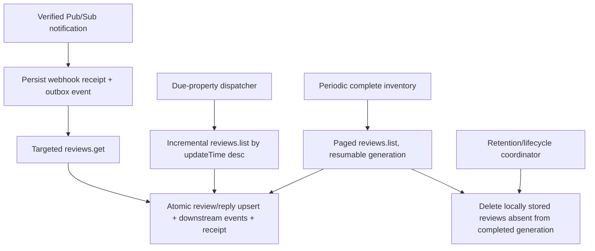

# Phase PRE17B — Review Data and Regional Readiness Plan

**Status:** Ready after PRE17A durable delivery and job runtime  
**Parent:** [Phase PRE17 master plan](phase-pre17-master-plan.md)  
**Estimate:** 10–15 engineering days  
**Primary gate:** Review ingestion is targeted, bounded, resumable, policy-controlled, and every active property has an explicit processing profile.

## 1. Purpose and boundaries

PRE17B makes Google reviews a trustworthy, lifecycle-managed input for later review intelligence. It hardens the Google adapters, replaces full-fetch synchronization with targeted and incremental paths, removes uncontrolled content copies, implements durable teardown, and records a provider-neutral processing region on every property.

The target is 5,000 properties and 500,000 new reviews per month. The design is optimized for burst recovery and reconciliation rather than the modest steady-state average of approximately 0.193 reviews/second.

This plan does not invoke an AI model, choose an AI provider, create sentiment/category/priority fields, generate replies, create organization summaries, or produce trend reports. Google-derived AI remains disabled until written policy clarification is recorded in ADR 0031.

## 2. Required decisions

Write ADR 0026 and ADR 0027 before schema implementation. ADR 0031 remains pending Google's response.

### 2.1 Source policy is a code-level contract

Represent Google retention and permitted operations behind a source policy, not scattered constants:

```ts
type SourceContentPolicy = Readonly<{
  source: 'google'
  contentTtl: Duration
  mayAnalyze: boolean
  mayAggregate: boolean
  mayRetainDerivationsAfterSourceDeletion: boolean
}>
```

PRE17 production defaults are:

- `contentTtl = 30 days` measured from a successful fetch of that stored copy;
- `mayAnalyze = false`;
- `mayAggregate = false` for review-derived analysis/summary data;
- `mayRetainDerivationsAfterSourceDeletion = false`.

The pending Google answer may change the interpretation of refresh and derivations. Any change requires ADR 0031, legal/privacy review where applicable, tests, and an explicit source-policy release. It must not require rewriting review use cases.

Google's current policy permits limited temporary storage for performance but says content may not be manipulated or aggregated, so sentiment, priority, and themes are a ship/no-ship question rather than a technical assumption. See the official [Business Profile API policies](https://developers.google.com/my-business/content/policies).

### 2.2 Property is the routing unit

Every property owns one processing profile:

```ts
type ProcessingProfile = Readonly<{
  propertyId: PropertyId
  countryCode: string
  timeZone: string
  region: 'us' | 'europe' | 'global'
  regionSource: 'country_default' | 'organization_override' | 'contract_override'
  routingPolicyVersion: number
  resolvedAt: Date
}>

type ProcessingAvailability =
  | { available: true; profile: ProcessingProfile }
  | {
      available: false
      reason: 'country_unresolved' | 'timezone_unresolved' | 'region_unsupported'
    }
```

- Route from the property, never the user IP, organization headquarters, UI language, review language, or current worker location.
- `us`, `europe`, and `global` are provider-neutral application cells. They are not Azure/AWS region names.
- The country-to-region policy is versioned. The initial Europe set must be explicitly reviewed and should cover the EEA plus any separately approved UK/Swiss routing policy; it must not be inferred from a string prefix.
- No processing path silently falls back to a different cell. Region-unavailable disables only the future AI operation, not review ingestion, inbox, manual replies, or dashboards.
- Changing a profile affects new work. It does not copy existing source content to another cell automatically.

### 2.3 One canonical source-content copy

The review context owns Google review content. Inbox, event payloads, queue payloads, activity, notifications, logs, traces, and dashboard caches must not persist review text or reviewer identity as convenience copies.

Cross-context readers use stable IDs and bounded batch lookup ports. This gives the content lifecycle one canonical deletion point and prevents every future feature from inventing another retention clock.

## 3. Target review ingestion flows



Each flow has a different purpose:

- A notification fetches the named review with `reviews.get`; it must not refetch the whole location.
- Incremental reconciliation catches missed notifications and changed reviews using `updateTime desc`, a saved watermark, and an overlap window.
- A slower complete inventory detects upstream deletions, which an incremental-only scan cannot observe.
- Initial import is the same resumable paged engine as complete inventory, not a special “load everything into memory” path.

The official list API allows a maximum `pageSize` of 50 and defaults to update-time ordering. See [reviews.list](https://developers.google.com/my-business/reference/rest/v4/accounts.locations.reviews/list) and [reviews.get](https://developers.google.com/my-business/reference/rest/v4/accounts.locations.reviews/get).

## 4. Data model changes

Use expand → backfill → verify → switch → contract. PRE17B migrations start after PRE17A; never edit migration `0003` or any applied file.

### 4.1 Properties

Add:

| Column                          | Behavior                                                                                                                 |
| ------------------------------- | ------------------------------------------------------------------------------------------------------------------------ |
| `country_code`                  | Nullable during expansion; uppercase CLDR/ISO-style two-letter code after validation. Required for active-property gate. |
| `country_source`                | `google_address`, `manual`, `organization_default`, or `admin_correction`.                                               |
| `timezone_source`               | `google_time_zone_api`, `manual`, `organization_default`, or `legacy`.                                                   |
| `timezone_resolved_at`          | When the current IANA time zone was established.                                                                         |
| `processing_region`             | `unresolved`, `us`, `europe`, or `global`; starts `unresolved`.                                                          |
| `processing_region_source`      | `country_default`, `organization_override`, or `contract_override`.                                                      |
| `routing_policy_version`        | Positive integer used to find profiles needing reevaluation.                                                             |
| `processing_region_resolved_at` | Resolution/confirmation time.                                                                                            |
| `source_epoch`                  | Monotonic integer incremented on disconnect/reconnect/source replacement; jobs recheck it to prevent stale work.         |

Keep the existing `timezone` column but validate that it is a real IANA identifier using a shared property calendar/time-zone service. Remove the current semantic of silently accepting `UTC` when the property time zone is unknown.

Indexes:

- Active unresolved profiles by `(processing_region, deleted_at)` using a partial index if query evidence supports it.
- Routing-policy backfill by `(routing_policy_version, id)`.
- Do not index country/time-zone fields without a concrete query.

### 4.2 Reviews

Expand the current schema with:

| Column                   | Behavior                                                                                           |
| ------------------------ | -------------------------------------------------------------------------------------------------- |
| `source_created_at`      | Google's `createTime`; replaces ambiguous internal use of `reviewed_at`.                           |
| `source_updated_at`      | Google's review `updateTime`; used for incremental ordering.                                       |
| `first_fetched_at`       | First successful local fetch. Immutable.                                                           |
| `last_fetched_at`        | Most recent successful fetch of this copy.                                                         |
| `content_expires_at`     | Calculated by `SourceContentPolicy` from successful fetch time, never publication time.            |
| `content_hash`           | Hash of normalized policy-controlled source fields; avoids emitting updates for unchanged fetches. |
| `source_seen_generation` | Nullable UUID used only by complete-inventory deletion detection.                                  |

Also:

- Keep `reviewed_at` as a compatibility read during expansion, backfill from it, switch callers to `source_created_at`, then contract it if no public compatibility need remains.
- Stop reading/writing `sentiment_label` and `sentiment_score`, verify they contain no required data, then drop them. Analysis belongs to a Phase 17 table with version/model/route/lifecycle metadata.
- Preserve the canonical Google review resource name, not just its trailing ID, in a bounded `source_name` field so targeted fetches are unambiguous.
- Add cursor indexes supporting `(property_id, source_updated_at DESC, id DESC)`, `(property_id, source_created_at DESC, id DESC)`, and expiry scans `(content_expires_at, id)`; validate exact shapes with query plans.
- Keep text out of covering indexes.

### 4.3 Synchronization state

Add `review_sync_state`, one row per property/source:

| Field group        | Required fields                                                      |
| ------------------ | -------------------------------------------------------------------- |
| Identity           | `property_id`, source, connection/location identity, `source_epoch`. |
| Incremental cursor | `watermark_updated_at`, `watermark_source_name`, overlap duration.   |
| Complete inventory | `generation_id`, `page_token`, started/completed times, status.      |
| Scheduling         | `next_incremental_at`, `next_inventory_at`, lease owner/until.       |
| Freshness          | last notification, success, and terminal source-error times.         |
| Error              | sanitized class and retry time; no upstream body.                    |

Use `review_sync_runs` for bounded operational history: run ID, property/source, mode, source epoch, timestamps, page/review/create/update/delete/failure counts, result, and sanitized error class. Keep 30 days. Do not store review IDs or payloads in run history.

### 4.4 Inbound webhook receipts

Add `inbound_webhook_receipts`:

- provider/topic identity plus Pub/Sub `messageId` as the unique key;
- received/accepted timestamp, notification kind, resolved property ID, and processing outcome;
- no encoded/decoded body, review text, reviewer data, JWT, or authorization header;
- 30-day retention.

The thin route requires a non-empty `messageId`; it must reject a missing ID rather than replacing it with the shared value `unknown`. Acceptance atomically inserts the receipt and a durable identifier-only notification event. A duplicate returns HTTP 2xx without another event.

### 4.5 Inbox references

Correct the current projection in expansion steps:

1. Change `property_id` to the real property UUID type and add an `ON DELETE CASCADE` foreign key.
2. Add nullable `review_id` and `feedback_id` columns with source-specific foreign keys and a check constraint requiring exactly one.
3. Backfill from `source_type/source_id`, quarantine and report any orphan before adding constraints.
4. Switch inbox queries to source IDs plus batched source-summary lookup.
5. Remove copied `snippet` and `reviewer_name`. Remove other duplicated source facts unless a measured query requires an explicitly lifecycle-bound projection.
6. Contract `source_type/source_id` only after all writers/readers use typed columns.

Review deletion then cascades the review inbox item, notes, views tied to the item, and other FK-owned children. Feedback remains independent and is not pulled into review AI planning merely because the inbox supports it.

### 4.6 Lifecycle runs

Add a small `contexts/lifecycle/` orchestration module with `content_deletion_runs` and `content_deletion_steps`.

A run contains scope (`review`, `connection`, `property`, or `organization`), source identity, organization/property IDs, requested reason, source epoch, status, timestamps, and content-free completion evidence. Steps name the owning context and status; they never list deleted content.

Expected participants initially include review, inbox, activity, notification, metric/read-model, cache, integration, and job-neutralization hooks. Future Phase 17/18 contexts must register a lifecycle participant before they may persist source-linked data.

The coordinator knows participant capabilities, not their tables. Each context owns an idempotent purge command and acknowledges completion through durable events. Keep completed content-free evidence for one year.

## 5. Adapter hardening

### B1 — Define and validate external contracts (1–2 days)

1. Replace TypeScript casts of Google JSON with strict Zod schemas at every response boundary: list page, individual review, location, account/location list, Pub/Sub envelope, and decoded notification.
2. Include Google review `updateTime`, canonical resource name, reply update time, and location identifiers in the domain-facing DTO.
3. Set list `pageSize=50` and make pagination a streaming/page callback or async iterator; never return the entire property history as one array.
4. Add `fetchReview(reviewName)` and a paged `listReviews(locationName, cursor)` to the facade port. Keep token refresh and Google-specific error translation inside the integration adapter.
5. Classify errors into auth revoked, not found/deleted, rate limited, transient upstream, timeout, and invalid upstream response.
6. Parse useful bounded Google request/error identifiers when available, but never retain the raw response body. Log only operation, status, error class, request ID, and source identifiers.
7. Apply abort deadlines and bounded response-size guards. Retry only idempotent reads and honor provider retry guidance with exponential backoff/jitter; let BullMQ own cross-attempt delay.
8. Add contract fixtures for missing optional text, anonymous reviewer, rating-only review, Unicode, maximum text, unexpected enum, invalid timestamp, pagination, 404, 401/403, 429, 5xx, timeout, and malformed JSON.

The adapter is the anti-corruption layer, but domain constructors still enforce application invariants. Remove the current assumption that a cast external payload is trusted enough to bypass domain validation.

## 6. Synchronization implementation

### B2 — Webhook acceptance and targeted fetch (1–2 days)

1. Keep JWT signature/audience verification in the route boundary.
2. Set an HTTP body limit before JSON/base64 decoding. Validate outer and decoded schemas and reject missing `messageId`.
3. Resolve notification location to exactly one active property/connection. Unknown or stale locations receive a durable, content-free outcome and 2xx only if retry cannot make them resolvable; transient database errors remain non-2xx.
4. Atomically store the webhook receipt and `google.review-notification-received.v1` outbox event.
5. The event consumer reloads connection/property/source epoch, calls `reviews.get`, and then:
   - on success, atomically upserts canonical review/reply plus downstream identifier-only events and consumer receipt;
   - on 404, starts/executes the review deletion lifecycle and records the receipt;
   - on revoked connection, disables synchronization and raises a reconnect-required state;
   - on transient/429, throws for bounded retry.
6. Return 2xx as soon as durable acceptance commits; do not wait for Google fetch or Redis.
7. Record `notification accepted → review committed` latency without review content.

### B3 — Incremental reconciliation (2–3 days)

1. A small Job Scheduler dispatches due properties in bounded database pages over a four-hour fleet window. Do not create 5,000 cron entries or enqueue the fleet at one instant.
2. Claim due sync-state rows with a lease/`SKIP LOCKED`, enqueue deterministic jobs, and advance `next_incremental_at` with jitter.
3. List reviews in `updateTime desc` order with page size 50.
4. Start from the newest page and continue until every item is older than the persisted `(watermark_updated_at, watermark_source_name)` minus a default 10-minute overlap.
5. Persist each page in one bounded transaction through the review command store; emit events only for created/content-changed/deleted facts.
6. Advance the watermark only after the page transaction commits. Use timestamp plus canonical source name as the tie-breaker.
7. A failed page resumes safely; repeated overlap pages produce no duplicate visible effects because content hashes and consumer receipts are idempotent.
8. Choose the production reconciliation interval after measuring Google quotas and notification reliability. Begin with daily reconciliation plus immediate notifications; make it configuration, not per-property Redis schedules.

### B4 — Initial and complete inventory (1–2 days)

1. Use the same paged engine for first import and later full inventories.
2. Allocate a generation ID, persist page token/checkpoint after each successful page, and mark reviews seen in that generation.
3. Only after the final page commits may the job delete local reviews for that property/source whose seen generation is older.
4. If a run never completes, it must not infer deletion. Expiry still protects the policy boundary.
5. Spread complete inventories across the month and set a default that completes before source content expiry. A suggested initial cadence is every 21 days, subject to Google quota measurement and ADR 0031.
6. Limit pages and elapsed time per job attempt; continue with a deterministic follow-up job rather than monopolizing a worker.
7. Import progress derives from durable page/run counters. Do not promise a percentage when total pages are unknown.

### B5 — Repository and domain cleanup (1–2 days)

1. Replace fixed 500/5,000 scans and offset APIs with opaque cursor methods returning `{items, nextCursor}`.
2. Introduce `persistReviewPage`/`applyFetchedReview` command-store methods that own review, mirrored reply, content hash, timestamps, and outbox changes atomically.
3. Separate outcomes: `created`, `content_changed`, `refreshed_unchanged`, `source_deleted`, and `stale_source_epoch`.
4. A mere refresh may extend `last_fetched_at/content_expires_at` under the configured policy but does not emit `review.updated` when the content hash is unchanged.
5. Rename durable events to clear facts such as `review.received.v1`, `review.content-changed.v1`, `review.source-deleted.v1`, and `review.reply-observed.v1`. Payloads carry IDs, rating only if proven necessary as a stable routing fact, and source timestamps—not text or identity.
6. Ensure a late job from an old connection/source epoch returns `stale_source_epoch` without writing.
7. Make repository tenant/property predicates mandatory in every lookup and update. Add cross-tenant negative tests.

## 7. Source lifecycle and deletion

### B6 — Implement lifecycle coordination (2–3 days)

All lifecycle workflows use “prevent new work → purge owned data → invalidate derived state/cache → record content-free completion.” They are durable, idempotent, retryable, and observable.

| Trigger                                        | Required behavior                                                                                                                                                                   |
| ---------------------------------------------- | ----------------------------------------------------------------------------------------------------------------------------------------------------------------------------------- |
| Content expiry                                 | Mark source unavailable, delete canonical review; FK/participants remove inbox/replies/copies; no stale job can recreate it without a new valid fetch.                              |
| Upstream review 404/complete-inventory absence | Same as source deletion; preserve only content-free deletion evidence.                                                                                                              |
| Google disconnect                              | Increment property/source epoch immediately, disable new sync, start connection-scoped lifecycle, purge all Google reviews/replies/caches/jobs, then finalize disassociation state. |
| Property deletion                              | Disable property, increment epoch, run all context participants, then finalize soft/hard deletion according to property policy. Direct FKs provide a final safety net.              |
| Organization deletion                          | Freeze organization commands, enumerate property/source scopes with cursors, run every participant, remove tenant data, and record minimal completion evidence.                     |

Important rules:

- Active BullMQ jobs cannot be trusted to be removable. Every worker reloads lifecycle/source epoch before and immediately before commit.
- A cache key must include organization/property/source generation so old entries become unreachable immediately; deletion also invalidates them explicitly.
- Notifications and activity may keep a content-free event fact if product/legal retention allows it, but must scrub reviewer names, snippets, reply text, and source URLs.
- No database foreign key may point from source content to a disconnected connection with `SET NULL` if that makes lineage undiscoverable. Either purge before finalization or keep a non-secret immutable source identifier until purge completes.
- User-authored internal notes need an explicit product decision: delete with their review inbox item by default. Do not preserve them accidentally after their source context disappears.
- Organization erasure must cover Better Auth/business schema boundaries and object/Redis stores, not only Drizzle tables.

Run reconciliation tests that seed every registered lifecycle participant. The test fails if a newly registered source-linked table has no deletion policy.

## 8. Property processing profiles

### B7 — Capture country and resolve time zone (1–2 days)

1. Extend the GBP location schema/read mask to capture `storefrontAddress.regionCode`, service-area base region where applicable, and output coordinates when available.
2. Normalize/validate country codes in the property domain. Do not infer country from free-form address text.
3. Add a `TimeZoneResolver` port. The Google adapter may call the official [Time Zone API](https://developers.google.com/maps/documentation/timezone/overview) with coordinates and current timestamp; store only the resulting IANA zone and provenance unless coordinates serve another approved product purpose.
4. Restrict the Google Maps API key by API and caller/IP as appropriate, configure billing/quotas/alerts, set timeouts, and translate errors. Provide a deterministic fake for tests.
5. If coordinates/time-zone lookup are unavailable, require an authorized user to select a country and time zone. Never default unresolved imported properties to UTC.
6. Validate IANA zones against the runtime's supported time-zone database and test daylight-saving boundaries, non-hour offsets, and zones whose rules change.
7. Present provenance and resolution status in property settings/import review. Changes are audited.

### B8 — Resolve and enforce processing region (1 day)

1. Implement a pure, versioned `countryCode → processingRegion` policy with exhaustive tests.
2. Backfill existing properties in cursor batches:
   - use verified GBP country when available;
   - preserve a valid existing IANA time zone but mark its provenance `legacy` until confirmed;
   - mark ambiguous records unresolved and surface an admin task.
3. Add `PropertyProcessingProfilePort.get(propertyId, organizationId)` as the sole future routing interface.
4. Add `ProcessingCapabilityRegistry` configuration that declares which application cells are deployed. It returns unavailable rather than another region if a required cell is absent.
5. Require 100% of active properties to be resolved before PRE17 closure. Deleted/disconnected properties are not counted, but reconnect/import must resolve before future AI eligibility.
6. Add authorization and audit tests for organization and contract overrides. A property manager cannot silently override a contractual residency setting.

No Azure, Bedrock, or OpenAI deployment identifier enters the property domain. Phase 17 maps application region + purpose to a provider deployment inside its infrastructure adapter.

## 9. Security and privacy requirements

- Treat review text, reviewer display name/photo, and review-linked inferences as potentially personal data.
- Use purpose-limited fields, minimum retention, and access-controlled lookup by ID, consistent with [GDPR Article 5](https://eur-lex.europa.eu/legal-content/EN/TXT/?uri=CELEX%3A32016R0679) and official [California CCPA guidance](https://oag.ca.gov/privacy/ccpa).
- Never log request/response bodies, decoded webhook data, tokens, authorization headers, review text, reviewer identity, reply text, or purge content.
- Validate URL/photo fields and render external text escaped. Do not proxy or fetch reviewer image URLs server-side without a separate SSRF-safe design.
- Webhook tests cover audience mismatch, expired JWT, algorithm/key failure, oversized body, malformed base64/JSON, missing message ID, duplicate ID, and replay.
- All system jobs authorize through resolved organization/property/source relationships, not caller-supplied combinations.
- Add database constraints where possible and negative tenant tests everywhere constraints cannot express tenant ownership.

## 10. Test strategy

### Pure/domain tests

- Source expiry from fetch time, boundary instants, clock injection, and unchanged-refresh behavior.
- Country normalization, routing-policy versions, all country groups, unresolved cases, override precedence, and no fallback.
- Cursor encode/decode/order and timestamp tie-breakers.
- Content-hash normalization and event outcome selection.
- IANA time-zone validation and property-local daylight-saving dates.

### PostgreSQL integration tests

- Page transaction atomically writes review/reply/outbox.
- Unique source review and webhook receipt constraints under concurrency.
- Cursor scans never skip/duplicate rows with equal timestamps.
- Complete generation only deletes after successful final page.
- Every lifecycle scope removes all registered content and leaves content-free evidence.
- Inbox type/FK/check constraints and cascade behavior.
- Old source-epoch jobs cannot commit after disconnect/reconnect.
- Clean and upgrade migration/backfill/contract paths.

### Redis/BullMQ integration tests

- Duplicate Pub/Sub receipt yields one targeted fetch event.
- 429/5xx retry, 404 deletion, revoked connection, Redis restart, worker kill, and stalled-job recovery.
- Due-property dispatch is leased, staggered, and does not create duplicate property jobs.
- Initial/full scan resumes from a persisted page token.
- Deletion racing with sync always ends deleted and cannot resurrect content.

### Contract tests with mocked Google HTTP

- `reviews.get`, 50-item list pagination, update-time ordering, overlap stop, malformed responses, timeouts, raw-error redaction, and location country/time-zone inputs.
- Do not call live Google APIs in CI. Add a tightly controlled staging smoke test with a designated test location if Google permits it.

## 11. Rollout

### Review sync flag states

Use `ENABLE_INCREMENTAL_REVIEW_SYNC` as a temporary state machine:

1. `legacy`: existing full fetch while new schema is populated.
2. `shadow`: targeted/incremental engine records run comparisons but is not the authoritative writer where duplicate fetch would breach quota/policy; use fixtures/staging where necessary.
3. `incremental`: webhook targeted fetch + incremental reconciliation authoritative; complete inventory remains scheduled safety.

Do not preserve the legacy full-fetch path as a permanent fallback. The complete inventory engine is the supported full reconciliation path.

### Content-policy flag

`ENFORCE_SOURCE_CONTENT_POLICY` begins report-only in local/staging while lineage gaps are fixed. Production review ingestion must not resume with the flag disabled after the enforcement migration. There is no fail-open behavior when policy lookup fails.

### Backfill order

1. Add nullable columns/tables/indexes concurrently where supported.
2. Deploy dual-compatible code.
3. Backfill review fetch timestamps conservatively from best available evidence; rows without trustworthy fetch time receive an immediate/short expiry and are refreshed or purged, not granted an invented 30-day clock.
4. Backfill typed inbox references and quarantine orphans.
5. Resolve property profiles and surface unresolved records.
6. Verify counts, tenant ownership, constraints, lineage, and expiry.
7. Switch writers/readers/jobs.
8. Add `NOT NULL`/checks in short migrations, then drop obsolete columns in a later deployment.

## 12. Operational targets

- Webhook durable acceptance p95 under 1 second, excluding network edge latency.
- Accepted notification to canonical review commit p95 under 60 seconds when Google is healthy.
- Incremental sync freshness and last full inventory completion visible per property.
- No sync job processes unbounded pages or runs longer than its configured attempt budget.
- All 5,000 properties receive staggered due times; a worker restart does not create a fleet-wide herd.
- Source expiry/deletion backlog oldest age remains below 24 hours normally; disconnect/property/org erasure has a separately documented completion objective no longer than Google's required disassociation window.
- 100% of active properties have validated country, IANA time zone, and non-unresolved processing region.
- Zero telemetry samples contain review/reviewer/reply content in automated leakage tests.

## 13. Suggested commit sequence

1. `docs: record source lifecycle and property routing ADRs`
2. `db: expand review sync and property processing metadata`
3. `refactor: validate and page Google review and location adapters`
4. `feat: durably deduplicate review notifications`
5. `feat: fetch notified reviews by resource name`
6. `feat: add incremental review reconciliation`
7. `feat: add resumable complete review inventory`
8. `refactor: add cursor review repositories and atomic page commands`
9. `db: add typed inbox source references and remove content copies`
10. `feat: add source-content lifecycle coordinator`
11. `feat: capture property country and resolve IANA time zone`
12. `feat: resolve and enforce property processing profiles`
13. `data: backfill and verify review lifecycle and property routing`
14. `db: contract obsolete review and inbox columns`
15. `test: prove sync, deletion, replay, and region boundaries`

## 14. Definition of done

PRE17B is done when:

- Webhooks require/persistently deduplicate Pub/Sub message IDs and fetch the named review.
- Periodic incremental reconciliation is bounded and complete inventory is resumable and deletion-aware.
- Google list requests use page size 50, all external payloads are runtime-validated, and raw responses/errors are not retained.
- Review expiry is based on successful fetch time through a source policy; premature sentiment columns are gone.
- No event/job/inbox/cache/log stores a convenience copy of review text or reviewer identity.
- Expiry, upstream deletion, disconnect, property deletion, and organization deletion are durable, idempotent, observable, and tested across all registered participants.
- Every active property has a validated country, IANA time zone, and explicit provider-neutral region, with no cross-region fallback.
- Google-derived analysis remains disabled and is independently switchable from all non-AI review features.
- PRE17C can build property-local incremental read models and exercise the system at target load.

## 15. Primary references

- [Google Business Profile API policies](https://developers.google.com/my-business/content/policies)
- [Google `reviews.list`](https://developers.google.com/my-business/reference/rest/v4/accounts.locations.reviews/list)
- [Google `reviews.get`](https://developers.google.com/my-business/reference/rest/v4/accounts.locations.reviews/get)
- [Google Business Profile location data](https://developers.google.com/my-business/content/location-data)
- [Google Business Information Location resource](https://developers.google.com/my-business/reference/businessinformation/rest/v1/accounts.locations)
- [Google Time Zone API](https://developers.google.com/maps/documentation/timezone/overview)
- [GDPR Article 5](https://eur-lex.europa.eu/legal-content/EN/TXT/?uri=CELEX%3A32016R0679)
- [California CCPA guidance](https://oag.ca.gov/privacy/ccpa)
- [PRE17 primary-source findings](pre17-ai-readiness-primary-research-2026-07-14.md)
