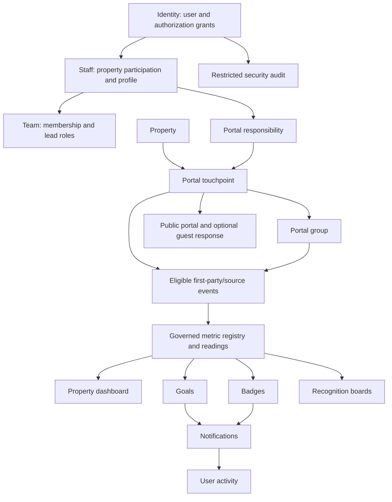
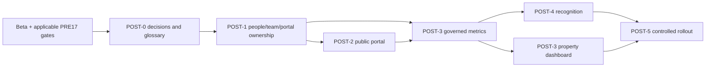

# Post-Beta Product Completion Program — Master Plan

**Status:** Proposed; product decisions remain before implementation  
**Date:** 2026-07-14  
**Starts after:** Beta acceptance and the applicable PRE17 foundations  
**Product center:** Real Google reviews, inbox work, and property operations  
**Scale target:** 5,000 properties and 500,000 new reviews/month  
**Regional posture:** Property-region routing; no silent cross-region fallback

## 1. Outcome

Finish the product contexts deliberately held behind beta capability gates: staff, teams, portals, guest interactions, metrics, goals, dashboards, badges, leaderboards, activity, and notifications. The result should be a coherent product rather than a set of individually implemented screens.

This program does not make guest feedback the center of Reputation Key. Imported reviews and the manager inbox remain the principal source of customer value. Public portals are review-link touchpoints first; private guest feedback is an optional, separately controlled capability. AI Phases 17 and 18 remain separate and no organization-wide AI summary is introduced here.

The beta plans were intentionally safety-first. They mention these contexts only to keep them server-disabled until safe; they do not complete their domain models or workflows. This program supplies that missing implementation-ready path.

## 2. Source material and authority

- [Post-beta primary research](post-beta-contexts-primary-research-2026-07-14.md)
- [Beta readiness master plan](beta-readiness-master-plan.md)
- [PRE17 master plan](phase-pre17-master-plan.md)
- [ADR 0013 — portal groups replace team/staff scope](../adr/0013-portal-groups-replace-team-staff-scope.md)
- [ADR 0014 — badges and leaderboards are separate contexts](../adr/0014-badges-and-leaderboards-separate-contexts.md)
- [ADR 0020 — progress-only goal model](../adr/0020-progress-only-goal-model.md)
- [ADR 0021 — remove composite leaderboard score](../adr/0021-leaderboard-remove-composite-add-matrix.md)
- The `CONTEXT.md` files and current implementation in every bounded context

The detailed plans below supersede the future-work parts of `goal-pages-design.md`, `phase-16.2-badges-leaderboards-implementation-plan.md`, and the corresponding sections of `plan.md`. Those documents remain historical design records. Accepted ADRs remain authoritative unless a new ADR explicitly supersedes a decision.

## 3. Product and safety boundaries

### 3.1 Non-negotiable boundaries

1. Google-derived metrics, goals, badges, leaderboards, sentiment, trends, or historical aggregates remain disabled until Google gives a written disposition that permits the exact use. A retention limit alone does not resolve Google's separate no-manipulation/no-aggregation language.
2. AI sentiment, priority, categorization, or other inferred review fields must never feed staff goals, badges, rankings, pay, scheduling, promotion, discipline, or termination.
3. Employee-facing features are coaching and positive recognition tools, not an employment-decision system. No negative badges, public bottom-performer lists, or automatic adverse consequence exists.
4. Ranking and export capabilities are off by default and independently capability-gated. A hidden navigation item is not a control.
5. Property-local summaries are the unit of analysis. This program adds neither an organization AI summary nor cross-property employee competition.
6. Missing, ineligible, expired, or insufficient data is `unavailable`, never silently converted to zero.
7. Staff can inspect the data attributed to them and request correction. Every material correction preserves evidence.
8. Review-link clicks, review-request scans, review volume/rating, named-staff mentions, and public-review conversion are never staff goal, badge, or leaderboard inputs. This remains true even if Google later permits limited property analytics.

### 3.2 Recommended domain defaults

These defaults make the plans concrete. They can be changed before the relevant ADR is accepted.

| Question                                   | Planning default                                                                                                                                                                                                     |
| ------------------------------------------ | -------------------------------------------------------------------------------------------------------------------------------------------------------------------------------------------------------------------- |
| What is a portal?                          | A physical or digital property touchpoint, such as lobby, breakfast, room card, or staff-specific QR. It is not an authorization grant.                                                                              |
| What is a portal group?                    | A property-local performance/reporting scope containing portals.                                                                                                                                                     |
| What is a team?                            | An administrative grouping of people with optional leads. It is not a metric or goal scope. Shifts/schedules are out until explicitly required.                                                                      |
| How is portal responsibility represented?  | An effective-dated relation separate from property access and team membership.                                                                                                                                       |
| What happens when a portal changes group?  | Event-time attribution: past facts keep the group captured when they occurred; future facts use the new group. Corrections are explicit.                                                                             |
| Who creates goals?                         | Managers create organizational goals; staff read and track them. Personal/self-created goals require a later, separate product decision.                                                                             |
| How do goals behave?                       | Progress, level, and ratio are different measure kinds. Monotonic progress goals can achieve before period close; corrections may invalidate/supersede that outcome. Level/ratio goals are met/not met for a period. |
| How does the guest portal route reviews?   | Public review links remain visible independently of any private rating or feedback. Rating does not change their order, prominence, or availability.                                                                 |
| Are private rating/feedback required?      | No. They are secondary, independently enabled features.                                                                                                                                                              |
| Are badges and leaderboards on by default? | No. The organization explicitly enables positive recognition after staff notice/consultation appropriate to its jurisdictions.                                                                                       |
| Can a badge be corrected?                  | Awards are never physically erased, but can be invalidated with reason and evidence. Award-time label, icon, rule version, and evidence are snapshotted.                                                             |
| What does a leaderboard show?              | A property-local, time-bounded per-metric rank/recognition board. No composite or normalized percentage score.                                                                                                       |
| What can staff see?                        | Their own position and anonymized peers by default; managers receive the named management view.                                                                                                                      |
| Activity versus audit?                     | Activity is a privacy-filtered user feed. Security audit is restricted, append-oriented evidence. Domain events are a third, internal concept.                                                                       |
| Which timezone owns recurrence/digests?    | Property timezone for property metrics/goals; user preference with organization fallback for personal notification delivery.                                                                                         |

## 4. Target domain map

The most important seam is the governed metric registry. Goals, badges, dashboards, and leaderboards must consume approved, versioned metric definitions instead of implementing their own SQL formulas or joining review tables directly.

## 5. Program sequence

| Phase       | Detailed plan                                                                                          | Outcome                                                                                         |                                       Effort |
| ----------- | ------------------------------------------------------------------------------------------------------ | ----------------------------------------------------------------------------------------------- | -------------------------------------------: |
| POST-BETA-0 | Decisions and domain alignment in this master plan                                                     | ADRs, glossary, policy capability registry, supersession map                                    |                                     2–4 days |
| POST-BETA-1 | [People, teams, and portal ownership](post-beta-1-people-teams-and-portal-ownership-plan.md)           | Access, membership, leadership, and performance attribution are separate and temporally correct |                                    9–14 days |
| POST-BETA-2 | [Public portals and guest experience](post-beta-2-public-portals-and-guest-experience-plan.md)         | Safe review-link touchpoints; optional private feedback and uploads                             | 8–13 days without uploads; +4–6 with uploads |
| POST-BETA-3 | [Metrics, goals, and property dashboards](post-beta-3-metrics-goals-and-property-dashboards-plan.md)   | Governed measurements, correct goal semantics, fast property-local read models                  |                                   13–20 days |
| POST-BETA-4 | [Recognition, activity, and notifications](post-beta-4-recognition-activity-and-notifications-plan.md) | Correctable positive recognition, bounded rankings, trustworthy feeds and delivery              |                                   11–17 days |
| POST-BETA-5 | Controlled rollout and closure                                                                         | Staff consultation, property trials, fairness/privacy review, scale and UX acceptance           |        4–7 engineering days plus observation |

**Total:** approximately **47–75 engineering days**, excluding legal review, Google response time, and observation windows. Existing code reduces greenfield work, but several data models need migration rather than incremental UI additions.

### Dependency order

POST-BETA-2 and the early metric-registry work in POST-BETA-3 may overlap after POST-BETA-1's canonical ownership model is fixed. Recognition cannot responsibly precede governed measurements.

## 6. Every-context coverage

| Context      | Beta/PRE17 foundation                                                | Post-beta completion work                                                                            | Primary plan           |
| ------------ | -------------------------------------------------------------------- | ---------------------------------------------------------------------------------------------------- | ---------------------- |
| Identity     | Invite-only access, built-in roles, policy seam, session safety      | Property access grant ownership; team-lead capabilities; staff-data view/correction authorization    | POST-BETA-1            |
| Property     | Archive/lifecycle, regional profile, tenant invariants               | Timezone as measurement authority; public portal capability; property-level rollout controls         | POST-BETA-1/2/3        |
| Integration  | Durable Google workflows, connection health, content policy controls | Source-policy capability exposed to metric registry; no direct downstream joins                      | POST-BETA-3            |
| Review       | Canonical review lifecycle and reply workflow                        | Explicit eligible/ineligible source contract only; remains the core product workflow                 | POST-BETA-3 dependency |
| Inbox        | Durable projection and manual reply workflow                         | Links to source/evidence and notification activity; no employee-scoring responsibility               | POST-BETA-4 dependency |
| Staff        | Assignment hardening                                                 | Split access, team membership, portal responsibility; effective dates; correction workflow           | POST-BETA-1            |
| Team         | Kept dark unless required                                            | Administrative teams, lead role, membership history, manager/staff views; no invented shift system   | POST-BETA-1            |
| Portal       | Public edge conditional                                              | Canonical touchpoint/group/responsibility model, token rotation, link safety, lifecycle              | POST-BETA-1/2          |
| Guest        | Public writes dark or hardened                                       | Optional coherent response aggregate, abuse/privacy/retention, moderation and deletion               | POST-BETA-2            |
| Metric       | Replay-safe projection/read model foundation                         | Versioned registry, source policy, idempotent readings, corrections, rollups, fairness metadata      | POST-BETA-3            |
| Goal         | UI exists but remains gated                                          | Measure-kind semantics, period/timezone, version snapshots, atomic progress, scalable reconciliation | POST-BETA-3            |
| Dashboard    | Limited property-local beta view                                     | Fast property-local scorecards and transparent metric evidence; no organization AI summary           | POST-BETA-3            |
| Badge        | Gated                                                                | Positive definitions, award snapshots/evidence, invalidation, durable evaluation, staff privacy      | POST-BETA-4            |
| Leaderboard  | Gated                                                                | Per-metric/time-bounded recognition board, cohort rules, scalable atomic projections                 | POST-BETA-4            |
| Activity     | Durable delivery foundation                                          | Separate user activity from security audit; retention, minimization, access, correction references   | POST-BETA-4            |
| Notification | In-app beta; email conditional                                       | Category/channel/property preferences, user timezone, idempotency, suppression, privacy-safe content | POST-BETA-4            |

## 7. POST-BETA-0 decisions and ADRs

Write these before schema work. Keep each ADR narrow and link its migration ticket.

| Proposed ADR                              | Decision                                                                                                                                                                    |
| ----------------------------------------- | --------------------------------------------------------------------------------------------------------------------------------------------------------------------------- |
| 0039 — People, access, and attribution    | `PropertyAccessGrant`, `TeamMembership`, and `PortalResponsibility` are separate effective-dated concepts with distinct owners.                                             |
| 0040 — Portal and group history           | Portal is a touchpoint; group is a reporting scope; facts use event-time attribution and never silently rewrite history. Supersedes ADR 0013's live-membership clause only. |
| 0041 — Governed metric registry           | Definition versions, source-policy allowlists, provenance, corrections, windows, timezones, eligibility, and retention are centralized.                                     |
| 0042 — Goal measure kinds                 | Progress, level, and ratio have explicit lifecycle/evaluation semantics; recurrence is property-local and versioned. Extends ADR 0020.                                      |
| 0043 — Worker recognition boundary        | Coaching/recognition only; AI fields excluded; feature off by default; visibility, correction, cohort, and employment-use boundaries.                                       |
| 0044 — Public portal and guest response   | Independent review link, optional private response, no rating-conditioned steering, session/abuse/privacy/lifecycle policy.                                                 |
| 0045 — Activity, audit, and domain events | Three separate concepts with ownership, audience, integrity, redaction, and retention rules.                                                                                |
| 0046 — Notification policy                | Mandatory versus optional categories, channel/property preferences, timezone, safe content, idempotency, and provider feedback.                                             |

Also correct the root and context glossaries after these ADRs are accepted: remove the obsolete composite leaderboard formula, distinguish first private rating from first review, fix goal terminology, and mark stale future plans as superseded. Do not edit terminology before the decisions are actually accepted.

## 8. Cross-cutting implementation rules

### 8.1 Data and migrations

- Use expand → backfill → verify → dual-read/dual-write only when necessary → cut over → contract.
- Put every invariant possible in the authoritative Drizzle schema and generated migration, not an untracked sidecar SQL script.
- Tenant consistency, same-property relationships, effective-date non-overlap, source-event idempotency, and state checks require database constraints or transactionally enforced invariants.
- Destructive changes require reconciliation reports and rollback procedures. No cascade may erase staff history, badge evidence, metric provenance, or audit records accidentally.
- Corrections append compensating facts or explicit invalidations; they do not rewrite evidence invisibly.

### 8.2 Jobs and delivery

- Source commands and their outbox events commit atomically.
- Projection consumers are idempotent by stable source-event ID and schema version.
- Fleet jobs are partitioned, checkpointed, bounded, retryable, and observable. No hourly loop may recompute every period/scope/metric for all 5,000 properties.
- A repair job compares canonical facts to projections. Repair and backfill consume the same domain service as live delivery.
- Every worker has queue-age, processing-latency, retry, dead-letter, and last-success signals with runbooks.

### 8.3 Authorization and privacy

- Use action/resource/property-scope capabilities, not UI role branches.
- Employee performance data is more restricted than ordinary team directory data.
- The normal activity feed never exposes audit payloads, guest text, review text, tokens, IPs, or provider identifiers unnecessarily.
- Region, retention, legal-hold, export, deletion, and data-subject handling are declared by data class.
- Public portal text must not promise anonymity if the system stores a session identifier, network-derived abuse signal, free text, or media.

### 8.4 UX and accessibility

- WCAG 2.2 AA is an engineering gate: keyboard, visible/unobscured focus, semantic tables, text chart alternatives, error suggestions, status announcements, target size, contrast, zoom/reflow, and reduced motion.
- Scores and goals expose their formula, period, timezone, included/excluded facts, sample threshold, freshness, and correction path in plain language.
- Never use color alone for rating, urgency, progress, or rank.
- Public portal Core Web Vitals objectives at the field 75th percentile are LCP ≤2.5 s, INP ≤200 ms, and CLS ≤0.1.

## 9. Controlled release strategy

Each context has its own server-side capability and kill switch. Release in this order:

1. Synthetic fixtures and replay tests only.
2. Internal managers using read-only views of generated first-party data.
3. One US property with staff-data visibility/correction but recognition disabled.
4. Enable goals for approved first-party metrics; observe at least two complete goal periods.
5. Enable private badges for one opted-in property; observe corrections and worker feedback.
6. Enable manager recognition board; staff ranking remains disabled.
7. If accepted, enable staff own-position/anonymized-peer view for a bounded season.
8. Add European property only after DPIA, worker notice/consultation, regional processing, retention, and local legal review are complete.

No rollout stage may wait for complaints to discover unfair attribution. Compare facts to source evidence, review opportunity/sample thresholds, and solicit staff feedback before expanding.

## 10. Decisions needed from product

The plans can be estimated and ticketed with the defaults above, but these answers must be recorded before their implementation gate:

1. Did “leadership” mean **leaderboards**, or do you also want a team-lead/manager workflow beyond assigning a lead and permissions?
2. Are portals used mainly for physical areas, individual staff QR/NFC cards, or both?
3. Do teams need only grouping, membership, and a lead, or are shifts/schedules actually part of the product?
4. Should staff be able to create private personal goals, or should all initial goals be manager-created?
5. For rankings, should staff see the full named table, only their own position with anonymized peers, or no staff ranking at all?
6. Should optional private rating/feedback remain on the public portal, or should its first release only expose property information and public review links?
7. May a badge award be visibly invalidated after attribution abuse/data correction, or must correction be manager-only and hidden from the recipient view?
8. Which Google-derived **property dashboard analytics** do you want most if Google explicitly permits them: review volume, average rating, reply count/rate, reply time, or all of these? They would not become staff gamification inputs.

## 11. Program completion gate

The program is complete when:

- all 16 contexts have a recorded ownership and lifecycle contract;
- staff access, membership, and attribution migrations reconcile exactly;
- enabled metrics are versioned, source-allowed, replayable, correctable, and fast at target scale;
- goal behavior is correct across timezone/DST, recurrence, corrections, insufficient data, and rule changes;
- recognition is positive, explainable, correctable, off by default, and cannot consume AI/restricted Google sources;
- public portal capabilities pass abuse, privacy, accessibility, upload-if-enabled, deletion, and performance gates;
- activity, audit, and notifications have separate privacy/retention/delivery evidence;
- at least one US property completes the controlled observation periods without unresolved P0/P1 issues;
- every remaining exception has owner, mitigation, expiry, and an explicit go/no-go disposition.
